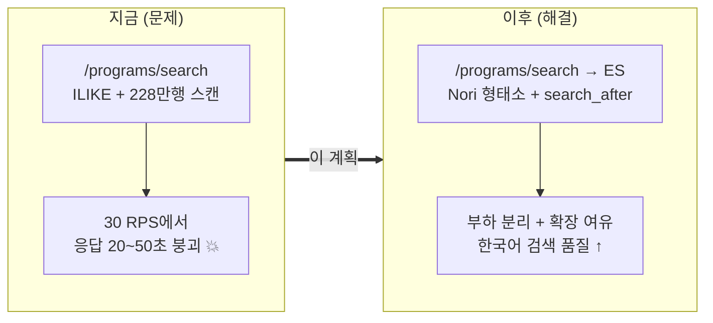
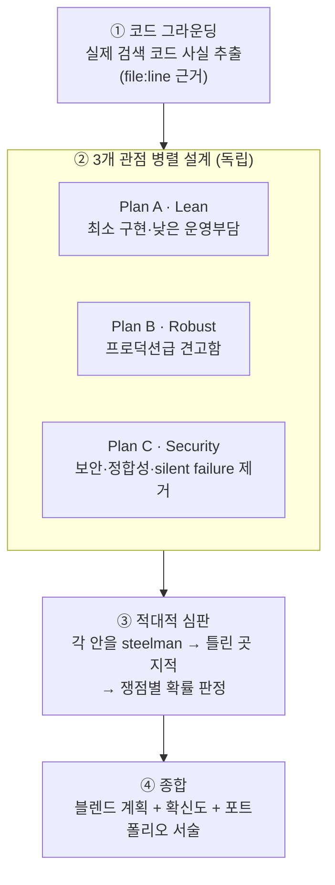
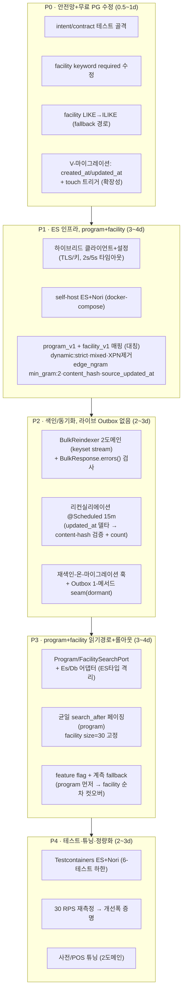
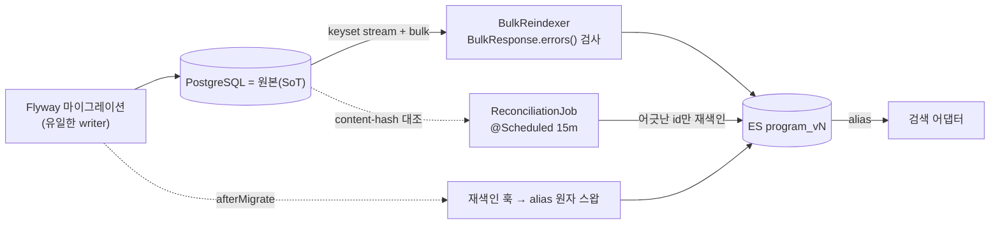
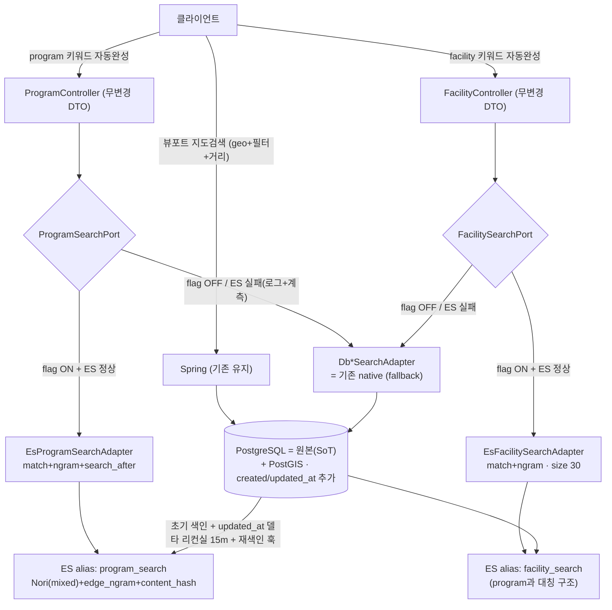

# MoveMap 검색 Elasticsearch 마이그레이션 — 최종 구현 계획

> 대상 프로젝트: MoveMap-Back (Java 17 / Spring Boot 3.5.7 / PostgreSQL+PostGIS)
> 범위: **키워드 자동완성 검색(`/search`)만** ES로 이관 (지도 뷰포트 검색은 PostgreSQL 유지)
> 이 문서의 성격: 설계 문서(무엇을 할지 결정)를 이어받아 **어떻게 구현할지**를 확정한 계획서.
> 작성 방식: 서로 다른 철학의 구현안 3개를 병렬로 세우고 → 적대적 심판이 교차검증·토론 → 확률 기반으로 종합.
> **모든 결론에 확신도(%)를 병기합니다.**

---

## 0. 한 장 요약 (TL;DR)

**결론 한 줄:** `/programs/search`(측정된 병목)와 `/facilities/search`를 **동일 구조로 함께** ES로 옮기고, 실제 데이터가 배포(Flyway)로만 바뀌는 현실에 맞춰 **"초기 색인 + content-hash 리컨실리에이션 + 재색인 훅"**으로 동기화한다. 설계가 "확정"했던 **Outbox는 도입하지 않는다**(관리자 CRUD 생기면 그때 검토). **확장성 대비 감사 컬럼(created_at/updated_at)은 추가**하고, 엔진은 **self-host 1노드**(로컬 사용·학습 목적)로 확정. **약 11~15 개발일. 전체 방향 확신도 78%.**

> 📝 **갱신 이력**: v2 = program+facility 둘 다·감사 컬럼 추가. v3 = **Outbox 완전 미도입**(dormant seam도 제외), **self-host 확정**(로컬 기준). 아래 §3.1·§3.2·§5·§6 반영.



### 핵심 결정과 확신도 (한눈에)

| # | 쟁점 | 최종 결정 | 확신도 |
|---|------|-----------|:------:|
| 1 | 동기화 방식 (설계문서 D7=Outbox) | **Outbox 미도입** → 초기 색인 + content-hash 리컨실리에이션 + 재색인 훅. (관리자 CRUD 생기면 그때 Outbox 검토) | 사용자 확정 |
| 2 | 엔진 배포 형태 | **self-host 1노드 확정** — 로컬 사용·학습 목적 | 사용자 확정 |
| 3 | facility도 ES로? | **program + facility 둘 다 동일 구조로 진행**(사용자 결정). facility PG 대소문자 버그도 fallback 경로용으로 함께 수정 | 사용자 확정 |
| 4 | 감사 컬럼(created/updated_at) 추가? | **추가**(확장성·감사 관례·delta 리컨실 가속). content_hash는 여전히 최종 드리프트 검증 | 70% |
| 5 | ES 클라이언트 | **하이브리드** — Spring Data ES 의존성 + 저수준 `ElasticsearchClient`(bulk 오류 검사·쿼리 빌드) | 85% |
| 6 | 자동완성 쿼리 (설계문서 D5=completion) | **completion suggester 미사용 확정** — edge_ngram + `match` + `search_after` 단일 메커니즘(접두매칭은 유지) | 사용자 확정 |
| 7 | 입력검증/보안 | **필수** — facility `keyword` `required=false`→required, 길이·size·제어문자 검증, 타입드 빌더로 인젝션 원천 차단 | 90% |
| 8 | 관측(메트릭) | **실측 가능한 4개**: fallback·latency·drift·last-success | 80% |
| 9 | 총 노력 수준 | **약 9~13 개발일** (Lean 골격 + 보안/정합성 엄밀함 − 과잉 인프라) | 75% |
| 10 | 리뷰 검색 포함 | **제외**(병목 아님 + PII/삭제권 부담) | 88% |

> ⚠️ **6번(자동완성)과 1번(Outbox)은 설계 문서에서 "확정(confirmed)"으로 표시됐던 항목을 근거를 들어 뒤집는 제안**입니다. 근거는 §3에 있으며, 최종 채택은 사용자 판단 몫으로 남겨 둡니다.

---

## 1. 배경 — 인턴을 위한 5분 브리핑

### 1.1 MoveMap엔 "검색"이 두 종류다

> 🧑‍🏫 **쉽게 말하면**
> - **① 지도 검색(뷰포트)** = 배달앱에서 지도를 움직이면 화면 안 가게가 뜨는 것. 위치·필터·거리순이 핵심. → **PostgreSQL이 이미 잘함. 안 건드림.**
> - **② 검색창 자동완성(`/search`)** = 유튜브 검색창에 글자 치면 추천이 뜨는 것. 오로지 "글자 매칭"이 전부. → **여기가 이번 대상.**

### 1.2 왜 바꾸나 — 측정이 말하는 진실

부하 테스트(k6 + EXPLAIN)로 확인한 사실:

| 엔드포인트 | 현재 성능 | 판정 |
|---|---|---|
| `/facilities/search` | p95 33~39ms, 30 RPS도 여유 | **이미 빠름 (개선 불필요)** |
| `/programs/search` | ~10 RPS 통과 → **~14 RPS 저하 → 30 RPS 붕괴(20~50초)** | **병목. 228만 행 전체 스캔이 원인** 💥 |

> 🚨 **면접에서 절대 하면 안 되는 말: "ES로 바꿔서 빨라졌어요."**
> `/facilities/search`는 이미 빠르므로 "속도"를 이유로 대면 측정 결과가 스스로를 반박합니다.
> **정직한 이유 3가지:** ① 한국어 형태소(Nori) 검색 품질, ② 검색 부하를 원본 DB에서 분리, ③ 성장 대비 확장 여유(programs가 예상 peak의 2~3배에서 붕괴).

### 1.3 이 계획을 이해하는 데 필요한 코드 사실 (검증 완료)

실제 코드를 조사해 확인한, **설계 문서가 놓쳤던 결정적 사실들**:

| 사실 | 근거 | 왜 중요한가 |
|---|---|---|
| **facility/program 행을 바꾸는 런타임 코드가 없다.** 데이터는 Flyway 마이그레이션으로만 적재됨 | `codebase-facts §4` | 설계 문서가 확정한 **Transactional Outbox가 "hook 걸 트랜잭션"이 없다** → §3.1의 핵심 쟁점 |
| `facility` 검색은 **대소문자 구분** `LIKE`이고 `keyword`가 **`required=false`** | `FacilityRepository.java:16`, `FacilityController.java:170` | 무료로 고칠 수 있는 버그(대소문자) + NPE/전체스캔 위험(required) |
| `created_at`/`updated_at` 컬럼이 **없다** | `codebase-facts §3` | "무엇이 바뀌었나"를 시간으로 못 잡음 → 리컨실리에이션 설계에 영향(§3.4) |
| 검색 테스트 0개. Testcontainers는 선언만 되고 미사용 | `codebase-facts §7` | 안전망이 없는 상태 = 그린필드. 동등성 회귀가 아니라 intent 테스트로 |
| 패키지는 도메인 우선(`domain/{facility,program}/...`), ES 의존성 없음, Java 17 | `codebase-facts §5,§8` | 새 코드 위치·버전을 관례에 맞춤 |

---

## 2. 어떻게 이 계획을 세웠나 (방법론 — 이것 자체가 포트폴리오 포인트)

혼자 한 판단이 아니라, **의도적으로 서로 다른 3개의 관점을 병렬로 세우고 적대적으로 교차검증**했습니다. "왜 이 구현을 골랐나"에 대해 "다른 안들과 저울질했고, 각 안이 틀린 지점까지 안다"고 답하기 위해서입니다.



- **① 그라운딩**: 설계 문서의 요약을 믿지 않고 실제 코드를 재확인 → "런타임 write path 없음" 같은 결정적 사실을 발견.
- **② 3개 관점**: 같은 결정 구조(11개 섹션)를 채우되 철학만 다르게 → 사과 대 사과로 비교 가능.
- **③ 적대적 심판**: 평균 내지 않고, 각 안의 **가장 강한 논거를 세운 뒤 반박**하고 쟁점별로 확률 판정.
- **④ 종합**: 이 문서.

> 💡 **왜 이 방식이 senior한가:** 단일 정답을 주장하는 대신, 트레이드오프를 명시적으로 저울질하고 "지금은 X, 조건이 바뀌면 Y"라는 조건부 결론과 확신도를 남겼습니다.

---

## 3. 10개 핵심 쟁점 — 토론과 결론

각 쟁점: **세 관점의 입장 → 가장 강한 반론 → 결론(확신도)**. (원자료: 3개 plan 문서 + 심판 판정문)

### 3.1 🔴 [최대 쟁점] 동기화: 설계 문서의 "Outbox 확정"을 뒤집다 — 확신도 **85%**

> 🧑‍🏫 **쉽게 말하면**: Outbox 패턴은 "DB에 글 쓸 때 같은 트랜잭션으로 '이거 색인해라' 쪽지를 함께 남기고, 일꾼이 그 쪽지를 보고 ES에 반영"하는 방식. **그런데 이 앱엔 시설/프로그램을 저장하는 코드 자체가 없다** — 데이터는 전부 배포 시 Flyway로만 들어온다. 즉 **쪽지를 남길 트랜잭션이 존재하지 않는다.**

| | 입장 |
|---|---|
| Plan A (Lean) | Outbox 완전 거부. 초기 색인 + `@Scheduled` 리컨실리에이션(count + MAX(id) 비교) |
| Plan B (Robust) | Outbox+relay+DLQ+ShedLock을 **지금 만들되 dormant**. + 감사 컬럼 마이그레이션(V18) |
| Plan C (Security) | Outbox **테이블+1개 publish 훅만** dormant. 실제 보증은 재색인+리컨실리에이션 |

**가장 강한 반론:** 생산자(producer)가 없는 Outbox는 "실제 쓰기로 테스트조차 못 하는 의식(ceremony)". 하지만 A의 `count + MAX(id)` 비교는 **행 수와 최대 id가 안 바뀌는 in-place UPDATE(예: 이름만 수정하는 `V14.3`)를 못 잡는 실제 구멍**.

**✅ 결론 (사용자 확정): 설계 문서 D7=Outbox를 오버라이드하고, Outbox는 코드로 도입하지 않는다(dormant seam도 제외).**
- **오늘의 정합성 보증 = ① 초기 전량 색인 + ② content-hash 리컨실리에이션 + ③ 마이그레이션-후 재색인 훅.** 데이터가 "배포 때만" 바뀌는 현실과 정확히 일치. 이 3개면 오늘의 정합성은 완결된다.
- **Outbox는 지금 아무것도 만들지 않는다** — 테이블·relay·DLQ·seam 전부 제외. 대신 **"언제 도입해야 하는지"만 문서로 남긴다**: 관리자 CRUD로 `programRepository.save(...)`/`facilityRepository.save(...)`가 트랜잭션 안에서 처음 호출되는 날. 그날 §부록에 정리한 도입 절차를 따른다.
- 근거: 생산자가 없는 지금 seam조차 죽은 코드라, "필요해지면 그때"가 YAGNI 원칙에 맞음(사용자 판단).

> 🧑‍🏫 **content-hash 리컨실리에이션이란?** 재고 실사와 같다. 각 문서의 핵심 필드를 sha256으로 요약해 두고, 주기적으로 "DB의 요약 ≟ ES의 요약"을 대조해 다르면 다시 색인. 시간표(updated_at)가 없어도, 심지어 시각이 같은 수정도 잡는다.

---

### 3.2 엔진 배포 형태: self-host vs 관리형 — **✅ self-host 확정 (사용자 결정)**

**결정:** **self-host 1노드로 확정.** 근거(사용자): **로컬 기준으로 직접 써보며 학습·시연하려는 목적**이므로 관리형(Elastic Cloud/AWS OpenSearch)은 불필요.

**구성:** `perf/` docker-compose 패턴 재사용, ES8 보안 ON(TLS + basic-auth/API-key), `localhost`/private 바인딩, **`9200` 외부 비공개.** (로컬이라도 보안 켠 채로 다뤄 두면 그대로 학습 자산이 됨.)

> 참고로 남긴 트레이드오프: 프로덕션 배포까지 간다면 그때는 관리형을 재검토할 가치가 있다(1인 운영자의 ES8 하드닝 부담·인증서 로테이션 등). 하지만 **현재 목표=로컬 학습**이므로 self-host가 정확한 선택.

---

### 3.3 facility도 ES로 옮길까? — **✅ 둘 다 진행 (사용자 결정)**

> 심판의 원래 판정은 "program만 먼저"(70%)였습니다. **사용자 결정으로 program + facility 둘 다 동일 구조로 진행**합니다. 근거: 성능 리포트를 두 도메인 한 번에 동일 구조로 냈으므로, 개선도 같은 구조로 가는 것이 일관성·비교가능성에 맞음.

**심판이 지적했던 사실(정직하게 유지):** facility는 이미 빠르므로(**p95 33~39ms**) facility의 ES 이관은 *성능이 아니라 형태소·일관성* 선택입니다. 포트폴리오 서술에서 이 점을 구분해야 함(§7-② 참고) — "facility가 ES로 빨라졌다"고 말하면 측정이 반박.

**적용:** program·facility 각각 `*_v1` 인덱스 + `*SearchPort` + Es/Db 어댑터를 **대칭 구조**로(3개 plan 모두 facility 매핑을 준비해 둠). facility의 PG `LIKE`→`ILIKE` 대소문자 수정은 **DB fallback 경로 정확성**을 위해 P0에서 여전히 수행.

> ⚖️ **이 결정이 수용하는 트레이드오프:** facility 색인·리컨실리에이션·재색인 운영을 하나 더 짊어짐(측정된 성능 이득 없음). 대신 두 도메인이 완전 대칭이 되어 코드·문서·운영이 단순해지고, "강남 축구" 다중토큰/대소문자 품질이 실제 개선됨. 노력 +1~2일.

---

### 3.4 감사 컬럼(created_at/updated_at) 추가할까? — 확신도 **70%**

| Plan A | Plan B | Plan C |
|---|---|---|
| 불필요(count+MAX(id)) | **V18로 추가** — 델타 리컨실리에이션+외부 버저닝에 필요 | 추가 안 함 — `content_hash` + `source_updated_at` 미러 |

**가장 강한 반론(심판):** 외부 버저닝(version_type=external)이 필요한 상황은 **동시·순서역전 쓰기**뿐인데, 그건 (미래의) Outbox와 함께만 존재. 오늘은 결정적 `_id` + 전체 덮어쓰기로 이미 멱등 → 심판은 "스킵"을 권했음.

**✅ 결론 (사용자 결정, 확신도 70%): 추가한다 — 확장성·감사 관례.** 사용자 지적("확장성을 위해 해놓아야 하는 것 아닐까?")이 타당함:
- **감사 컬럼은 엔티티 표준 관례** — 대부분의 도메인 테이블이 created_at/updated_at을 가지는 게 정상. 지금 없는 게 오히려 부채.
- **미래 대비 비용이 거의 0** — `V-마이그레이션` 한 개 + `BEFORE UPDATE` 트리거(`touch_updated_at`)면 끝. 관리자 CRUD·Outbox·외부 버저닝이 오는 날 이미 준비돼 있음.
- **오늘도 이득**: 트리거로 updated_at이 신뢰 가능해지면, 리컨실리에이션이 **`updated_at > lastRun` 델타 pre-filter로 빨라지고**(228만 행 전체 해시 대신 바뀐 행만), 그다음 `content_hash`로 정밀 검증. 즉 content_hash와 배타적이 아니라 **상호 보완**.
- ⚠️ 단, **최종 드리프트 판정은 여전히 `content_hash`** — updated_at을 안 건드리는 수정도 hash는 잡으므로. 감사 컬럼은 "속도/확장성", content_hash는 "정확성" 담당.

> 심판의 "스킵" 논거(write-less 테이블 churn)는 여전히 유효한 반대 관점이나, **확장성·관례를 우선하는 사용자 판단을 채택**. B(Robust)의 V18 방향과 일치하되, B가 함께 붙였던 dormant Outbox/DLQ는 여전히 제외.

---

### 3.5 ES 클라이언트: 순수 Spring Data vs 하이브리드 — 확신도 **85%**

**가장 강한 반론:** `bulk` 호출은 HTTP 200을 주면서 **개별 문서는 실패**할 수 있다(부분 실패). 이걸 잡으려면 `BulkResponse.errors()`로 항목별 결과를 봐야 하는데, **Spring Data의 `saveAll`은 이걸 숨긴다** → 조용한 부분 색인 실패(정합성 구멍).

**✅ 결론 (85%): 하이브리드.** 의존성은 `spring-boot-starter-data-elasticsearch`(Boot 3.5.7 BOM이 Spring Data ES 5.x + ES Java client 8.x 관리), 그러나 **bulk·타입드 쿼리는 저수준 `ElasticsearchClient` 직접 사용**. 둘은 배타적이지 않다(Spring Data가 그 클라이언트를 감쌈).

---

### 3.6 🔴 자동완성 메커니즘: 설계 D5(completion suggester)를 뒤집다 — 확신도 **70%**

> 🧑‍🏫 **이 쟁점을 처음부터 쉽게 (제일 헷갈리는 부분)**
>
> **"자동완성을 ES로 어떻게 구현하느냐"**에는 여러 방법이 있는데, 대표적으로 3가지입니다. 검색어 "수영"을 쳤을 때:
> - **completion suggester**: ES가 자동완성 전용으로 만든 초고속 기능. 메모리에 "수영장", "수영강습" 같은 후보를 미리 나무 구조로 넣어두고 앞글자로 순식간에 찾음. **엄청 빠른데, "1페이지·2페이지"처럼 여러 페이지로 나눠 주는(페이징) 걸 못 한다.**
> - **edge_ngram**: "수영"을 색인할 때 "수", "수영" 조각으로 미리 쪼개 저장. 일반 검색 쿼리(`match`)로 앞글자 매칭이 되고, **페이징(더보기)이 자연스럽게 된다.**
> - **match_phrase_prefix**: 그때그때 앞글자 매칭. 유연하지만 상대적으로 느릴 수 있음.
>
> **문제의 핵심:** program 검색엔 **"더보기(페이징)"**가 있습니다. 그런데 설계 문서가 "확정"한 방식(completion)은 페이징을 못 해서, Plan A는 **1페이지는 completion, 2페이지부터는 다른 쿼리**를 쓰자고 했습니다. **여기서 사고가 납니다** — 1페이지를 만드는 규칙과 2페이지를 만드는 규칙이 다르면, **"더보기"를 눌렀을 때 1페이지에 있던 게 또 나오거나, 1페이지에 없던 게 갑자기 튀어나올 수 있어요.** 사용자 눈에 "검색이 이상하다"로 보이는 버그입니다.
>
> **그래서 결론:** 처음부터 끝까지 **한 가지 방식(edge_ngram + `search_after`)으로 통일**하면 모든 페이지가 같은 규칙이라 이 문제가 사라집니다. **사용자 결정: completion suggester는 아예 쓰지 않는다** — edge_ngram 하나로 접두/부분 매칭까지 커버하므로 별도의 자동완성 전용 컴포넌트가 불필요.

| Plan A | Plan B | Plan C |
|---|---|---|
| completion(1페이지) + `match_phrase_prefix`(N페이지) — **본인이 recall 불일치 인정** | edge_ngram 멀티필드 + `match` + `search_after` (전 페이지 균일) | `match`/`match_phrase_prefix` + 드롭다운용 completion |

**가장 강한 반론:** program 검색은 **페이징된다("더보기").** 1페이지는 completion, N페이지는 다른 쿼리 → **"더보기"가 1페이지에 없던 문서를 보이거나 그 반대**가 되는 **눈에 보이는 정합성 결함.**

**✅ 결론 (사용자 확정): completion suggester는 사용하지 않는다.** 전 도메인·전 페이지 **단일 메커니즘 — edge_ngram(min_gram:2) + `match`(nori) + `search_after` + `id` tie-breaker**. 접두/부분 매칭은 edge_ngram이(글자 치는 중 추천 UX 유지), 형태소 품질은 nori `match`가 담당. facility는 `size=30` 고정, 커서 없음.
> 이로써 설계 D5(completion suggester)는 **채택하지 않는 것으로 확정.** 페이징 규칙이 전 페이지 동일해져 "더보기 불일치" 결함이 원천 제거됨. (min_gram:2·형태소 스톱태그 튜닝은 P4에서 실데이터로 검증.)

---

### 3.7 입력검증·인젝션 안전 + `required=false` 버그 — 확신도 **90%**

> 🧑‍🏫 **쉽게 말하면**: SQL 인젝션처럼, ES에도 사용자가 검색어에 `name:(x) OR _exists_:*` 같은 쿼리 문법을 끼워 넣는 공격이 가능하다 — **단, `query_string` 같은 "파서가 문법을 해석하는" 쿼리를 쓸 때만.** 우리가 `match`처럼 "검색어를 그냥 값으로 취급하는" 타입드 빌더만 쓰면 인젝션은 **구조적으로 불가능**해진다(= 바인딩된 SQL 파라미터와 같은 원리).

**✅ 결론 (90%, 필수 ~0.5일):**
- facility `keyword` `required=false`→**required**로 수정(현재 미입력 시 NPE/전체 스캔 위험).
- 길이 캡(facility ≤50, program ≤100), `size` clamp(1~100/facility 고정 30), 제어문자 거부, 커서는 서버 검증(위조 방지).
- 쿼리는 **절대 `query_string`/`wildcard`/`regexp`/script 쓰지 않음** → 인젝션·leading-wildcard ReDoS 원천 차단.
- 타입드 빌더 인젝션-안전은 **공짜**. 이건 gold-plating이 아니라 실제 버그 수정.

---

### 3.8 관측 깊이 — 확신도 **80%**

**가장 강한 반론:** A의 fallback 카운터 1개는 너무 얇다(latency·drift 없음). B의 7개는 **오늘 항상 0인 dormant 컴포넌트(relay lag/dead)를 계측** — 대시보드 의식.

**✅ 결론 (80%): 오늘 실측되는 4개만.**
`esFallback{domain}`(카운터) · `es_search_latency{domain}`(타이머) · `reconciliation_drift`(게이지) · `reconciliation_last_success_ts`(게이지). Outbox 메트릭은 Outbox와 함께 나중에. 기존 `perf/`의 Prometheus+Grafana 스택 재사용.

---

### 3.9 노력/야망 수준 — 확신도 **75%**

| Plan A | Plan B | Plan C |
|---|---|---|
| ~2주 | 17~23일 | 14~17일 |

**가장 강한 반론:** 포트폴리오는 "**senior하되 과설계 아님**"으로 읽혀야 한다. B의 dormant Outbox/DLQ/V18은 리뷰어가 "over-engineering"이라 지적할 지점. A의 동기화는 너무 coarse.

**✅ 결론 (75%): 약 9~13 개발일** = A의 골격 + C의 정합성 엄밀함(bulk 오류 검사·content-hash 리컨실·검증·계측 fallback) − B의 dormant 인프라.

---

### 3.10 나머지 오픈 아이템

| 아이템 | 결론 | 확신도 |
|---|---|:---:|
| 리뷰 검색 포함 | **제외** — 병목 아님, A-scope DTO 아님, 리뷰는 런타임 write path가 있어 Outbox 문제를 조기 소환 + PII/삭제권 부담 | **88%** |
| D4 사전 큐레이션 | `mixed` + 작은/빈 `userdict_ko.txt` 시작 → 이름 토큰에서 후보 반자동 추출 → 사람 승인. 사전 변경=재색인(alias 스왑) | 72% |
| Nori POS stoptags(XPN) | **XPN(접두사) 제거** — "비회원/무산소/비급여"가 "회원/산소/급여"로 의미 반전되는 것 방지(Elastic 공식 경고) | 65% |
| 매핑 `dynamic` | **`dynamic: strict`** — 스키마 드리프트 시 조용히 검색 불가 필드를 만드는 대신 색인 요청을 크게 실패시킴 | 80% |

---

## 4. 각 관점이 틀렸던 지점 (적대적 검증의 결과)

> 세 안 모두 강점이 있었지만, 심판은 각각의 **가장 큰 오류/맹점**을 지적했습니다. 이것이 블렌드에서 걸러진 부분입니다.

**Plan A (Lean)의 오류**
1. `COUNT(*)+MAX(id)` 리컨실리에이션은 in-place UPDATE(`V14.3`)를 못 잡는 **실제 드리프트 구멍** (본인도 §11.4에서 인정하면서 v1으로 채택 → 모순).
2. 1페이지 completion vs N페이지 `match_phrase_prefix`는 "의식적 차이"가 아니라 **출시된 UX 결함**.
3. **`BulkResponse.errors()` 항목별 검사 없음** → 조용한 부분 색인 실패. 싸게 고칠 수 있는데 빠뜨림.
4. facility가 ES 불필요하다 논증해 놓고 그대로 색인 → 자기모순.

**Plan B (Robust)의 오류**
1. **생산자 없는 Outbox+relay+DLQ+ShedLock을 6~8일치로 구축** — 실제 쓰기로 테스트 불가, 본인도 절반 인정.
2. write-less 테이블에 V18 컬럼+트리거 = 현재 이득 거의 0인 스키마 churn.
3. **`edge_ngram min_gram:1`** → 228만 문서에 모든 단일 문자 색인 = 인덱스 팽창 + 한 글자 노이즈 매칭(**min_gram:2가 정상 하한**).
4. 7개 메트릭이 dormant 컴포넌트를 계측(항상 0).
5. `nori_readingform`(로마자)를 색인 분석기에 추가 — A-scope 자동완성엔 노이즈.

**Plan C (Security)의 오류**
1. **Outbox에 대한 엇갈린 메시지**: 본문(§5a)은 relay 워커까지 구현해 놓고 §11 자기비판에서 "워커는 만들지 말라"고 함 → 본문에서 빼야 했음.
2. 관리형 ES 권장은 보안 최적이나 **포트폴리오의 명시된 ADR 목표(운영 학습)를 버림** — B만큼 이 긴장을 정면으로 다루지 못함.
3. 동일한 `min_gram:1` 팽창 오류.
4. **9개 필수 머지 게이트 테스트**는 1인 포트폴리오에서 "결국 안 써지는 야망"이 될 위험 → 올바른 6개 하한(인젝션·계측fallback·부분실패·리컨실·intent·contract)을 명시했어야.
5. 228만 행 야간 전체 checksum은 재색인-온-마이그레이션이 이미 재빌드하는 상황에서 과도.

---

## 5. 최종 블렌드 구현 계획 (P0~P4)

**Spine:** program + facility(동일 구조) · 하이브리드 클라이언트 · 균일 `search_after` · content-hash 리컨실리에이션 + 재색인 훅(라이브 Outbox 없음) · 감사 컬럼(확장성) · 계측 fallback · self-host 1노드. **~11~15 개발일. 전체 확신도 78%.**



### P0 — 안전망 + 무료 PG 수정 (0.5~1일)
- 현행 `/search` 동작 문서화 + intent/contract 테스트 골격(Testcontainers 의존성 이미 선언됨).
- **facility `keyword` `required=false`→required + 길이 캡** (`FacilityController.java:170`). — 확신도 90%
- **facility 대소문자 버그 PG에서 수정: `LIKE`→`ILIKE`** (`FacilityRepository.java:16`). DB fallback 경로 정확성 확보. — 확신도 85%
- **감사 컬럼 마이그레이션(사용자 결정, §3.4)**: `facility`·`program`에 `created_at`/`updated_at timestamptz` 추가 + `BEFORE UPDATE` 트리거(`touch_updated_at`). 확장성·감사 관례 + 리컨실 델타 pre-filter 근거.
```sql
-- V__add_audit_columns.sql (버전 번호는 현재 최신 Flyway 뒤로)
ALTER TABLE facility ADD COLUMN created_at timestamptz NOT NULL DEFAULT now(),
                     ADD COLUMN updated_at timestamptz NOT NULL DEFAULT now();
ALTER TABLE program  ADD COLUMN created_at timestamptz NOT NULL DEFAULT now(),
                     ADD COLUMN updated_at timestamptz NOT NULL DEFAULT now();
CREATE OR REPLACE FUNCTION touch_updated_at() RETURNS trigger AS $$
  BEGIN NEW.updated_at = now(); RETURN NEW; END; $$ LANGUAGE plpgsql;
CREATE TRIGGER trg_facility_touch BEFORE UPDATE ON facility FOR EACH ROW EXECUTE FUNCTION touch_updated_at();
CREATE TRIGGER trg_program_touch  BEFORE UPDATE ON program  FOR EACH ROW EXECUTE FUNCTION touch_updated_at();
CREATE INDEX idx_facility_updated_at ON facility(updated_at);
CREATE INDEX idx_program_updated_at  ON program(updated_at);
```

### P1 — ES 인프라, program + facility 대칭 (3~4일)
> `program_v1`과 `facility_v1`을 **동일 구조**로 만든다. 아래 매핑은 program 예시이고, facility는 `name`=시설명, `facility_name` 필드 없음(대신 `facility_type`/`facility_subtype` 반환)만 다르고 나머지(analyzer·`content_hash`·`source_updated_at`·`dynamic:strict`)는 동일.
```gradle
// build.gradle
implementation 'org.springframework.boot:spring-boot-starter-data-elasticsearch' // Boot 3.5.7 BOM 관리
testImplementation 'org.testcontainers:elasticsearch:1.20.1'                      // 이미 선언된 TC 활용
```
- `global/config/ElasticsearchConfig` — 바운드 타임아웃(connect 2s / socket 5s → 빠른 fallback), TLS + basic-auth/API-key를 **gitignore된 `application-es.yml`**에서 주입(기존 시크릿 관례).
- self-host ES + Nori (docker-compose, `perf/` 패턴 재사용, 보안 ON, private 바인딩).
- **`program_v1` 매핑** (핵심 아티팩트):

```jsonc
{
  "settings": {
    "number_of_shards": 1, "number_of_replicas": 1,
    "analysis": {
      "tokenizer": {
        "nori_user": { "type": "nori_tokenizer", "decompound_mode": "mixed",
                       "user_dictionary": "userdict_ko.txt" }        // 사전 변경=재색인(D4)
      },
      "filter": {
        "nori_pos": { "type": "nori_part_of_speech",
          // XPN(접두사) 제거 → "비회원/무산소/비급여" 의미반전 방지 (§3.10)
          "stoptags": ["E","IC","J","MAG","MAJ","MM","SP","SSC","SSO","SC","SE","VCP","VCN","XSA","XSN","XSV"] },
        "edge_ngram_filter": { "type": "edge_ngram", "min_gram": 2, "max_gram": 20 } // min_gram:2 (1 아님)
      },
      "analyzer": {
        "nori_index":  { "type":"custom","tokenizer":"nori_user","filter":["nori_pos","lowercase"] },
        "nori_search": { "type":"custom","tokenizer":"nori_user","filter":["nori_pos","lowercase"] },
        "ac_index":    { "type":"custom","tokenizer":"nori_user","filter":["nori_pos","lowercase","edge_ngram_filter"] },
        "ac_search":   { "type":"custom","tokenizer":"nori_user","filter":["nori_pos","lowercase"] } // 검색시 edge_ngram 미적용(과매칭 방지)
      }
    }
  },
  "mappings": {
    "dynamic": "strict",                                             // 스키마 드리프트를 조용히 넘기지 않음
    "properties": {
      "id":               { "type": "long" },
      "name": { "type": "text", "analyzer": "nori_index", "search_analyzer": "nori_search",
                "fields": { "keyword": { "type": "keyword", "ignore_above": 256 },
                            "ngram":   { "type": "text", "analyzer": "ac_index", "search_analyzer": "ac_search" } } },
      "facility_name": { "type": "text", "analyzer": "nori_index", "search_analyzer": "nori_search",
                         "fields": { "keyword": { "type": "keyword", "ignore_above": 256 } } },
      "facility_subtype": { "type": "keyword" },
      "address":          { "type": "text", "analyzer": "nori_index", "search_analyzer": "nori_search" },
      // --- 내부 제어 필드 (클라이언트로 절대 반환 안 함) ---
      "content_hash":     { "type": "keyword" },                      // 리컨실리에이션 드리프트 감지
      "source_updated_at":{ "type": "date" }
    }
  }
}
```
- `IndexBootstrapper`: 부팅 시 인덱스+alias 없으면 생성(멱등). 앱은 **항상 alias(`program_search`)만** 조회.

### P2 — 색인/동기화, 라이브 Outbox 없음 (2~3일)


> Outbox는 이 그림에 없다 — 오늘은 도입하지 않는다(§3.1). 관리자 CRUD가 생기는 날 부록의 절차대로 추가.

- **`BulkReindexer`(program·facility 2도메인)**: PG를 keyset 스트림(`id > ? ORDER BY id LIMIT 5000`) → `content_hash` 계산 → bulk. **`BulkResponse.errors()` 항목별 검사** → 로그 + `bulkItemFailures` 메트릭 + 바운드 재시도 → dead-letter(초기엔 "로그 + 수동 재실행"). — 확신도 90%(이 검사는 필수)
- **리컨실리에이션 `@Scheduled`(15분)**: **`updated_at > lastRun` 델타로 바뀐 행만 추린 뒤 `content_hash` 비교**(감사 컬럼 덕에 228만 행 전체 해시 대신 델타만) + `count(PG)` vs `count(ES)` → 어긋난 id 자동 치유, `reconciliation_drift`·`last_success_ts` 방출. **이것이 오늘의 실제 정합성 보증.** — 확신도 85%
- **재색인-온-마이그레이션 훅**(Flyway `afterMigrate` 또는 런북 게이트) → 재빌드 + 원자 alias 스왑. "새 V-스크립트가 행을 넣었는데 ES가 모름" 경로 차단. — 확신도 80%
- **Outbox = 도입하지 않음.** 코드·테이블·seam 전부 없음. 도입 조건과 절차만 부록에 문서화(§3.1).

### P3 — program + facility 읽기경로 + 롤아웃 (3~4일)
- **program·facility 대칭 구조**: `ProgramSearchPort`/`FacilitySearchPort` + `Es*SearchAdapter`(타입드 빌더, 인젝션-안전) + `Db*SearchAdapter`(기존 native = fallback). **ES 문서 타입은 port를 넘지 않음**(컨트롤러/DTO 무변경). 아래는 program 쿼리 예시(facility는 `facility_name` 없이 `size=30` 고정, 커서 없음).
- **균일 페이징 쿼리**(핵심 아티팩트):
```java
Query q = BoolQuery.of(b -> b.should(
    MatchQuery.of(m -> m.field("name").query(kw).boost(2f))._toQuery(),          // kw는 '값', DSL 아님
    MatchQuery.of(m -> m.field("facility_name").query(kw))._toQuery(),
    MatchQuery.of(m -> m.field("name.ngram").query(kw).boost(1.5f))._toQuery()
).minimumShouldMatch("1"))._toQuery();

SearchRequest.of(s -> s.index("program_search").query(q).size(clampedSize)
    .sort(so -> so.score(sc -> sc.order(SortOrder.Desc)))
    .sort(so -> so.field(f -> f.field("id").order(SortOrder.Asc)))                // id tie-breaker → 안정 커서
    .searchAfter(decodedCursor)                                                   // 첫 페이지는 null
    .trackTotalHits(t -> t.enabled(false)));                                      // 깊은 카운트 비용 제거
// nextCursor = encode(lastHit.sort()); hasNext = hits==size; DTO는 바이트 동일
```
- 입력검증(길이·size clamp·제어문자·커서 서버검증). 공백 제거 정규화 parity를 쿼리어에 적용.
- 도메인별 feature flag(기본 DB) + **계측 fallback**:
```java
catch (ElasticsearchException | IOException e) {
  log.warn("ES 검색 fallback→DB domain={} keyword_len={} cause={}", domain, kw.length(), e.toString()); // 원문 아닌 길이만
  searchMetrics.esFallback(domain).increment();     // 카운터 → 알림. 조용한 다운그레이드 아님
  return dbAdapter.search(query);                    // 정합성 유지, 저하는 '보이게'
}
```
- **컷오버 순서: program 먼저(측정된 병목) → 검증 후 facility 순차.** 도메인별 flag라 독립 컷오버·롤백 가능. 롤백=flag를 DB로.

### P4 — 테스트·튜닝·정량화 (2~3일)
- Testcontainers ES+Nori(커스텀 이미지, `@BeforeAll`에서 플러그인 존재 assert). **테스트 하한 6개**: ①인젝션-리터럴 처리 ②fallback 계측+로그 확인 ③부분 bulk 실패 표면화 ④리컨실리에이션 드리프트 치유 ⑤intent("수영"→수영장; "강남 축구") ⑥contract(DTO 바이트 동일). — 확신도 80%
- **30 RPS 재측정 → 병목 해소 정량화**(이 모든 작업의 목적).
- 사전/POS 튜닝(program·facility 2도메인). facility는 "성능 아닌 형태소/품질 개선"으로 정량화(대소문자·"강남 축구" 다중토큰 개선을 intent 테스트로 증명).

---

## 6. 최종 아키텍처 (한 장)



---

## 7. 포트폴리오 서술 — "왜 전환했나 → 어떤 성과가 났나"

> 포트폴리오/면접의 핵심은 **문제 → 결정 → 성과**입니다. 아래를 그대로 README·이력서에 쓸 수 있게 정리했습니다.
> ⚠️ **정직성 주의**: 이 문서는 *구현 계획*입니다. "성과"의 **AS-IS(before) 수치는 이미 측정된 실측치**이고, **개선 후(after) 수치는 구현+P4 재측정으로 채울 자리(`___`)** 입니다. 지어내지 말고 실제 측정치로 채우세요.

### 7.1 한 줄 요약 (프로젝트 리스트용)
> 부하 테스트로 `/programs/search`가 **30 RPS에서 붕괴(응답 최대 50초, 228만 행 전체 스캔)**함을 규명하고, RDB 확장(pg_trgm·pg_bigm·PGroonga)과 경량 엔진을 비교한 뒤 **한국어 형태소 검색 품질(Nori) + 검색 부하 분리**를 위해 Elasticsearch로 전환. 데이터 동기화는 실제 write 경로가 없는 현실에 맞춰 **리컨실리에이션 기반**으로 설계.

### 7.2 왜 ES로 전환했나 (문제 → 대안 비교 → 결정)

**① 문제를 측정으로 규명했다 (추측 아님).** k6 + `EXPLAIN` + `pg_stat_statements`로:
- `/programs/search`: ~10 RPS는 통과(p95 198ms)하나 **~14 RPS부터 저하 → 30 RPS에서 붕괴(응답 20~50초)**. 원인 = `name_normalized ILIKE 'kw%' + ORDER BY id LIMIT`가 **228만 행을 전체 스캔**, DB CPU 포화(앱은 유휴).
- 즉 문제는 "느린 쿼리 하나"가 아니라 **검색 부하가 원본 DB를 잡아먹어 확장 여유가 없다**는 구조.

**② 싼 대안부터 차례로 검토하고 기각했다.**

| 대안 | 왜 부족했나 |
|---|---|
| 쿼리 재설계 / 인덱스 | `ORDER BY id LIMIT` 구조상 pg_trgm이 효과 제한, 부하는 여전히 DB에 |
| pg_bigm | 부분일치(n-gram)일 뿐 **형태소·랭킹이 아님** |
| PGroonga | 형태소는 좋으나 **관리형 RDS에 설치 불가 + 부하 분리 안 됨** |
| 경량 엔진(Typesense 등) | 한국어 형태소 품질 약함 |

**③ 그래서 ES를 골랐다 — 근거는 "속도"가 아니다.**
- **한국어 검색 품질**: Nori 형태소로 `LIKE`가 못 하던 "강남 축구"(다중 토큰)·대소문자·복합명사 분해 매칭.
- **부하 분리 + 확장 여유**: 검색 부하를 원본 DB에서 떼어내 성장 헤드룸 확보(programs가 예상 peak의 2~3배에서 붕괴하던 문제).
- ⚠️ **`/facilities/search`는 이미 빨랐다(p95 33~39ms).** facility도 함께 옮겼지만 근거는 *속도가 아니라 품질·일관성*이다. "빨라졌다"고 말하면 측정이 스스로를 반박한다.

### 7.3 성과 (Result)

**정량 — 전/후 비교표** (before=실측 / after=구현 후 P4 재측정으로 채움):

| 지표 (`/programs/search`, 30 RPS) | AS-IS (측정됨) | 개선 후 (P4 측정 예정) |
|---|---|---|
| p95 응답시간 | **20~50초 (붕괴)** | `___ ms` |
| 안정 처리 RPS | ~14 RPS에서 저하 | `___ RPS` |
| DB CPU | **포화(100%)** | `___ %` (검색 부하 분리) |
| 오류율 | 높음(타임아웃) | `___ %` |

> 측정 방식은 §5 P4 + `perf/`의 k6·Prometheus·Grafana 스택으로 **동일 시나리오 전/후 오버레이**. "왜 pg_trgm이 아니라 ES인가"에 **3조건(현재/pg_trgm/ES) 비교 데이터**로 답한다.

**정성 — 검색 품질 개선**(intent 테스트로 증명):
- 대소문자 무시("YOGA"="yoga"), 다중 토큰("강남 축구") 매칭, 형태소 기반 재현율 향상.
- program·facility **동일 구조**로 이관해 코드·운영·문서 일관성 확보.

### 7.4 이 과정에서 보여줄 엔지니어링 판단 (면접 talking points)
- **측정 우선**: "요즘 다 쓰니까"가 아니라 부하 테스트로 병목을 규명하고, 속도가 아닌 **품질·부하 분리**를 근거로 삼음(정직).
- **확정 설계도 근거로 뒤집음**: 설계가 확정한 Transactional Outbox를, 코드에 **런타임 write 경로가 없음**을 확인하고 도입 보류 — 대신 "언제 도입할지"를 문서화(YAGNI).
- **동기화를 현실에 맞춤**: 데이터가 배포(Flyway) 때만 바뀌므로 초기 색인 + content-hash 리컨실리에이션 + 재색인 훅으로 설계(불변식: PG=원본, ES=파생, staleness는 리컨실 주기로 bound).
- **운영을 직접**: self-host로 버전드 인덱스·원자 alias 스왑·재색인을 손수 다룸(로컬 학습 목적).

---

## 8. 남은 리스크 / 확신이 낮은 지점 (정직한 자기평가)

1. **Nori Testcontainers 이미지 패키징** — 설계가 "확인 필요"로 남긴 항목, **아직 실증 안 됨**. intent 테스트 신뢰 전에 `@BeforeAll`에서 플러그인 존재 확인.
2. **`min_gram:2`·XPN 제거** — 추론된 기본값이지 측정 아님. P4에서 실제 시설/프로그램 이름 샘플로 검증. (※ 자동완성/edge_ngram 자체를 넣을지는 아래 "미결" 참고)

> **참고 — 사용자 결정으로 해소된 리스크:** ① facility ES 여부는 "둘 다 진행" 확정(품질/일관성). ② 감사 컬럼은 "확장성 위해 추가" 확정(리컨실 델타 가속). ③ 엔진은 self-host 확정(로컬 학습). ④ Outbox는 미도입 확정(YAGNI). ⑤ 자동완성은 **completion suggester 미사용 + edge_ngram 접두매칭 유지**로 확정(§3.6).

> **블렌드 spine(program+facility 동일 구조·하이브리드·content-hash 리컨실+재색인 훅·**Outbox 미도입**·감사 컬럼·self-host·계측 fallback·11~15일)이 이 포트폴리오에 맞는 야망 수준이라는 전체 확신도: ~78%.**

---

## 부록 A. Outbox는 언제·어떻게 도입하나 (지금은 안 만듦)

> 지금은 코드로 만들지 않는다(§3.1). 아래는 **미래에 필요해지면** 따를 조건과 절차 — "언제 켜는지 알고 유예했다"를 증명하는 문서용.

- **도입 트리거(이 중 하나라도 발생하면):**
  - 관리자/사용자 기능이 `facility`/`program` 행을 **런타임에 저장·수정·삭제**하기 시작(= `facilityRepository.save(...)`/`programRepository.save(...)`가 `@Transactional` 안에서 호출됨). 현재는 없음(`codebase-facts §4`).
  - "수 초 이내 색인 반영"이 요구사항이 됨(현재는 리컨실 주기 ≤15분으로 충분).
- **도입 절차(순서대로):**
  1. `search_outbox(id, aggregate_type, aggregate_id, op, doc_version, status, attempts, next_attempt_at, ...)` 테이블 추가(Flyway).
  2. 그 CRUD 서비스 메서드에서 **행 변경과 같은 트랜잭션**으로 `outboxAppender.enqueue(...)` 호출.
  3. `@Scheduled` relay 워커(`SKIP LOCKED` 클레임 → bulk 색인 → status 갱신) + 재시도/DLQ. 다중 인스턴스면 ShedLock.
  4. 멱등: ES `_id`=PG PK + `version_type=external`(= updated_at millis, 이미 감사 컬럼 있음) → 순서역전/중복 replay 무시.
  5. 리컨실리에이션은 그대로 **최종 안전망**으로 유지.
- 즉 지금 만든 **감사 컬럼·content_hash·리컨실·alias**가 그대로 재사용되므로, 그날의 작업은 "테이블+워커 추가"뿐 재설계가 아니다.

---

## 부록 B. 산출물 위치

- 이 문서(최종): `docs/es-migration-implementation-plan.md`
- 원자료(세션 작업 폴더): `00-design.md`(설계) · `01-codebase-facts.md`(코드 사실) · `plans/plan-A-lean.md` · `plan-B-robust.md` · `plan-C-security.md` · `02-judge-verdict.md`(적대적 판정문)
- 성능 baseline: `perf/AS-IS-BASELINE-REPORT.md`, `perf/BENCHMARK_REPORT.md`
- 관련 기록: memory `es-migration-decisions.md`, `movemap-search-benchmark-plan.md`
