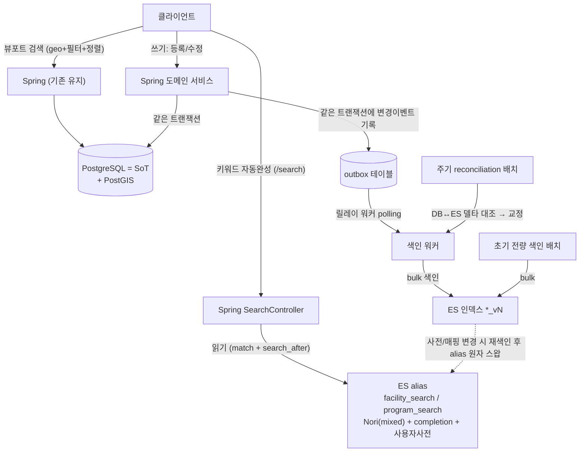

# MoveMap 검색 Elasticsearch 마이그레이션 설계 문서

> 상태: **결정 대기 초안(Draft for decision)** · 대상: MoveMap-Back (Java 21 / Spring Boot 3.x / PostgreSQL + PostGIS)
> 목적: 현재 `LIKE`/`ILIKE` 기반 **키워드/자동완성 검색**을 검색엔진 + 한국어 형태소(Nori)로 이관. **엔진 미정**(Elasticsearch / OpenSearch / Typesense 등 — §D0 및 벤더 비교 참고). 뷰포트 지도검색은 PostgreSQL 유지.
> 이 문서는 **무엇을 결정해야 하는지 + 각 결정의 트레이드오프**를 정리한다. 최종 선택 중 일부는 **당신이 판단할 몫으로 남겨두었다**(⬜ 표시).

---

## 0. 한눈에 보기 (TL;DR)

- 현재 검색은 두 갈래다: **① 뷰포트 지도검색**(geo bounding box + 구조화 필터 + 커서 + 거리정렬)과 **② `/search` 자동완성**(facility=ILIKE 부분일치, program=공백제거 후 prefix). 이 둘은 성격이 완전히 달라 ES 이관 전략도 달라야 한다.
- ES는 **PostgreSQL을 원본(SoT)으로 두는 검색 전용 read model**로 붙인다. RDB 미러가 아니라 **검색 결과 단위로 비정규화한 문서**를 설계한다.
- **결과 동등성(equivalence)을 pin하는 회귀 테스트는 목표가 아니다** — 형태소 분석으로 결과가 달라지는 게 정상. 테스트는 (a) 엔진 무관 API 계약, (b) intent 기반 인수 테스트, (c) 형태소로 달라지는 케이스의 "의식적 차이 목록"으로 재정의한다.
- 가장 큰 미결 판단: **마이그레이션 범위**(자동완성만 vs 지도검색까지)와 **동기화 방식**. 나머지는 권장안이 비교적 명확하다.

### 결정 0 (ADR) — DB 조회 검색 → 검색엔진 도입 · **채택(Accepted), 2026-07-22**

> 가장 근본 결정. "검색엔진을 쓸 것이냐"부터 트레이드오프를 저울질한 기록.

**맥락**: 현재 `LIKE`/`ILIKE` 검색. 엔진 도입 전, 대안들을 **조사 + 실측 벤치마크**로 비교했다.

**측정으로 확인한 사실 (벤치마크, 리소스 제한 컨테이너 환경)**:
- `facilities/search`는 **이미 빠름** (p95 33~39ms, 30 RPS도 여유). → 속도 개선 여지 없음.
- `programs/search`는 **예상 부하(~10 RPS)는 통과**(p95 198ms)하나, **~14 RPS 저하 → 30 RPS 붕괴**(20~50초). 병목은 **DB의 programs 쿼리**(`name_normalized ILIKE` + `ORDER BY id LIMIT`), 앱은 유휴.
- 즉 문제는 "형태소 부재"가 아니라 **쿼리 구조 + 확장 여유 부족**.

**검토한 선택지와 트레이드오프**:

| 선택지 | 확장성/부하분리 | 한국어 품질 | 다차원 랭킹 | 운영부담 | 판정 |
|---|---|---|---|---|---|
| 쿼리 재설계(현행 유지) | ✗(DB 부하 그대로) | 현행 | 없음 | 없음 | 병행 검토(병목 완화용) |
| pg_bigm (RDS OK) | ✗ | 중(부분일치) | 없음 | 최소 | 부분 개선만 |
| PGroonga (self-host) | ✗ | 상(형태소) | 제한 | 중 | RDS 불가 + 부하 분리 못 함 |
| Meilisearch | △ | 하(형태소 약함) | 중 | 중 | 한국어 품질 미흡 |
| **검색엔진(ES/OpenSearch)** | **✅ 부하 분리+확장** | **상(Nori)** | **✅(BM25+function_score)** | 높음 | **채택** |

**결정: 검색엔진(Elasticsearch 또는 관리형 OpenSearch) 도입.**

**근거 (우선순위)**:
1. **확장성 헤드룸 + 부하 분리** — programs가 예상 peak의 **2~3배에서 붕괴**. 성장 대비 여유가 좁고, 검색 부하를 원본 DB에서 분리할 필요.
2. **한국어 검색 품질 + 다차원 랭킹** — 형태소(Nori) + 텍스트관련도(BM25)에 거리·인기·평점을 결합하는 랭킹(function_score)은 RDB로 흉내내기 어려움.
3. **인프라 제약** — 관리형 RDS는 형태소 확장(PGroonga 등) 설치 불가. 반면 **관리형 검색엔진(OpenSearch)은 Nori 형태소 기본 제공** → "관리형 편의 + 형태소"를 동시에 얻는 길이 검색엔진 쪽에 있음.

**명시적으로 근거가 아닌 것**: **현재 부하에서의 속도** — 이미 SLO를 통과하므로 속도로는 정당화하지 않는다(그렇게 주장하면 역효과).

**채택한 대가(수용한 트레이드오프)**:
- 운영 복잡도 ↑ (클러스터/JVM/모니터링/스냅샷)
- **DB↔검색엔진 데이터 동기화** 필요 (Outbox + reconciliation)
- **재색인 운영** (사전/매핑 변경 시 alias 스왑)
- **eventual consistency** (near-real-time, "수 초 지연 허용"으로 합의)

**기각한 대안과 이유**: 쿼리재설계·pg_bigm은 부분 개선엔 유효하나 다차원 랭킹·통합 UX·부하 분리를 못 줌(단 programs 쿼리 재설계는 **병행** 가치 있음). PGroonga는 형태소 우수하나 RDS 불가 + 인덱스 5배 + 부하 분리 안 됨. Meilisearch는 한국어 형태소가 현재 약함.

**엔진 선택 (2026-07-22 확정): Elasticsearch** — Nori 1급 지원 + 생태계·문서·커뮤니티 성숙(첫 검색엔진 학습·운영에 유리). OpenSearch는 Lucene 공유로 거의 동급이나 생태계/학습가치로 ES 선택. Typesense는 형태소 약함. **미결 ⬜**: RDS vs self-host(배포 형태) → 이후 자체호스팅 ES vs 관리형(Elastic Cloud) 세부 결정.

#### 포트폴리오 서술 (선택 이유 — 그대로 쓸 수 있는 문안)

**한 줄 (프로젝트 요약)**
> 부하 테스트로 `programs/search`가 동시성에서 붕괴함을 확인하고, RDB 확장(pg_trgm·pg_bigm·PGroonga)과 경량 엔진(Typesense)을 비교한 뒤, **한국어 형태소 검색 품질(Nori) + 검색 부하 분리**를 위해 Elasticsearch를 도입했다.

**문단 (README)**
> 기존 `ILIKE` 검색 중 키워드 자동완성(`programs/search`)이 22.8만 행 전체 스캔으로 **30 RPS에서 응답 50초까지 붕괴**함을 측정으로 규명했다(앱은 유휴, DB CPU 포화). 단순 인덱스(pg_trgm)로는 `ORDER BY id LIMIT` 구조 때문에 개선되지 않았고, PostgreSQL 확장(pg_bigm/PGroonga)·경량 엔진(Typesense)까지 비교했다. 최종적으로 **① Nori 형태소 분석을 통한 한국어 검색 품질, ② 검색 부하를 원본 DB에서 분리, ③ 성숙한 생태계와 운영 경험**을 이유로 Elasticsearch를 선택했다. 대가로 DB↔ES 동기화(Transactional Outbox)와 재색인 운영을 수용했고, 지도(뷰포트) 검색은 PostGIS가 이미 잘 확장되므로 범위에서 제외했다. **속도는 이미 예상 부하에서 충분했으므로 선택 근거로 삼지 않았다.**

**면접 talking points**
| 질문 | 답변 요지 |
|---|---|
| 왜 검색엔진? | 측정으로 programs 병목 규명 + 한국어 형태소는 RDB `LIKE`의 구조적 한계 |
| 왜 pg_bigm 아니고? | pg_bigm은 부분일치(n-gram)일 뿐 형태소·랭킹이 아님 |
| 왜 OpenSearch/Typesense 아니고 ES? | Nori 1급 + 생태계·문서·커뮤니티 최고. OpenSearch는 Lucene 공유라 스킬 전이됨(정직 인정), Typesense는 형태소 약함 |
| 트레이드오프는? | 동기화·재색인·eventual consistency를 인지하고 수용 |

**피해야 할 표현**: ❌"빨라서"(측정상 이미 빠름 → 반박) · ❌"취업에 좋아서/요즘 다 씀"(근거 아님) → ✅"측정→비교→품질·확장·통합 근거로 선택"

---

### 확정된 결정 (2026-07-21)

| # | 결정 | 선택 | 함의 |
|---|---|---|---|
| **D1** | 마이그레이션 범위 | **⚠️ 변경(2026-07-22): 자동완성/키워드 검색만 — A** | `/facilities/search`·`/programs/search`(순수 키워드)만 ES로. **뷰포트 검색(markers/list)은 PostgreSQL 유지.** → ES엔 geo·필터·비트마스크·커서 재현 **불필요**, 문서는 텍스트 필드 위주로 **대폭 단순화**. 이것이 측정된 병목(`/programs/search` 붕괴)에 정확히 대응. |
| **D7** | DB→ES 동기화 | **Transactional Outbox** | 도메인 트랜잭션에 `outbox` 테이블 기록 → 릴레이 워커가 ES 반영. 정합성 강함, relay 워커·outbox 테이블 구현 필요. |
| **D3** | Nori decompound | **mixed로 시작** | `강남스포츠센터`→전체+부분 모두 색인. 노이즈는 이후 사용자 사전/튜닝으로 보정. |
| **D5** | 자동완성 | **completion suggester** | 시설명/프로그램명 prefix 특화. 초성검색은 범위 밖. |
| D4 | 사전 큐레이션 | **미정 ⬜** | 수동 vs 반자동 추출 — 이후 결정. |

> **D1이 B→A로 변경됨(2026-07-22).** 뷰포트는 geo가 먼저 후보를 좁혀 확장에 유리하고(구조적), ES로 옮기면 필터·비트마스크·커서 재현만 복잡해진다. 반면 **측정으로 붕괴가 확인된 건 필터 없는 `/search` 자동완성**(228만 행 전체 스캔)이므로, ES 도입을 **거기에 집중**한다. → §4 아키텍처·§5 로드맵을 A 범위로 갱신함.
>
> **비트마스크 관련 메모**: 뷰포트를 PG에 남기므로 요일/나이 비트마스크는 당분간 PG에 그대로 둔다. 단, 비트마스크는 "인덱싱·패싯·이식성"을 희생한 **설계 부채**로 인지한다(향후 뷰포트도 개선/이관할 때 discrete 모델로 푸는 것을 검토). 지금 범위(A)에선 비트마스크를 건드리지 않는다.

---

## 1. 현재 상태 (As-Is)

### 1.1 먼저, MoveMap에는 "검색"이 두 종류다

MoveMap 화면에서 사용자가 시설/프로그램을 찾는 방법은 **성격이 완전히 다른 두 가지**가 있다. 이걸 먼저 구분해야 ES 이관 이야기가 이해된다.

#### ① 뷰포트(viewport) 조회 — "지도 보면서 둘러보기"

> **한 줄 비유**: 배달앱이나 카카오맵에서 **지도를 손으로 움직이면, 지금 화면에 보이는 영역 안의 가게(=시설)들이 뜨는 것**과 똑같다.

"뷰포트(viewport)"는 **지금 지도 화면에 보이는 사각형 영역**을 뜻한다. 사용자가 지도를 움직이거나 확대/축소하면, 화면에 보이는 사각형이 바뀐다. 앱은 그 **사각형의 네 귀퉁이 좌표**(북동쪽 위·경도 + 남서쪽 위·경도)를 서버로 보내고, 서버는 **그 사각형 안에 들어오는 시설/프로그램만** 골라서 돌려준다. 여기서 키워드 검색은 "옵션"일 뿐, 핵심은 **위치(사각형 범위) + 필터(가격·나이·요일 등) + 거리순 정렬**이다.

> **헷갈리기 쉬운 점 2가지**
> - 범위는 **원(반경)이 아니라 사각형(직사각형)** 이다. 화면 네 귀퉁이 좌표로 만든 직사각형 안이면 걸린다(`latitude/longitude BETWEEN …`). 거리(`ST_Distance`)는 **정렬에만** 쓰고 필터로는 안 쓴다. (반경 필터 `ST_DWithin`은 키워드 없는 *초기 마커 조회*에만 사용)
> - 이 화면에서 키워드를 치면 `name ILIKE '%수영%'`(부분일치)가 **사각형 범위 조건과 함께(AND)** 걸린다. 즉 "화면에 보이는 사각형 안 + 이름에 '수영' 포함".


이 화면을 그리는 API가 `GET /facilities/markers`·`/facilities/list`·`/programs/markers`·`/programs/list` 이다. (`markers`=지도 위 핀, `list`=아래 목록)

#### ② `/search` — "검색창에 이름 쳐서 찾기 (자동완성)"

> **한 줄 비유**: 유튜브·구글 **검색창에 글자를 치면 아래로 추천 목록이 뜨는 것**과 똑같다. 지도와 무관하고, 내 위치도 필요 없다.

사용자가 상단 **검색창에 "수영"이라고 입력**하면, 앱은 그 키워드만 서버로 보내고, 서버는 **이름(시설명/프로그램명)이 매칭되는 것**을 간단한 목록(이름·주소 정도)으로 돌려준다. 위치·거리·필터가 없고 오로지 **글자 매칭**이 전부다. **여기가 형태소 분석(Nori)의 효과가 가장 큰 지점**이다.

> **중요**: 이 검색은 **전체 데이터 대상**이다. 지금 지도가 어디를 보고 있든 상관없이, DB의 **모든** 시설/프로그램에서 이름으로 찾는다(위치·범위 조건 0개). facility는 최대 30개, program은 커서로 "더보기". 코드상 `WHERE 1=1 + 키워드`만 있고 지역/좌표 조건이 전혀 없다.


이 화면을 그리는 API가 `GET /facilities/search`·`GET /programs/search` 이다.

#### 두 검색을 나란히 비교

| 구분 | ① 뷰포트 조회 (지도 둘러보기) | ② `/search` (검색창 자동완성) |
|---|---|---|
| 언제 쓰나 | 지도를 움직이며 주변을 훑을 때 | 검색창에 이름을 칠 때 |
| 엔드포인트 | `/facilities/markers`·`/list`, `/programs/markers`·`/list` | `/facilities/search`, `/programs/search` |
| 핵심 조건 | **위치(사각형 범위) + 필터 + 거리** | **키워드(글자) 하나** |
| 글자 매칭 방식 | `name ILIKE '%수영%'` (부분일치) | facility: `ILIKE '%수영%'` 30개 · program: `'수영%'` **앞부분(prefix)** 매칭 (공백 제거) |
| 같이 거는 조건 | 지도 범위, 시/구(지역코드), 바우처, 가격·나이·요일·날짜 | 없음 |
| 정렬 | 내 위치 기준 **가까운 순**(PostGIS `ST_Distance`) | program: 커서 순 · facility: 30개 단순 |
| 페이지네이션 | 커서 방식 + size | facility: 없음(30개 고정) · program: 커서+size |
| 응답 정보량 | 많음(거리·평점·리뷰수·북마크) | 적음(이름·주소·종류) |
| **ES 이관 우선순위** | 낮음(위치·필터가 주라 RDB가 이미 잘함) | **높음**(Nori 형태소 효과가 큼) |

근거: `FacilityController`(`markers` L82, `list` L137, `search` L175), `ProgramController`(`markers` L96, `list` L177, `search` L217), `FacilityRepository.java:16`(`LIKE '%kw%'`), `FacilityRepositoryCustomImpl`(ILIKE), `ProgramRepositoryCustomImpl.searchProgramsByKeyword`(prefix), `ProgramSearchByKeywordRequest.normalizedKeyword()`(공백 전부 제거).

### 1.2 현재 API 계약 (ES로 옮겨도 유지 대상)

**요청 파라미터 공통**: `keyword`(≤50자, 자동완성은 ≤100자), 뷰포트 4좌표(northEast/southWest lat·lng, 한국 범위 검증), `city`+`district`(쌍으로만), program 추가 필터(`minPrice/maxPrice`, `minAge/maxAge`, `startDate/endDate`), `userLat/userLng`(거리계산), `cursor`, `size`(기본 20, 최대 100).

**응답 DTO 핵심 필드**:
- Facility list: `id, name, latitude, longitude, facilityType, facilitySubtype, address, isVoucherAvailable, distanceMeters, avgRating, reviewCount, isBookmarked`
- Program list: 위 + `beginDate/endDate, weekdays[], price, startTime/endTime, targetAgeGroups[], capacity, distance, avgRating, reviewCount, isBookmarked`
- Simple(자동완성): `id, name(programName), facilityName, facilitySubtype, address`

**주의할 계약 디테일**:
- `weekdays`, `targetAgeGroups`는 DB에 **비트마스크**로 저장되고 `WeekdayUtil`/`AgeGroupUtil`로 디코딩됨 → ES 문서에는 **디코딩된 배열**로 저장해야 필터·표시가 쉬움.
- program 자동완성은 검색어 **공백을 전부 제거**한 뒤 정규화 컬럼에 prefix 매칭 → ES에서 재현하려면 동일한 정규화 규칙을 analyzer/필드로 옮겨야 함.
- 거리(`distanceMeters` vs program `distance(km)`) — 단위가 다름. 계약 유지 시 단위 변환 주의.

### 1.3 테스트 현황

검색 관련 테스트 **전무**. `src/test`에는 컨텍스트 로드 + 유틸 단위테스트 4개뿐. `src/test/resources` 디렉토리 자체가 없음. Testcontainers 의존성은 `build.gradle:59-60`에 선언되어 있으나 **사용하는 테스트 없음**. → ES 이관의 안전망이 0인 상태.

---

## 2. 아키텍처 원칙

1. **PostgreSQL = Source of Truth**, ES = 검색 전용 2차 인덱스(read model). 예약/리뷰/회원 등 트랜잭션·관계·PostGIS 연산은 계속 RDB.
2. ES 문서는 **비정규화**. 검색 결과 카드에 필요한 시설명·주소·subtype·좌표·평점 등을 색인 시점에 펼쳐 넣어 조회 시 JOIN 제거.
3. 애플리케이션은 **항상 alias**로 ES를 조회한다(인덱스 실체 교체를 인지하지 않음).
4. **점진적 전환** — 도메인/엔드포인트 단위로, fallback 경로를 두고 옮긴다.

---

## 3. 결정 로그 (Decision Log)

각 결정: **옵션 → 트레이드오프 → 권장(확신도) → 당신의 판단 필요 여부**.

---

### D1. 마이그레이션 범위 ✅ **확정: A (자동완성/키워드 검색만) — 2026-07-22**

**무엇을 ES로 옮길 것인가?**

| 옵션 | 내용 | 장점 | 단점 |
|---|---|---|---|
| **A. 자동완성/키워드 검색만 ✅** | `/facilities/search`, `/programs/search` 두 개만 ES. 뷰포트는 PG 유지 | Nori 효과 가장 큰 곳, **측정된 병목에 정확히 대응**, geo/필터/비트마스크/커서 이관 불필요, 리스크·복잡도 최소 | 지도검색의 키워드 매칭은 여전히 ILIKE(단, geo가 먼저 좁혀 문제 아님) |
| B. 자동완성 + 지도검색 | 위 + 뷰포트 검색까지 ES | 검색 품질 일관성 | geo_bbox + 필터 + 커서 + 거리정렬을 ES에서 재현(복잡도↑) |
| C. 전체 | 전부 ES | 단일 스택 | 오버엔지니어링 |

**확정 근거 (A 선택, 확신도 80%)**:
1. **측정된 병목이 정확히 A의 대상**: 벤치마크상 붕괴한 건 필터 없는 `/programs/search`(228만 행 전체 스캔). ES 텍스트 인덱싱이 정확히 잘 푸는 영역.
2. **뷰포트는 옮길 이유가 약함**: geo 바운딩 박스가 후보를 먼저 좁혀 **구조적으로 확장에 유리**(전체 크기 무관). ES로 옮기면 필터·비트마스크·커서 재현만 복잡.
3. **"필터+검색을 두 시스템으로 쪼개기"는 페이징에서 붕괴** → 뷰포트를 반쪽만 ES로 옮기는 건 불가. 통째로 옮기거나(복잡) 통째로 PG에 두거나(A) 둘 중 하나인데, **측정 근거상 A가 합리적.**
4. **비트마스크 부채 회피**: 뷰포트를 PG에 남기므로 요일/나이 비트마스크를 지금 건드리지 않아도 됨(부채는 인지하되 범위 밖).

> **결과**: ES 문서는 **텍스트 필드 위주로 단순**해지고(§D2), geo·필터·정렬·커서 재현이 사라져 구현 범위가 크게 줄었다. 아래 §4 아키텍처·§5 로드맵을 A 기준으로 갱신했다.

---

### D2. 인덱스 문서 설계 (스키마)

도메인별로 인덱스를 나눈다: `facility`, `program`, (선택) `facility_review` / `program_review`.

> **⚠️ D1=A 범위 반영**: 자동완성/키워드 검색만 ES로 옮기므로 문서는 **텍스트 검색 필드 위주로 단순**하다. geo(`location`)·필터(`price`·`weekdays`·`target_age_groups`·`region_cd`)·정렬 필드는 **넣지 않는다**(뷰포트는 PostgreSQL 유지). 즉 비트마스크 디코딩도 이 범위에선 불필요.

예시 — `program` 자동완성 문서 (A 범위):
```jsonc
{
  "id": 123,
  "name": "청소년 축구 교실",              // text(nori) + keyword + autocomplete 멀티필드
  "facility_name": "강남종합체육관",         // JOIN 비정규화 (검색 대상)
  "facility_subtype": "축구장",             // 검색 대상
  "address": "서울특별시 강남구 …"           // 검색 결과 표시용
}
```
> 나중에 뷰포트까지 ES로 확장(B)하면 그때 `location(geo_point)`·`price`·`weekdays`(디코딩)·`region_cd` 등 필터 필드를 추가한다. **지금(A)은 제외.**

멀티필드 표준(공식 문서 근거):
```jsonc
"name": {
  "type": "text",
  "analyzer": "nori_index",  "search_analyzer": "nori_search",
  "fields": {
    "keyword":      { "type": "keyword" },                              // 정렬/집계
    "autocomplete": { "type": "text", "analyzer": "edge_ngram", "search_analyzer": "standard" }
  }
}
```
- 정렬/집계는 반드시 `keyword` 서브필드에서(analyzed text는 부적합).
- 근거: [multi-fields/edge_ngram](https://www.elastic.co/guide/en/elasticsearch/reference/8.19/analysis-edgengram-tokenizer.html)

**권장 (확신도 85%)**: 도메인별 인덱스 + 위 비정규화 문서 + alias. 리뷰 검색은 D1의 후순위 단계로.

---

### D3. Nori `decompound_mode` (복합명사 분해)

시설/프로그램명은 "강남스포츠센터", "한강수영장" 같은 복합 고유명사가 많다.

| mode | 동작(공식 예시) | 특성 |
|---|---|---|
| `none` | `가거도항` → 원형 1토큰 | 고유명사 보존, 부분어 매칭 약함 |
| `discard`(기본) | `가곡역` → `가곡`,`역` | 부분어 매칭 O, 원형 정확매칭 재현율↓ |
| `mixed` | `가곡역` → `가곡역`,`가곡`,`역` | 전체+부분 모두 매칭, 인덱스↑·모호매칭↑ |

**권장 (확신도 70%)**: **`mixed`** 또는 **`discard` + user_dictionary 등록** 중 택1. 실데이터 샘플로 A/B 필요.
- `mixed`: "강남스포츠센터"/"스포츠센터"/"센터" 다 잡힘. 대신 노이즈↑.
- `discard`+사전: 고유명사를 사전에 등록해 하나로 지키고, 분해는 통제. 정밀하지만 사전 관리 부담.
- ⚠️ **주의**: `nori_part_of_speech` 기본 stoptags에 `XPN`(접두사)이 포함 → "비급여"→"급여"처럼 **의미 반전** 가능(공식 경고). 운동 도메인 "비회원/무산소" 등 점검 후 stoptags 커스터마이즈 검토.
- 근거: [nori_tokenizer](https://www.elastic.co/docs/reference/elasticsearch/plugins/analysis-nori-tokenizer), [nori_part_of_speech](https://www.elastic.co/guide/en/elasticsearch/plugins/current/analysis-nori-speech.html)

> **당신이 정할 것**: mixed vs discard+사전 (실데이터 샘플 A/B 후 확정 권장). ⬜

---

### D4. 사용자 사전 운영 — **재색인 vs 동의어 분리가 핵심**

**결정적 사실**: Nori `user_dictionary`는 **tokenizer 레벨**이라 `_reload_search_analyzers` API로 **hot reload 불가**. 사전을 바꾸면 **재색인(reindex)** 이 필요하다. 반면 **동의어(synonym)** 는 `updateable:true` search analyzer로 두면 reload API로 무중단 반영 가능.

→ **두 경로를 분리 설계**:
- **사전(고유명사·복합어 분해)** = tokenizer, 변경 시 신규 인덱스 재색인 + alias 스왑.
- **동의어(축구=풋살? 헬스=피트니스 등)** = search analyzer, reload API로 무중단.

사전 포맷: `<token> [<token>...]` — 한 토큰이면 단일 토큰 등록(분해 방지), 뒤에 나열하면 커스텀 분해 규칙(예 `세종시 세종 시`). 파일(`config/userdict_ko.txt`) vs 인라인(`user_dictionary_rules`) — 규칙 多/버전관리는 파일, 소량은 인라인.
- 근거: [Reload analyzers](https://www.elastic.co/guide/en/elasticsearch/reference/8.18/indices-reload-analyzers.html), [nori_tokenizer](https://www.elastic.co/docs/reference/elasticsearch/plugins/analysis-nori-tokenizer)

**권장 (확신도 80%)**: 사전=파일+재색인 파이프라인, 동의어=updateable+reload. 신규 시설/프로그램 등록으로 사전이 계속 자라므로, **사전 갱신→재색인 운영 절차를 처음부터** 만들어 둔다(D10 alias와 연동).

> **당신이 정할 것**: 사전에 넣을 단어를 수동 큐레이션할지, 시설/프로그램명에서 반자동 추출할지. ⬜

---

### D5. 자동완성 방식

현재 program은 `keyword%` prefix. ES 대체 3안:

| 방식 | 장점 | 단점 |
|---|---|---|
| **completion suggester** | prefix 조회 **가장 빠름**(FST 인메모리), 정해진 시설명에 최적 | 임의 어절 순서 약함, 별도 인덱싱/쿼리 API |
| **edge_ngram 멀티필드** | 임의 어절·중간매칭 유연, 일반 쿼리와 통합 | 인덱스↑, min/max_gram 튜닝 필수 |
| **search_as_you_type** | 설정 간단(필드타입만) | 커스터마이즈 제약 |

**권장 (확신도 65%)**: 시설명/프로그램명은 사실상 정해진 문자열 → **completion suggester** 1순위. 중간어절/유연성 필요하면 **edge_ngram 멀티필드**. 자동완성은 색인=edge_ngram, 검색=standard로 **분석기 분리**(과매칭 방지).
- ⚠️ 한글 **초성 검색**("ㄱㄴㄷ")은 Nori 기본 미지원 — 커스텀/서드파티 자모 분해 필터 영역(**확인 필요**). 현재 기능에 초성 검색은 없으므로 범위 밖으로 두는 것을 권장.
- 근거: [Suggesters](https://www.elastic.co/guide/en/elasticsearch/reference/8.19/search-suggesters.html), [completion](https://www.elastic.co/guide/en/elasticsearch/reference/8.19/completion.html)

> **당신이 정할 것**: completion suggester vs edge_ngram. 초성검색 지원 여부(권장: 미지원). ⬜

---

### D6. Spring ES 클라이언트

| 옵션 | 특성 |
|---|---|
| **Spring Data Elasticsearch 5.x** (`ElasticsearchOperations`) | 매핑/리포지토리 추상화, 생산성↑. 내부적으로 **공식 Java API Client를 감쌈**. ES 8.x 호환. |
| **공식 Elasticsearch Java Client** (저수준) | Nori custom analyzer·복잡 bool/자동완성 쿼리 세밀 제어 쉬움. 보일러플레이트↑ |

**권장 (확신도 75%)**: **Spring Data Elasticsearch 5.x를 기본**으로 하되, Nori 매핑 정의·복잡 쿼리는 **`ElasticsearchOperations`(+ 필요시 내부 Java Client 직접 접근)** 으로 작성. 둘은 배타적이지 않다(Spring Data가 Java Client 위에 있음).
- 근거: [Spring Data ES Clients](https://docs.spring.io/spring-data/elasticsearch/reference/elasticsearch/clients.html), [Versions](https://docs.spring.io/spring-data/elasticsearch/reference/elasticsearch/versions.html)

---

### D7. DB → ES 동기화 방식 ⬜ **(당신의 판단 필요)**

| 방식 | 정합성 | 복잡도 | 장애 시나리오 |
|---|---|---|---|
| **A. Dual write** | 약함 | 낮음 | DB 성공·ES 실패 시 영구 불일치, 롤백 어려움 |
| **B. `@TransactionalEventListener(AFTER_COMMIT)` + `@Async`** | 중간 | 중간 | 커밋 후 비동기 색인. 앱 크래시/색인예외 시 유실 → 재시도 필요 |
| **C. Transactional Outbox** | 강함 | 중상 | outbox 테이블에 먼저 기록 → 워커가 relay. 유실 거의 없음 |
| **D. CDC (Debezium+Kafka)** | 강함 | 높음 | WAL 구독. 견고하나 인프라 과중 |

**AFTER_COMMIT 정확한 시맨틱(공식)**: 트랜잭션이 **커밋된 후** 실행. 이 시점 트랜잭션 리소스는 살아있지만 새 쓰기는 커밋되지 않음 → 리스너를 **자체 트랜잭션**으로 돌리려면 `@Async @Transactional(REQUIRES_NEW) @TransactionalEventListener` 조합. `@Async`가 없으면 커밋 스레드에서 동기 실행됨.
- 근거: [Transaction-bound Events](https://docs.spring.io/spring-framework/reference/data-access/transaction/event.html)

**권장 (확신도 75%)**: **B(이벤트 기반 비동기) + 재시도 안전장치**.
- 이유: 포트폴리오 규모에서 CDC/Kafka는 명백한 과설계. Dual write는 "왜 이렇게 했나"에 약함. 이벤트 기반은 "커밋 후에만 색인 → 유령 데이터 방지 / 색인 실패가 원본 트랜잭션을 깨지 않음"이라는 트레이드오프 서사가 분명하다(면접 설명 용이).
- 단, 유실 대비로 **재시도 큐 + 주기적 reconciliation 배치**(D11)를 반드시 얹는다. 정합성 요구가 더 높다고 판단하면 **C(Outbox)** 로 승급.

> **당신이 정할 것**: B(이벤트) vs C(Outbox). 규모·정합성 요구로 결정. ⬜

---

### D8. 페이지네이션

현재 커서(last id/distance) 방식. ES는 **`search_after`가 정확히 이 커서 모델에 대응**한다.

- `from/size`는 `index.max_result_window`(기본 10,000) 이후 깊은 페이지에서 메모리/성능 급락 → 무한스크롤엔 부적합.
- `search_after` = stateless live cursor, 무한스크롤/"더보기"에 최적. 정렬 tie-breaker로 `id` 포함 필수.
- 근거: [Paginate search results](https://www.elastic.co/docs/reference/elasticsearch/rest-apis/paginate-search-results)

**권장 (확신도 90%)**: `search_after` + 정렬키(**관련도 `_score` 또는 `id`** — A 범위엔 거리정렬 없음) + `id` tie-breaker. 응답의 `nextCursor`를 `search_after` 토큰으로 매핑. facility 자동완성의 "30개 고정"은 그대로 size=30로.

---

### D9. Geo — **범위 밖 (D1=A: 뷰포트는 PostgreSQL/PostGIS 유지)**

> D1=A 확정으로 **geo는 ES 범위가 아니다.** 뷰포트 지도검색(geo_bounding_box·거리정렬)은 PostGIS에 그대로 둔다. 아래는 **향후 B로 확장할 때를 위한 참고**로만 남긴다.
>
> (참고) 확장 시: `geo_point` + `geo_bounding_box`(뷰포트) + `geo_distance`(반경) + `_geo_distance` sort. `distance_type`은 도시권 근거리라 `arc`로 충분(정밀도 ~1cm, BKD 트리). 근거: [geo_distance query](https://www.elastic.co/guide/en/elasticsearch/reference/current/query-dsl-geo-distance-query.html)

---

### D10. 무중단 재색인 (Alias)

사전/매핑 변경 시: 신규 인덱스 생성 → 재색인 → alias의 `remove`(구)+`add`(신)를 **단일 원자 액션**으로 스왑. 다운타임 없음, 두 인덱스를 동시에 가리키는 순간 없음. 앱은 alias만 조회.
- 근거: [Aliases](https://www.elastic.co/guide/en/elasticsearch/reference/current/aliases.html)

**권장 (확신도 90%)**: `facility_search` / `program_search` alias 고정. 인덱스는 `program_v1`, `program_v2`… 버전드. 재색인 스크립트/운영 커맨드를 리포에 포함.

---

### D11. 정합성 안전장치

이벤트 기반(D7-B)의 유실을 메우는 2중 안전망:
1. **색인 실패 재시도**: 실패 시 재시도(간단히는 로컬 재시도 + 실패 레코드 테이블/로그, 필요시 DLQ).
2. **주기적 reconciliation 배치**: DB와 ES를 주기 대조(예: updated_at 기반 델타 재색인)해 드리프트 교정.

**권장 (확신도 70%)**: 최소한 (2) reconciliation 배치는 넣는다(이벤트 유실의 최종 방어선). (1)은 규모에 맞게 경량으로.

---

### D12. 테스트 전략 — **"동등성 pin"을 버리고 재정의**

형태소 분석 도입으로 결과가 달라지는 게 정상이므로, "옛 결과와 동일" 회귀 테스트는 만들지 않는다. 대신:

| 종류 | 내용 | ES 이관 후 유효성 |
|---|---|---|
| **엔진 무관 API 계약** | 페이지네이션·응답 스키마·필터·정렬·거리단위 | 그대로 유효 — 우선 작성 |
| **intent 기반 인수 테스트** | "'수영' 검색 → 수영장이 결과에 포함" (동일성 아닌 포함) | 두 구현 공통 스펙 |
| **형태소 차이 목록** | LIKE `%육관%`가 잡던 부분문자열을 Nori는 못 잡는 등 | 회귀가 아니라 "의식적 차이"로 문서화 → 의사결정 |

인프라: `@DataJpaTest`(현행 baseline) / ES는 **Testcontainers Elasticsearch**(Nori 플러그인 포함 이미지) 통합 테스트. 이미 있는 Testcontainers 의존성 활용.

**권장 (확신도 75%)**: intent 기반 인수 테스트 세트를 ES 매핑과 함께 작성(analyzer 튜닝의 판정 기준이 됨). 순수 동등성 회귀는 만들지 않는다.

---

## 4. 제안 아키텍처 (종합) — D1=A(자동완성만), D7=Outbox 반영



핵심:
- **뷰포트 검색(geo+필터)은 PostgreSQL/PostGIS에 그대로 둔다** — ES는 오직 **키워드 자동완성**만 담당(텍스트 `match` + `search_after`, geo·필터·정렬 없음).
- **쓰기 트랜잭션이 DB와 outbox에 원자적으로 함께 기록**되므로 색인 이벤트 유실이 없고, 릴레이 워커가 ES에 반영한다. 앱은 항상 **alias**만 조회.

---

## 5. 단계별 로드맵 (확정: D1=A 자동완성만, D7=Outbox)

- **P0. 안전망**: 현행 `/search` 동작 문서화 + intent 테스트 목록 초안. (baseline 부하 측정은 이미 완료 — programs/search 병목 확인)
- **P1. 검색엔진 인프라**: 엔진 선택(§벤더 비교) → analysis-nori(mixed) 또는 대안, 클라이언트 연결, `program`/`facility` **키워드 검색 인덱스 매핑**(멀티필드 `text`(nori) + `keyword` + `completion`/`edge_ngram`). **geo·필터·비트마스크 필드 불필요**(뷰포트는 PG 유지). alias.
- **P2. 색인 파이프라인(Outbox)**: `outbox` 테이블 + 도메인 트랜잭션 내 이벤트 기록 + 릴레이 워커(bulk 색인) + 초기 전량 색인 배치 + reconciliation 배치. (색인 대상 = 시설명/프로그램명 등 검색 필드만)
- **P3. 자동완성 이관**: `/programs/search`, `/facilities/search`를 검색엔진으로. feature flag + dual-read(엔진 실패 시 DB fallback). → **측정된 병목 해소가 여기서 일어남.**
- **P4. 검증·튜닝**: intent 테스트로 mixed 결과 점검, 노이즈 보정용 사용자 사전/동의어, 사전 큐레이션 절차(D4) 확정. **전환 전후 동일 부하(30 RPS)로 재측정해 개선폭 정량화.**
- **(범위 밖) 뷰포트 검색**: PostgreSQL/PostGIS 유지. geo가 먼저 좁혀 확장에 유리하므로 이관 보류. 향후 필요 시 별도 검토(그때 비트마스크→discrete 모델 재설계 동반).

---

## 6. 리스크

- **사전 변경 = 재색인**이라는 제약을 초기에 설계에 못 박지 않으면, 운영 중 "사전 바꿨는데 왜 반영 안 되지"로 이어짐(D4).
- `nori_part_of_speech` 기본 stoptags의 접두어 의미반전(D3) — 도메인 어휘 미점검 시 잘못된 검색.
- 이벤트 기반 색인의 유실(D7-B) — reconciliation 없으면 조용한 드리프트.
- 범위 과확장(D1-C) — 포트폴리오에 CDC/Kafka/전체이관은 과설계로 읽힐 수 있음.

---

## 7. 결정 체크리스트

- [x] **D0. 검색엔진 도입 여부**: **채택** (ADR §결정 0) — 근거: 확장성 헤드룸 + 한국어 품질·랭킹, 속도 아님
- [x] **D1. 마이그레이션 범위**: ~~B(+지도검색)~~ → **A(자동완성/키워드 검색만) 확정(2026-07-22)** · 뷰포트는 PG 유지
- [x] **D3. decompound_mode**: **mixed로 시작** (노이즈는 사전/튜닝으로 보정)
- [ ] **D4. 사전 큐레이션**: 수동 / 반자동 추출 — **미정 ⬜**
- [x] **D5. 자동완성**: **completion suggester 확정** · 초성검색 범위 밖
- [x] **D7. 동기화**: **Transactional Outbox 확정**
- [ ] **엔진 선택**: ES vs OpenSearch(자체/AWS) vs Typesense 등 — **미정 ⬜** (§벤더 비교 참고, RDS/self-host·형태소 필요도로 결정)
- [ ] (부수) 리뷰 검색 포함 여부 — **미정 ⬜**

나머지 결정(D2·D6·D8·D9·D10·D11·D12)은 권장안이 명확해 별도 판단 없이 진행 가능(원하면 조정).

### 남은 미정 항목
1. **D4. 사용자 사전 큐레이션 방식** — 수동 큐레이션 vs 시설/프로그램명 반자동 추출.
2. **리뷰 검색 포함 여부** — `facility_review`/`program_review`를 이번 이관 범위에 넣을지.

---

## 부록. 출처

- Nori: [nori_tokenizer](https://www.elastic.co/docs/reference/elasticsearch/plugins/analysis-nori-tokenizer) · [part_of_speech](https://www.elastic.co/guide/en/elasticsearch/plugins/current/analysis-nori-speech.html) · [readingform](https://www.elastic.co/guide/en/elasticsearch/plugins/current/analysis-nori-readingform.html)
- 운영: [Reload search analyzers](https://www.elastic.co/guide/en/elasticsearch/reference/8.18/indices-reload-analyzers.html) · [Aliases](https://www.elastic.co/guide/en/elasticsearch/reference/current/aliases.html)
- 자동완성: [edge_ngram](https://www.elastic.co/guide/en/elasticsearch/reference/8.19/analysis-edgengram-tokenizer.html) · [Suggesters](https://www.elastic.co/guide/en/elasticsearch/reference/8.19/search-suggesters.html) · [completion](https://www.elastic.co/guide/en/elasticsearch/reference/8.19/completion.html)
- Geo: [geo_distance query](https://www.elastic.co/guide/en/elasticsearch/reference/current/query-dsl-geo-distance-query.html) · [geo_point](https://www.elastic.co/docs/reference/elasticsearch/mapping-reference/geo-point)
- 페이지네이션: [Paginate search results](https://www.elastic.co/docs/reference/elasticsearch/rest-apis/paginate-search-results)
- Spring: [Spring Data ES Clients](https://docs.spring.io/spring-data/elasticsearch/reference/elasticsearch/clients.html) · [Versions](https://docs.spring.io/spring-data/elasticsearch/reference/elasticsearch/versions.html) · [Transaction-bound Events](https://docs.spring.io/spring-framework/reference/data-access/transaction/event.html)

> 확인 필요(추측 배제): (a) 한글 초성/자모 분해는 Nori 기본 미제공(서드파티 영역), (b) 인덱스 close→open으로 tokenizer 사전 재로딩 가능 여부, (c) Testcontainers ES 이미지의 Nori 플러그인 포함 방식.
