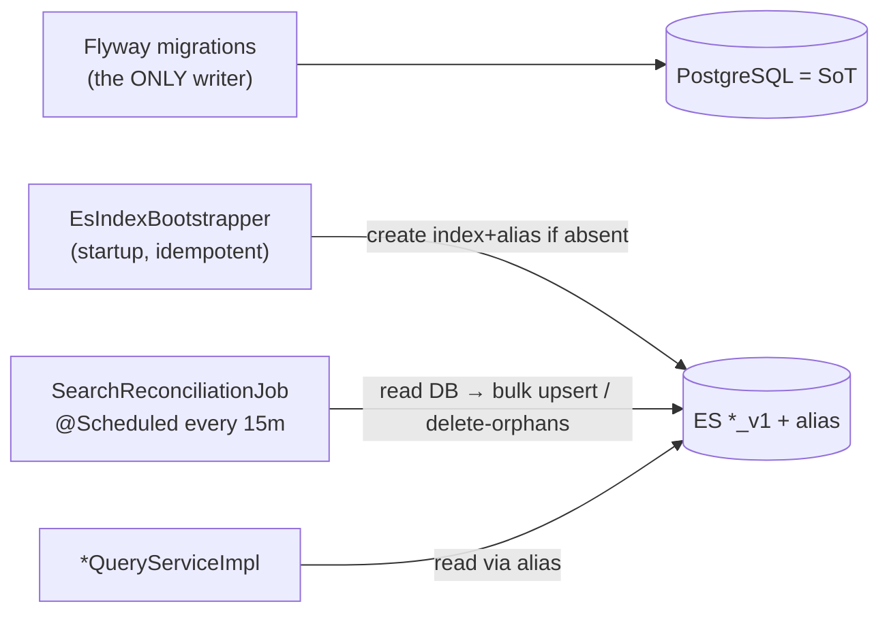

# Plan A — LEAN: Elasticsearch + Nori for `/facilities/search` & `/programs/search`

> Planner-A (LEAN). Scope is **D1=A (autocomplete only)**, FIXED. Viewport/map search stays on PostgreSQL/PostGIS.
> Philosophy: fix the *measured* bottleneck with the fewest moving parts, lowest ops burden, smallest risk surface. Argue against over-engineering at every fork.
> Every code/layout claim is grounded in `01-codebase-facts.md` (cited as `facts §N`) or the design doc (`design D#`).

---

## 0. LEAN thesis (read this first)

Three facts drive every choice below:

1. **The bottleneck is narrow and measured.** `facilities/search` is already fast (p95 33–39ms) and does *not* need ES for speed; only `programs/search` collapses under concurrency (~14 RPS degrade → 30 RPS ≈ 20–50s) because of `name_normalized ILIKE 'kw%' + ORDER BY id LIMIT` on 228k rows (`design D0`, `perf/BENCHMARK_REPORT.md`). The honest justification for ES is **Korean morphology quality + load isolation + headroom**, not raw latency (`design §ADR`).
2. **There is NO runtime write path for facility/program base rows.** They are loaded exclusively by Flyway migrations; the only live `@Transactional` mutations are bookmark/review toggles, which don't touch indexable fields (`facts §4`). **A Transactional Outbox has no domain transaction to hook into today.** The design doc's D7=Outbox is premature for the current reality — I diverge here (justified in §5).
3. **Zero search tests exist; Testcontainers is declared but unused** (`facts §7`). This is greenfield — no equivalence regression to preserve, so we test *intent*, not byte-parity (`design D12`).

**LEAN posture:** Spring Data Elasticsearch (productivity over low-level control), one ES index per domain behind an alias, **initial bulk index + a periodic `@Scheduled` reconciliation reindex from DB** as the *complete and honest* sync mechanism for today, a feature flag with DB fallback, and a small Testcontainers-Nori intent test suite. We defer the Outbox to the day admin CRUD lands, and we say exactly when that is.

---

## 1. Package / class layout (domain-first, grounded in `facts §8`)

The repo is strictly domain-first (`domain/{facility,program}/{controller,dto,entity,repository,service}`), config beans in `global/config/`, no `search/` or `infrastructure/` package exists (`facts §8`). We **match that convention** — no hexagonal layer, no new top-level package. ES is an alternate read adapter behind the existing `*QueryService` interfaces.

```
global/
  config/
    ElasticsearchConfig.java          // @Configuration, extends ElasticsearchConfiguration (Spring Data ES)
    SearchFeatureProperties.java      // @ConfigurationProperties("movemap.search") — flag + fallback toggles
domain/facility/
  repository/
    FacilitySearchDocument.java       // @Document(indexName="facility_search") — ES doc mapping
    FacilitySearchEsRepository.java    // custom adapter: builds NativeQuery, calls ElasticsearchOperations
  service/
    FacilityQueryServiceImpl.java     // MODIFIED: delegate searchFacilityListByKeyword → ES adapter w/ flag+fallback
domain/program/
  repository/
    ProgramSearchDocument.java        // @Document(indexName="program_search")
    ProgramSearchEsRepository.java     // NativeQuery + search_after + completion suggester
  service/
    ProgramQueryServiceImpl.java      // MODIFIED: delegate searchPrograms → ES adapter w/ flag+fallback
global/search/                        // ONE cross-cutting package (the only new one) for indexing plumbing
  EsIndexBootstrapper.java            // creates index+alias if absent on startup (idempotent)
  SearchReconciliationJob.java        // @Scheduled full/delta reindex from DB (the sync mechanism)
  SearchIndexAdminController.java     // POST /internal/search/reindex (manual trigger, auth-gated) — optional
```

Why `global/search/` and not per-domain for the indexer: the reconciliation job reads *both* domains and owns cross-cutting index lifecycle (alias swap, bootstrap). Putting it under one domain would misattribute ownership. This is the single deviation from pure domain-first, and it is justified by cross-domain scope. Everything query-facing stays inside its domain package, preserving the `*QueryService` contracts (`facts §8` convention).

**Contracts preserved (no controller/DTO changes):**
- `FacilitySimpleListResponse{ List<FacilitySimpleInfo>{id,name,facilityType,facilitySubtype,address} }` (`facts §1`).
- `ProgramSimpleListResponse{ List<ProgramSimpleItem>{id,programName,facilityName,facilitySubtype,address}, nextCursor, hasNext, currentSize }` (`facts §1`).
- `FacilityController.searchFacilityListByKeyword` L170-184 and `ProgramController.searchPrograms` L216-225 are untouched (`facts §1`). The swap happens entirely behind `*QueryServiceImpl`.

---

## 2. ES index mappings (A scope: text fields only, no geo/filter/bitmask)

Per `design D2`, A-scope documents are **text-only**: no `location`, no `price`, no `weekdays`/`target` bitmask, no `region_cd`. Two indices, each behind an alias.

### 2.1 Shared analysis settings (Nori)

```jsonc
// settings applied to BOTH facility_search_v1 and program_search_v1
{
  "settings": {
    "index": { "number_of_shards": 1, "number_of_replicas": 0 },   // single node / lean; bump replicas if managed multi-AZ
    "analysis": {
      "tokenizer": {
        "nori_mixed_tokenizer": {
          "type": "nori_tokenizer",
          "decompound_mode": "mixed",                               // design D3: 강남스포츠센터→전체+부분
          "user_dictionary": "userdict_ko.txt"                      // file-based; empty at v1, grows later (design D4)
        }
      },
      "filter": {
        "nori_posfilter": {
          "type": "nori_part_of_speech",
          // default stoptags drop XPN(prefix) → "비급여"→"급여" reversal risk (design D3 warning).
          // LEAN: start with DEFAULT stoptags, add domain audit as a P4 tuning task, not a P1 blocker.
          "stoptags": ["E","IC","J","MAG","MAJ","MM","SP","SSC","SSO","SC","SE","XPN","XSA","XSN","XSV","UNA","NA","VSV"]
        },
        "lowercase_filter": { "type": "lowercase" }                 // fixes facility case-sensitivity bug (facts §2)
      },
      "analyzer": {
        "nori_index":  { "type": "custom", "tokenizer": "nori_mixed_tokenizer",
                         "filter": ["nori_posfilter","lowercase_filter"] },
        "nori_search": { "type": "custom", "tokenizer": "nori_mixed_tokenizer",
                         "filter": ["nori_posfilter","lowercase_filter"] }
      }
    }
  }
}
```

> Note: index and search analyzer are identical at v1 (both `nori_mixed`). We keep them as *separate named analyzers* so synonyms can later be attached to `nori_search` as an `updateable` filter and hot-reloaded without reindex (`design D4`). No synonyms at v1 — YAGNI.

### 2.2 `program_search` mapping

```jsonc
{
  "mappings": {
    "properties": {
      "id":               { "type": "long" },
      "name": {
        "type": "text", "analyzer": "nori_index", "search_analyzer": "nori_search",
        "fields": { "keyword": { "type": "keyword" } }              // sort/agg + exact
      },
      "facility_name": {
        "type": "text", "analyzer": "nori_index", "search_analyzer": "nori_search",
        "fields": { "keyword": { "type": "keyword" } }
      },
      "facility_subtype": { "type": "keyword" },                    // used as a search term today via ILIKE; keyword is enough
      "address":          { "type": "keyword" },                    // display-only in the Simple DTO; not searched today
      "suggest": {
        "type": "completion", "analyzer": "nori_index",
        "preserve_separators": true, "preserve_position_increments": true, "max_input_length": 100
      }
    }
  }
}
```

### 2.3 `facility_search` mapping (near-identical, no cursor needs)

```jsonc
{
  "mappings": {
    "properties": {
      "id":               { "type": "long" },
      "name": {
        "type": "text", "analyzer": "nori_index", "search_analyzer": "nori_search",
        "fields": { "keyword": { "type": "keyword" } }
      },
      "facility_type":    { "type": "keyword" },                    // returned in FacilitySimpleInfo
      "facility_subtype": { "type": "keyword" },                    // searched today (facts §2: name OR facility_subtype)
      "address":          { "type": "keyword" },
      "suggest":          { "type": "completion", "analyzer": "nori_index", "max_input_length": 100 }
    }
  }
}
```

**LEAN mapping decisions & what they drop:**
- `facility_subtype`/`address` as `keyword` (not analyzed `text`). Today facility search does `name LIKE '%kw%' OR facility_subtype LIKE '%kw%'` (`facts §2`); subtypes are a small controlled vocabulary, so a keyword-term match on the tokenized query is sufficient and cheaper than a second nori field. If subtype partial-match matters, promote to a nori multi-field in P4 — cheap, alias-swapped.
- `completion` field is populated from `name` only (the prefix use-case in `design D5`). We do **not** feed facility_name into program suggest to avoid double-source ambiguity in v1.
- No `edge_ngram`. `design D5` picks completion suggester (confirmed). We honor that — one prefix mechanism, not two.

---

## 3. Client & config

**Choice: Spring Data Elasticsearch** (`ElasticsearchOperations` + `NativeQuery`), per `design D6` and LEAN productivity bias. It wraps the official Java client, so we retain low-level escape hatches (`.withQuery(co.elastic.clients...)`) for the completion suggester and `search_after` without adopting the raw client's boilerplate everywhere.

**Version pins (grounded in Spring Boot 3.5.7 BOM, `facts §5`):**
| Artifact | Version | Source |
|---|---|---|
| `spring-boot-starter-data-elasticsearch` | 3.5.7 (managed) | Boot BOM |
| `spring-data-elasticsearch` | 5.5.x (transitive) | Boot 3.5 BOM |
| `co.elastic.clients:elasticsearch-java` | 8.18.x (transitive) | Boot 3.5 BOM |
| ES **server** | 8.18.x | pin server to client minor to stay in the [supported skew](https://www.elastic.co/support/matrix) |
| `analysis-nori` plugin | matches server 8.18.x | bundled in custom image (§9) |
| `org.testcontainers:elasticsearch` | 1.20.1 (align w/ existing testcontainers `facts §5`) | test only |

```java
// global/config/ElasticsearchConfig.java
@Configuration
class ElasticsearchConfig extends ElasticsearchConfiguration {
  private final EsProps props; // uris, username, password, apiKey
  @Override public ClientConfiguration clientConfiguration() {
    var b = ClientConfiguration.builder().connectedTo(props.host());   // e.g. localhost:9200
    if (props.tls())     b = b.usingSsl();
    if (props.hasAuth()) b = b.withBasicAuth(props.username(), props.password());
    return b.withConnectTimeout(Duration.ofSeconds(2))
            .withSocketTimeout(Duration.ofSeconds(2))                  // fail fast → fallback (§6)
            .build();
  }
}
```

```yaml
# application-*.yml (new keys; secrets stay in gitignored profiles per facts §6)
movemap:
  search:
    engine: es              # es | db  → the feature flag (§6)
    fallback-to-db: true
    es:
      host: ${ES_HOST:localhost:9200}
      tls: ${ES_TLS:false}
      username: ${ES_USER:}
      password: ${ES_PASS:}
    reconcile:
      cron: "0 */15 * * * *" # every 15 min (§5)
      enabled: true
```

Config bean lives in `global/config/` next to `SecurityConfig` (`facts §8` convention).

---

## 4. Query implementation

### 4.1 Facility `/search` (fixed 30, no pagination)

Today: `name LIKE '%kw%' OR facility_subtype LIKE '%kw%' LIMIT 30`, case-sensitive (`facts §2`). ES mapping:

```jsonc
// GET facility_search/_search
{
  "size": 30,
  "query": {
    "bool": {
      "should": [
        { "match": { "name": { "query": "<kw>", "operator": "and" } } },   // nori-analyzed, case-insensitive now
        { "term":  { "facility_subtype": "<kw>" } }
      ],
      "minimum_should_match": 1
    }
  }
}
```
- `operator:and` keeps multi-token queries ("강남 축구") conjunctive — directly addresses the `FIXME` at FacilityController L167-169 (`facts §1`).
- Fixed `size:30`; no cursor (matches contract, `facts §1`). Sort defaults to `_score` (relevance) — an *improvement* over today's undefined order, acceptable because there is no equivalence contract to preserve (`design D12`).

### 4.2 Program `/search` (prefix today → completion + match, cursor → `search_after`)

Today: `name_normalized ILIKE 'kw%' OR facility_name_normalized ILIKE 'kw%'`, whitespace stripped, `id > cursor ORDER BY id ASC LIMIT size` (`facts §2`). The design confirms **completion suggester** for prefix (`design D5`) and **`search_after` + id tie-breaker** for the cursor (`design D8`).

**Two-part behavior, kept simple:**
- **Primary (prefix autocomplete):** completion suggester on `suggest` field → returns up to `size` ids fast (FST in-memory). This is the honest replacement for `'kw%'` prefix semantics.
- **Cursor "더보기" / full match:** a `match` query with `search_after` for the paginated path, because completion suggester does **not** paginate. LEAN decision: use completion for the *first* page (fast prefix), and `match` + `search_after` when `cursor != null`.

```jsonc
// First page (cursor == null): prefix autocomplete
// GET program_search/_search
{ "suggest": { "prog": { "prefix": "<normalizedKw>", "completion": { "field": "suggest", "size": 20 } } } }

// Subsequent pages (cursor != null): match + search_after, id tie-breaker
{
  "size": 20,
  "query": {
    "bool": { "should": [
      { "match_phrase_prefix": { "name": "<normalizedKw>" } },
      { "match_phrase_prefix": { "facility_name": "<normalizedKw>" } }
    ], "minimum_should_match": 1 }
  },
  "sort": [ { "id": "asc" } ],          // preserves today's ORDER BY id ASC (facts §2)
  "search_after": [ <cursorId> ]        // nextCursor = last hit's id
}
```

**Normalization parity (critical):** today the app strips whitespace via `keyword.replaceAll("\\s+","")` (`ProgramSearchByKeywordRequest.normalizedKeyword`, `facts §2`) and the DB stored column strips only literal spaces. In ES we **apply the same `\\s+`→"" strip to the query string before sending it to the suggester**, and feed the `suggest` input field from the *same normalized program name* at index time. This keeps prefix semantics identical without depending on Postgres generated columns.

> LEAN honesty: `match_phrase_prefix` on the cursor path is a slightly different recall profile than the completion suggester on page 1. That's an accepted, documented "conscious difference" (`design D12`), not a regression. For a portfolio-scale autocomplete this is fine; if page-1/page-N consistency ever matters, switch both to a single `search_as_you_type` field (one mechanism) — a P4 alias-swap, not a rewrite.

**Response mapping:** ES hits → existing `ProgramSimpleItem`/`FacilitySimpleInfo` records unchanged; `nextCursor = lastId`, `hasNext = (hits == size+1)` mirroring the current `size+1` probe at `ProgramQueryServiceImpl` L132 (`facts §2`).

---

## 5. Indexing / sync — the LEAN core argument

### 5.1 Confront the reality head-on

`facts §4` is unambiguous: **no application code creates/updates/deletes facility or program rows.** They are populated only by Flyway migrations (`V3.*`, `V4.*`, `V5.*`, `V14.*`). The only live `@Transactional` writes are bookmark/review toggles, which change *computed* fields (`avgRating`, `reviewCount`) that A-scope documents **don't even store**. Therefore:

> **A Transactional Outbox would be wiring a relay worker + outbox table to a transaction that never fires.** It is pure ceremony today — code that can never be exercised, cannot be tested against a real write, and adds an operational component (relay worker, outbox table, poll loop) for zero current benefit. This is textbook over-engineering. **I diverge from `design D7`=Outbox.**

### 5.2 The LEAN sync design: bulk index + scheduled reconciliation



**Initial bulk index** (`EsIndexBootstrapper` + first reconciliation run, or explicit `POST /internal/search/reindex`):
- Stream rows with a keyset cursor (`SELECT id,name,facility_name,facility_subtype,address FROM program WHERE id > ? ORDER BY id LIMIT 5000`) to bound memory over 228k rows.
- `BulkRequest` batches of ~2–5k docs via `ElasticsearchOperations.bulkIndex`.
- Build the `suggest` input from the whitespace-stripped name (parity, §4.2).

**Reconciliation job** (`@Scheduled(cron)`, the honest sync):
- Because Flyway is the only writer, **data changes only on deploy/migration**. A periodic full-or-delta reconcile from DB is not just "good enough" — it is *exactly aligned* with how data actually changes. There is no missed-event window because there are no runtime events.
- v1 = **cheap full reconcile**: count-and-checksum guard (compare `COUNT(*)` and `MAX(id)` DB-vs-ES; only do a full bulk reindex-into-new-version + alias swap when they diverge). Because migrations are infrequent, this runs cheaply and mostly no-ops.
- Trigger a reindex explicitly at the end of a data-loading deploy via the admin endpoint — turning "sync" into a deploy step, which matches the deploy-time nature of the data.

### 5.3 When to upgrade to Outbox (stated explicitly)

Adopt the `design D7` Outbox **the day an admin/CRUD write path for facility/program rows is introduced** — i.e., when a service method does `facilityRepository.save(...)` or `programRepository.save(...)` inside a domain `@Transactional` (none exist today, `facts §4`). At that point:
- Add `outbox(id, aggregate_type, aggregate_id, op, created_at, processed_at)`; write to it in the same transaction as the save.
- A `@Scheduled` relay (reuse `spring-retry`, already on classpath `facts §5`) polls unprocessed rows → bulk index → mark processed.
- Keep the reconciliation job as the drift backstop (`design D11`).

This is a **one-file-per-domain addition** later, not a rearchitecture — the read path, mappings, alias, and fallback are all unchanged. The reconciliation job we build now *is* the D11 safety net the Outbox would need anyway, so nothing is wasted.

**Confidence that bulk+reconcile is sufficient for today: 85%.** The 15% risk: if the team quietly adds runtime writes without noticing, ES silently drifts for up to one reconcile interval. Mitigated by (a) the reconcile job, (b) a code-review note, (c) the explicit upgrade trigger above.

---

## 6. Rollout & fallback

**Feature flag:** `movemap.search.engine = es | db` (property-driven, per-endpoint override possible later). Default `db` until P3 validation passes, then flip to `es`.

**Dual-read with DB fallback** inside `*QueryServiceImpl` (contract unchanged, `facts §8`):

```java
public FacilitySimpleListResponse searchFacilityListByKeyword(Long memberId, String keyword) {
  if (props.engine() == DB) return legacyDbSearch(keyword);            // existing FacilityRepository path (facts §2)
  try {
    return esAdapter.search(keyword);
  } catch (Exception e) {                                              // ES down / timeout (2s, §3)
    meter.increment("search.es.fallback", "domain", "facility");
    log.warn("ES facility search failed, falling back to DB", e);
    if (props.fallbackToDb()) return legacyDbSearch(keyword);
    throw new CustomException(ErrorCode.SEARCH_UNAVAILABLE);           // reuse existing exception infra (facts §8)
  }
}
```

- **How toggled:** config property (hot via `@RefreshScope` optional; a restart is acceptable at portfolio scale — LEAN). No dynamic flag service.
- **How failures surface:** a Micrometer counter `search.es.fallback{domain}` (visible in the existing/perf Prometheus stack, `00-perf-impl.md` P2) + WARN log. A sustained nonzero fallback rate is the alert signal (§9).
- **Legacy path is retained, not deleted** — it is both the fallback and the `engine=db` mode. This is the smallest possible safety net that is still real.

**Cutover sequence:** deploy with `engine=db` → bulk index → verify counts + intent tests green against prod-like data → flip `engine=es` → watch fallback counter + p95 → keep DB path for ≥1 release before considering removal (we recommend *never* removing it; it's cheap insurance).

---

## 7. Testing (greenfield — `facts §7`, `design D12`)

No equivalence/parity regression (morphology *should* change results, `design D12`). Test intent + contract + engine wiring.

**7.1 Testcontainers ES + Nori integration** — activate the already-declared-but-unused Testcontainers dep (`facts §5`, §7). Nori isn't in the stock image, so build a fixture image:
```dockerfile
# src/test/resources/es-nori/Dockerfile
FROM docker.elastic.co/elasticsearch/elasticsearch:8.18.3
RUN bin/elasticsearch-plugin install --batch analysis-nori
```
```java
@Container static ElasticsearchContainer ES =
  new ElasticsearchContainer(new ImageFromDockerfile().withDockerfile(Path.of("src/test/resources/es-nori/Dockerfile")))
    .withEnv("xpack.security.enabled","false");
```
Reuse a single container across the suite (static) for speed.

**7.2 Intent-based acceptance tests** (`design D12`) — the analyzer tuning judge:
- `"수영"` → results include a facility/program whose name contains 수영장 (inclusion, not equality).
- `"강남 축구"` (the FIXME case, `facts §1`) → returns 강남 축구 programs with `operator:and` — the concrete motivation for the migration.
- Case-insensitivity: `"YOGA"` and `"yoga"` return the same set (fixes the facility case-sensitive bug, `facts §2`).
- Prefix parity: `"수 영"` (with space) normalizes to `"수영"` and returns the same first page as `"수영"` (whitespace-strip parity, §4.2).
- Cursor: page 1 (`cursor=null`) + page 2 (`cursor=lastId`) return disjoint, id-ascending sets summing to the full match (search_after correctness, §4.2).

**7.3 Engine-agnostic contract tests** — assert response *schema* independent of engine: `FacilitySimpleListResponse` has ≤30 items; `ProgramSimpleListResponse` has `nextCursor`/`hasNext`/`currentSize` consistent with `items.size()`. Run the **same** contract test against both `engine=db` and `engine=es` — proves the swap preserves the contract (`facts §1`).

**7.4 Fallback test:** point the ES client at a dead port with `fallback-to-db=true` → assert DB results returned and the fallback counter incremented.

**Explicitly NOT tested:** old-vs-new result equality (anti-goal, `design D12`).

---

## 8. Security posture (brief — LEAN; another planner goes deep)

- **Keyword input:** ES queries are built via the typed Java client (`NativeQuery` / `co.elastic.clients` builders), not string concatenation → no query-injection surface. Keep the existing bean-validation caps (`keyword` ≤100 for program, `@NotBlank`; facility unbounded today — add a ≤100 guard while we're here) (`facts §1`). Cap completion `size` server-side.
- **ES network/auth:** ES bound to a private network/VPC only, **never** publicly reachable. Enable `xpack.security` with basic-auth or API-key in all non-test envs; TLS on the client (§3). Secrets live in the gitignored profiles like existing DB creds (`facts §6`), never in the repo.
- **Actuator:** the perf work adds `/actuator/prometheus` (`00-perf-impl.md` P2). Do **not** blanket-whitelist `/actuator/**` in `SecurityConfig` (`facts §6`); expose only `health,prometheus` and prefer a separate management port, or whitelist the exact paths. ES health should surface via a custom indicator, not by exposing ES itself.
- **PII:** A-scope documents store only public catalog fields (name, facility_name, subtype, address) — **no member data** (`facts §1`). Bookmarks/`isBookmarked` are computed at query time in PG and are *not* indexed. So the ES index carries no PII; auth on the endpoints (JWT, `facts §6`) still applies unchanged since the controllers are untouched.

---

## 9. Ops (minimal but present)

- **Alias / reindex (`design D10`):** app always reads `facility_search` / `program_search` *aliases*; concrete indices are `*_v1`, `*_v2`… Reindex = build `_v2` → bulk load → atomic `POST _aliases {remove _v1, add _v2}`. Ship this as the `SearchIndexAdminController.reindex` endpoint + a documented runbook. Because dictionary changes require reindex (`design D4`), this procedure is the dictionary-update procedure too.
- **Config:** one custom Nori image (§7.1 Dockerfile) reused for test and runtime; version pinned to 8.18.x (§3).
- **Observability (reuse the perf Prometheus/Grafana stack, `00-perf-impl.md` P2):**
  - `search.es.fallback{domain}` counter (fallback rate → primary alert).
  - `search.es.latency{domain}` timer (compare against the DB baseline from `perf/`).
  - Reconcile job: last-run timestamp + DB-vs-ES count gauge (drift detector).
  - A custom Spring `HealthIndicator` pinging ES cluster health.
- **Backup:** single-node lean setup → nightly snapshot to object storage only if self-hosting (see §10); managed handles it.

---

## 10. Open-item resolutions (recommendation + confidence)

| Open item | LEAN recommendation | Confidence |
|---|---|---|
| **Self-host vs managed (Elastic Cloud)** | **Managed (Elastic Cloud, smallest tier) for running the service; self-host only in local/Testcontainers.** LEAN optimizes for lowest *operational* burden — self-managed ES means JVM tuning, snapshots, upgrades, node monitoring (`design §ADR` lists these as accepted costs). For a single-index autocomplete workload, managed removes all of that for ~one small node's cost, and Elastic Cloud ships Nori as a supported plugin. **Caveat:** if this is explicitly a portfolio piece meant to *demonstrate* ES operations, self-host one node via docker-compose (reusing the `perf/` compose pattern, `facts §9`) to have an ops story to tell. Decision hinges on the portfolio narrative goal — flagged for the owner. | 60% (managed) / narrative-dependent |
| **Review-search inclusion** (`facility_review`/`program_review`) | **Exclude from this migration.** Not in the measured bottleneck, not in the A-scope Simple DTOs (`facts §1`), and reviews *do* have a runtime write path (`facts §4`) which would force the Outbox question early. Keep A tight; revisit as a separate initiative. | 85% (exclude) |
| **D4 dictionary curation** (manual vs semi-auto) | **Ship v1 with an empty `userdict_ko.txt` + `mixed` decompound; curate later, semi-automatically.** LEAN: don't hand-curate a dictionary before data proves it's needed. Start with `mixed` (handles most compounds, `design D3`), let intent tests (§7.2) surface bad splits, then extract candidate proper nouns semi-automatically from high-frequency facility/program name tokens (`SELECT name, COUNT(*)…`) and register the ones that mis-split. Manual curation only for the long tail. Every dictionary change = reindex via the §9 alias procedure. | 70% (empty→semi-auto) |

---

## 11. Effort, risks, and the tradeoffs LEAN accepts

### 11.1 Effort (per phase, roadmap-aligned `design §5`)

| Phase | Work | Est. |
|---|---|---|
| P1 Infra | Boot dep + `ElasticsearchConfig`, custom Nori image, two mappings+alias, `EsIndexBootstrapper` | 2–3 d |
| P2 Indexing | Bulk indexer (keyset stream) + `SearchReconciliationJob` + reindex endpoint | 2–3 d |
| P3 Cutover | Two ES adapters, flag+fallback in both `*QueryServiceImpl`, wire response mapping | 2–3 d |
| P4 Test+tune | Testcontainers-Nori suite, intent/contract/fallback tests, re-run 30 RPS bench to quantify | 3–4 d |
| **Total** | | **~2 weeks (1 dev)** |

The Outbox we *don't* build saves ~2–3 d now and, more importantly, removes an untestable component (no write to trigger it) from the risk surface.

### 11.2 Risks
- **Nori plugin image drift** — must rebuild on every ES minor bump (mitigate: pin 8.18.x, Dockerfile in repo).
- **`nori_part_of_speech` XPN prefix reversal** ("비급여"→"급여", `design D3`) — start default stoptags, audit domain vocab in P4 (intent tests catch egregious cases).
- **Silent drift if runtime writes appear** — mitigated by reconcile job + explicit Outbox-upgrade trigger (§5.3); residual 15%.
- **`facility` didn't need ES for speed** — we index it anyway for morphology/consistency and the "강남 축구" FIXME (`facts §1`); accept minor extra ops for one small index.
- **Managed-vs-self-host undecided** — blocks nothing technical; the client config (§3) is identical either way.

### 11.3 TRADEOFFS LEAN explicitly accepts (vs a robust plan)
1. **No Outbox → up-to-one-interval drift *if* runtime writes are added unnoticed.** We accept eventual/deploy-time consistency because the data only changes at deploy today (`facts §4`). A robust plan pays for real-time consistency infra that currently has nothing to consist.
2. **Page-1 (completion suggester) vs page-N (`match_phrase_prefix`) recall differ.** We accept a documented "conscious difference" (`design D12`) instead of unifying on `search_as_you_type` now. Robust plan gets uniform paging semantics at the cost of a heavier field + tuning.
3. **Restart-to-flip feature flag, no dynamic flag service; DB fallback retained indefinitely as the only safety net.** We accept a manual cutover and a "keep the old code" strategy over blue/green search infra or a config service. Robust plan gets zero-downtime dynamic toggling; we get one property and a `try/catch`.

### 11.4 Self-critique (honest)
- **Biggest wobble:** indexing `facility` at all. It's already fast; the *only* honest reasons are the "강남 축구" multi-token FIXME and stack consistency. A stricter LEAN reading would ship **program-only** first and defer facility to P4. I'd actually recommend that as a fallback if timeline compresses — program-only is the true measured bottleneck, ~30% less P3 work. (Confidence this is the better sequencing: 55%.)
- **The reconcile "count+MAX(id) checksum" is coarse** — it won't detect an in-place UPDATE that changes a name without changing count or max id (e.g., `V14.3` UPDATE-heavy migrations, `facts §4`). Honest fix: also compare a cheap `MAX(updated_at)` if such a column exists, or just reindex-on-deploy unconditionally (simplest, and matches deploy-time data changes). I lean toward **reindex-on-deploy as a deploy step** over clever drift detection — less code, no false-confidence. (Confidence: 75%.)
- **Divergence from `design D7`=Outbox is a deliberate, defensible call, not an oversight** — but it *does* contradict a "confirmed" decision in the design doc. If the judge weights design-doc fidelity over current-reality fit, this is where I lose points. I stand by it: wiring an Outbox to a nonexistent transaction is the more indefensible choice (§5.1).
