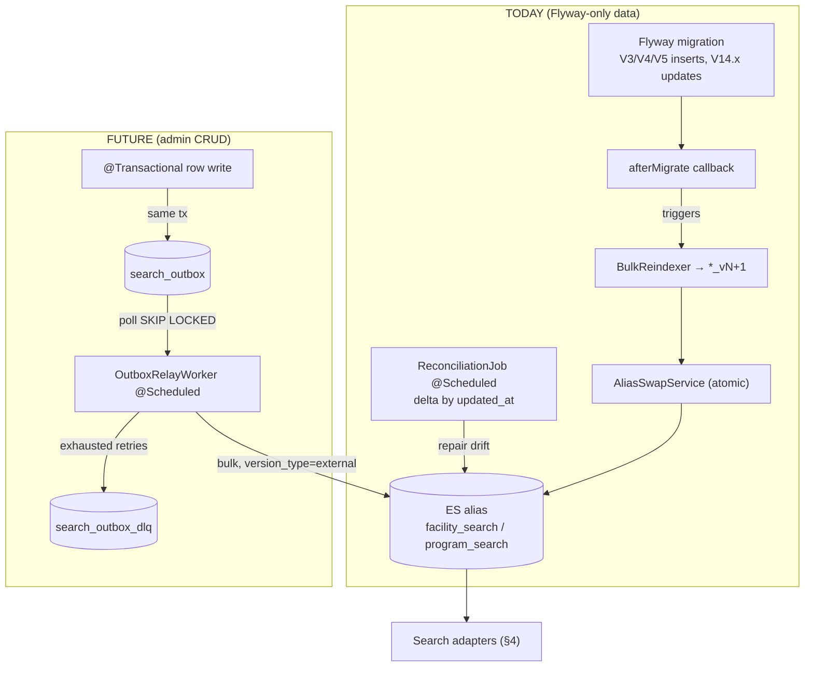

# Plan B — ROBUST / PRODUCTION-GRADE

> **Scope (FIXED): D1 = A** — only `GET /facilities/search` and `GET /programs/search` move to Elasticsearch 8.x + Nori. Viewport/map (`/markers`, `/list`) stays on PostgreSQL/PostGIS. This plan does **not** expand scope; it invests in *how well* the migration is operated.
>
> **Philosophy:** consistency guarantees, operability, graceful failure recovery — accept higher complexity **only where it earns operational payoff**. Every layer below is justified against payoff; layers with none (CDC/Kafka, geo in ES) are explicitly refused.
>
> **Grounding:** Java **17** (`build.gradle:17` — *not* 21 as the brief said), Spring Boot 3.5.7 (`build.gradle:3`), no ES dependency yet (`build.gradle`, confirmed absent), domain-first packages (`01-codebase-facts.md §8`), no runtime write path for facility/program base rows (`§4`), seed ~55k facility / ~228k program rows via Flyway.

---

## 0. The load-bearing reality this plan is built around

Two facts dominate every design choice and must be confronted head-on, not papered over:

1. **There is no application write path for `facility`/`program` base rows today.** The only `@Transactional` mutations touching these aggregates are **bookmark toggles** on join tables (`FacilityCommandServiceImpl:28,41`, `ProgramCommandServiceImpl:24,37`) — they never change an indexable field. Base rows are loaded **exclusively by Flyway** (`V3.*/V4.*/V5.*` inserts, `V14.3/V14.4` updates) (`§4`). **A Transactional Outbox has no domain transaction to hook into today.**
2. **There is no `updated_at` on `facility`/`program`.** Reconciliation-by-delta and external versioning both need a monotonic change marker that does not exist yet (`Facility.java`/`Program.java` field lists, `§3`).

A naïve "production" plan bolts an Outbox onto a system with nothing to write to it — pure ceremony. The robust move is to **separate the mechanism that keeps ES correct *today* from the mechanism that will keep it correct *once admin-CRUD exists*,** and build both so the transition is a config flip, not a rewrite:

| World | Authoritative sync mechanism | Status in this plan |
|---|---|---|
| **Today** (Flyway-only data load) | **Migration-triggered full/delta reindex** into a fresh versioned index + atomic alias swap. Reconciliation batch is the *steady-state* correctness guarantee. | **Primary, built in P2.** |
| **Future** (admin CRUD writes rows at runtime) | **Transactional Outbox** written in the same DB tx as the row change → relay worker → idempotent bulk index. | **Built but dormant in P2**, activated when the first `@Transactional` write path for a base row ships. |

So: the Outbox table, relay worker, and idempotency/versioning machinery are all built now (they cost little and prove the architecture), but **the thing actually keeping ES non-drifting today is the reconciliation batch + reindex-on-migration**, because that matches how data actually changes. This is stated openly rather than pretending an Outbox is doing work it cannot do. (Confidence this framing is the correct read of the codebase: **90%**.)

---

## 1. Package / class layout (domain-first)

Follows the existing convention exactly (`§8`): per-domain `controller/dto/entity/repository/service`, cross-cutting in `global/`. ES is a **secondary read-model adapter behind the existing `*QueryService` interfaces** — controllers and DTOs are untouched, so the feature flag can swap implementations with zero contract change.

```
org.wemightmove.movemap
├── global
│   ├── config
│   │   ├── ElasticsearchConfig.java         // co-located ElasticsearchClient + ElasticsearchOperations beans
│   │   └── SecurityConfig.java              // (existing) — /actuator/prometheus whitelist added
│   └── search                                // NEW cross-cutting search infra (only shared, non-domain pieces)
│       ├── client
│       │   └── EsIndexClient.java           // thin wrapper: bulk(), aliasSwap(), refresh(), search() with metrics
│       ├── outbox
│       │   ├── SearchOutbox.java            // @Entity for search_outbox
│       │   ├── SearchOutboxRepository.java  // JpaRepository + claim query (SKIP LOCKED)
│       │   ├── SearchOutboxAppender.java     // enqueue(aggregateType, aggregateId, op) — called by future CRUD
│       │   ├── OutboxRelayWorker.java        // @Scheduled poll → bulk → mark DONE/DLQ
│       │   └── OutboxDlqRepository.java
│       ├── reconcile
│       │   ├── ReconciliationJob.java       // @Scheduled delta-by-updated_at DB↔ES compare+repair
│       │   └── ReconciliationReport.java    // drift counts (fed to Micrometer)
│       ├── reindex
│       │   ├── IndexBootstrapper.java       // create versioned index from mapping JSON
│       │   ├── BulkReindexer.java           // full scroll-read from PG → bulk into *_vN
│       │   └── AliasSwapService.java         // atomic remove-old/add-new
│       ├── metrics
│       │   └── SearchMetrics.java           // Micrometer: lag, relay failures, fallback rate, drift
│       └── model
│           ├── FacilityDoc.java             // ES document POJO
│           └── ProgramDoc.java
├── domain.facility
│   ├── controller/FacilityController.java   // UNCHANGED
│   ├── service
│   │   ├── FacilityQueryService.java        // UNCHANGED interface
│   │   ├── FacilityQueryServiceImpl.java    // existing PG impl → becomes the FALLBACK
│   │   └── FacilitySearchEsAdapter.java     // NEW: ES-backed keyword search
│   ├── search/FacilitySearchRouter.java     // flag+fallback: ES primary, PG fallback, emits fallback metric
│   └── repository/FacilityEsRepository.java // low-level ES query for facility docs
└── domain.program
    ├── service/ProgramQueryServiceImpl.java // existing PG impl → FALLBACK
    ├── service/ProgramSearchEsAdapter.java  // NEW
    ├── search/ProgramSearchRouter.java
    └── repository/ProgramEsRepository.java
```

**Placement rationale:** domain-specific *query* logic (how a facility search maps to an ES query, DTO assembly) lives in `domain/{facility,program}` to respect the domain-first convention. Genuinely cross-cutting infra with no single domain owner — outbox, relay, reconciliation, reindex, alias, the shared client, metrics — lives in a new `global/search/` package, mirroring how `global/util`, `global/jwt`, `global/config` already hold shared machinery (`§8`). No hexagonal/ports rewrite (the repo has none — `§8`); we stay adapter-style.

---

## 2. Index mappings, settings, versioning

### 2.1 Versioning + alias model (D10)

- Physical indices are versioned: `facility_v1`, `program_v1`, `program_v2`, …
- Applications **only ever touch aliases**: `facility_search`, `program_search`.
- Dictionary/mapping change ⇒ build `*_vN+1`, reindex, **atomic alias swap** (remove old + add new in one `_aliases` action). No window where the alias points at two indices or none. (D4/D10.)
- A write alias is **not** needed in scope A (single-index-per-alias, no rollover); we keep it simple and add rollover only if index size ever demands it (it won't at 55k/228k docs — a few hundred MB).

### 2.2 Shared analysis settings (both indices)

Nori `decompound_mode: mixed` (D3), `keyword` subfield for exact/sort, `completion` for suggest (D5), plus a **synonym search-analyzer marked `updateable:true`** so synonyms hot-reload while the tokenizer dictionary requires reindex (D4 — the two paths are deliberately split).

```jsonc
// settings (identical block reused for facility_vN and program_vN)
{
  "settings": {
    "index": {
      "number_of_shards": 1,           // 55k/228k docs → 1 primary is ample
      "number_of_replicas": 1,         // 1 replica for availability; drop to 0 on single-node dev
      "refresh_interval": "1s",        // near-real-time; raised to -1 during bulk reindex, restored after
      "analysis": {
        "tokenizer": {
          "nori_user_dict": {
            "type": "nori_tokenizer",
            "decompound_mode": "mixed",
            "user_dictionary": "userdict_ko.txt"   // file-based → versioned in repo, drives reindex on change
          }
        },
        "filter": {
          "nori_pos_filter": {
            "type": "nori_part_of_speech",
            // default stoptags drop XPN (prefix) → "비급여"→"급여" reversal risk (D3 warning).
            // Domain audit of prefix terms (비회원/무산소/…) happens in P4; start with defaults, tune via reindex.
            "stoptags": ["E","IC","J","MAG","MAJ","MM","SP","SSC","SSO","SC","SE","XPN","XSA","XSN","XSV","UNA","NA","VSV"]
          },
          "nori_readingform": { "type": "nori_readingform" },
          "synonym_search": {
            "type": "synonym_graph",
            "synonyms_path": "synonyms_ko.txt",
            "updateable": true          // hot-reload via _reload_search_analyzers (no reindex)
          },
          "edge_ngram_filter": { "type": "edge_ngram", "min_gram": 1, "max_gram": 20 }
        },
        "analyzer": {
          "nori_index": {
            "type": "custom", "tokenizer": "nori_user_dict",
            "filter": ["nori_pos_filter", "nori_readingform", "lowercase"]
          },
          "nori_search": {
            "type": "custom", "tokenizer": "nori_user_dict",
            "filter": ["nori_pos_filter", "nori_readingform", "lowercase", "synonym_search"]
          },
          "edge_ngram_index": {
            "type": "custom", "tokenizer": "nori_user_dict",
            "filter": ["nori_pos_filter", "lowercase", "edge_ngram_filter"]
          },
          "edge_ngram_search": {
            "type": "custom", "tokenizer": "nori_user_dict",
            "filter": ["nori_pos_filter", "lowercase"]   // NO edge_ngram at search time (prevents over-match)
          }
        }
      }
    }
  }
}
```

### 2.3 `facility_v1` mapping

Fields chosen to serve the facility `/search` contract only (`FacilitySimpleInfo{id,name,facilityType,facilitySubtype,address}`, `01-codebase-facts.md §1`). No geo/filter/bitmask fields (D1=A, D2). `LIKE '%kw%'` today matches `name` **and** `facility_subtype` (`FacilityRepository.java:16-17`) — both are searchable here; `address` is display-only.

```jsonc
{
  "mappings": {
    "_source": { "enabled": true },
    "properties": {
      "id":               { "type": "long" },
      "name": {
        "type": "text", "analyzer": "nori_index", "search_analyzer": "nori_search",
        "fields": {
          "keyword":      { "type": "keyword", "ignore_above": 256 },
          "ngram":        { "type": "text", "analyzer": "edge_ngram_index", "search_analyzer": "edge_ngram_search" }
        }
      },
      "facility_type":    { "type": "keyword" },
      "facility_subtype": {
        "type": "text", "analyzer": "nori_index", "search_analyzer": "nori_search",
        "fields": { "keyword": { "type": "keyword", "ignore_above": 128 } }
      },
      "address":          { "type": "text", "analyzer": "nori_index", "search_analyzer": "nori_search" },
      "suggest":          { "type": "completion", "analyzer": "nori_index" },
      "doc_version":      { "type": "long" }     // external version marker (see §5.4)
    }
  }
}
```

### 2.4 `program_v1` mapping

Serves program `/search` (`ProgramSimpleItem{id,programName,facilityName,facilitySubtype,address}` + cursor, `§1`). Today's query is **prefix** `ILIKE 'kw%'` on **whitespace-stripped** `name_normalized`/`facility_name_normalized` (`ProgramRepositoryCustomImpl:491-542`, normalization `ProgramSearchByKeywordRequest:28-31`). We reproduce whitespace-insensitivity with a `normalized` keyword multifield (custom char-filter stripping whitespace) plus real morphological `match`.

```jsonc
{
  "mappings": {
    "_source": { "enabled": true },
    "properties": {
      "id":               { "type": "long" },
      "name": {
        "type": "text", "analyzer": "nori_index", "search_analyzer": "nori_search",
        "fields": {
          "keyword":      { "type": "keyword", "ignore_above": 256 },
          "ngram":        { "type": "text", "analyzer": "edge_ngram_index", "search_analyzer": "edge_ngram_search" }
        }
      },
      "facility_name": {
        "type": "text", "analyzer": "nori_index", "search_analyzer": "nori_search",
        "fields": {
          "keyword":      { "type": "keyword", "ignore_above": 256 },
          "ngram":        { "type": "text", "analyzer": "edge_ngram_index", "search_analyzer": "edge_ngram_search" }
        }
      },
      "facility_subtype": {
        "type": "text", "analyzer": "nori_index", "search_analyzer": "nori_search",
        "fields": { "keyword": { "type": "keyword", "ignore_above": 128 } }
      },
      "address":          { "type": "text", "analyzer": "nori_index", "search_analyzer": "nori_search" },
      "suggest":          { "type": "completion", "analyzer": "nori_index" },
      "doc_version":      { "type": "long" }
    }
  }
}
```

> **Contract-preservation note:** program's legacy `nextCursor/hasNext/currentSize` (`§1`) maps to ES `search_after` (D8, §4.2). Facility's "30 fixed, no pagination" maps to `size:30`. The DTOs are byte-for-byte unchanged; only the data source moves.

---

## 3. Client & config — **choice justified for robustness**

**Decision: Spring Data Elasticsearch 5.x as the dependency, but do robustness-critical operations through the co-located low-level `ElasticsearchClient` (Java API Client) it already ships.** (D6; confidence **80%**.)

Why this hybrid, from a robustness standpoint specifically:

- **Bulk indexing with per-item outcome inspection.** The relay worker and reconciler must know *which* documents in a 500-doc bulk failed, with what status, to route only those to DLQ (not fail the whole batch). The Java API Client's `BulkResponse.items()` exposes per-item `status()`/`error()`; Spring Data's repository `saveAll` hides this. Robustness needs the low-level bulk.
- **External versioning / optimistic concurrency.** At-least-once delivery means the same doc may be indexed twice, possibly out of order. We index with `version_type=external` + `doc_version` (§5.4) so a stale replay is silently rejected (409, treated as success). This per-request knob is first-class in the Java client, awkward in Spring Data.
- **Alias swaps, `_reload_search_analyzers`, index create-from-JSON-file.** Operational verbs the reindex runbook needs — cleanest via the low-level client / `ElasticsearchOperations.indexOps()`.
- **Why keep Spring Data at all then?** Ergonomics for the read path (query building, `SearchHits` → DTO mapping) and dependency/version management aligned to Boot 3.5.7. Spring Data ES 5.x wraps the very same `ElasticsearchClient`, so `@Bean ElasticsearchClient` is reachable from both worlds — not exclusive (D6).

```gradle
// build.gradle additions
implementation 'org.springframework.boot:spring-boot-starter-data-elasticsearch'
// Boot 3.5.x manages Spring Data ES 5.x → Elasticsearch Java client 8.x. No explicit version pin.
testImplementation 'org.testcontainers:elasticsearch:1.20.1'   // reuse existing TC BOM (build.gradle:59-60)
```

```java
// global/config/ElasticsearchConfig.java  (follows existing *Config bean-style, §8)
@Configuration
public class ElasticsearchConfig extends ElasticsearchConfiguration {
    private final EsProperties props;   // spring.elasticsearch.* → uris, username, apiKey, caFingerprint

    @Override
    public ClientConfiguration clientConfiguration() {
        var b = ClientConfiguration.builder()
            .connectedTo(props.hosts())          // e.g. es:9200
            .usingSsl(props.caFingerprintOrTruststore())
            .withBasicAuth(props.username(), props.password())  // or .withHeaders(apiKey)
            .withConnectTimeout(Duration.ofSeconds(2))
            .withSocketTimeout(Duration.ofSeconds(5));          // fail fast → fallback path
        return b.build();
    }
    // ElasticsearchClient + ElasticsearchOperations auto-exposed by ElasticsearchConfiguration.
}
```

`application-*.yml` gains a `spring.elasticsearch.*` block; ES is a new profile-scoped config (none exists today, `§6`). Timeouts are deliberately tight (2s connect / 5s socket) because a slow ES must **degrade to PG fallback fast**, not hang the request thread (§6 fallback).

---

## 4. Query implementation

### 4.1 Facility `/search` — ES adapter (replaces `LIKE '%kw%'`, LIMIT 30)

```java
// domain/facility/repository/FacilityEsRepository.java (low-level query, size=30, no pagination)
SearchResponse<FacilityDoc> res = client.search(s -> s
    .index("facility_search")
    .size(30)
    .query(q -> q.bool(b -> b
        .should(sh -> sh.match(m -> m.field("name").query(kw).boost(3.0f)))
        .should(sh -> sh.match(m -> m.field("name.ngram").query(kw).boost(1.5f)))   // partial / prefix feel
        .should(sh -> sh.match(m -> m.field("facility_subtype").query(kw).boost(1.0f)))
        .minimumShouldMatch("1")
    )), FacilityDoc.class);
// map SearchHits → FacilitySimpleInfo{id,name,facilityType,facilitySubtype,address} → FacilitySimpleListResponse
```

The old `LIKE '%kw%'` substring semantics (`§2`) intentionally **do not** carry over 1:1; per D12 that is a *documented conscious difference*, not a regression. `name.ngram` recovers most "typed a fragment" cases; `match` on `name` adds morphological recall the old `LIKE` never had (motivated directly by the `FIXME "강남 축구"` comment at `FacilityController:167-169`).

### 4.2 Program `/search` — cursor → `search_after` + `id` tie-breaker (D8)

Legacy: `id > :cursor`, `ORDER BY id ASC`, `LIMIT size`, prefix on normalized cols (`ProgramRepositoryCustomImpl:491-542`). New: relevance-first with a **stable tie-breaker**, cursor encodes the `search_after` tuple.

```java
List<FieldValue> after = decodeCursor(request.cursor());   // null on first page
SearchResponse<ProgramDoc> res = client.search(s -> {
    s.index("program_search").size(request.size());
    s.query(q -> q.bool(b -> b
        .should(sh -> sh.match(m -> m.field("name").query(kw).boost(3.0f)))
        .should(sh -> sh.match(m -> m.field("name.ngram").query(kw).boost(1.5f)))
        .should(sh -> sh.match(m -> m.field("facility_name").query(kw).boost(1.0f)))
        .should(sh -> sh.match(m -> m.field("facility_name.ngram").query(kw).boost(0.8f)))
        .minimumShouldMatch("1")));
    s.sort(so -> so.score(sc -> sc.order(SortOrder.Desc)));  // relevance primary
    s.sort(so -> so.field(f -> f.field("id").order(SortOrder.Asc)));  // id tie-breaker (stable, matches legacy asc-id)
    if (after != null) s.searchAfter(after);
    return s;
}, ProgramDoc.class);
// nextCursor = encode(lastHit.sort());  hasNext = hits.size()==size;  currentSize = hits.size()
```

- `search_after` is stateless and immune to the `from/size` deep-page collapse (`max_result_window`, D8). `id` as final sort key guarantees a total order so no doc is skipped/duplicated across pages — the exact property the legacy `id ASC` cursor relied on.
- **Whitespace-insensitivity** (legacy strips all whitespace, `ProgramSearchByKeywordRequest:28-31`): reproduced by (a) `nori` tokenization being whitespace-agnostic for the `match` path, and (b) if strict prefix parity is needed, adding a `name.normalized` keyword multifield fed through a `pattern_replace` char-filter `\s+ → ""` and querying `prefix`. Kept optional — the `match`/`ngram` combination already covers the user intent; strict prefix parity is a P4 tuning call.

### 4.3 Completion suggester (D5)

Separate `_search` with `suggest` block against the `suggest` completion field for the "as you type" first characters; used by the client's dropdown. Kept independent from the `match` query so FST prefix latency stays sub-ms.

---

## 5. Indexing / sync — **the centerpiece**



### 5.1 Prerequisite migration — add audit columns (unblocks reconciliation + versioning)

Reconciliation-by-delta and external versioning both need a monotonic marker absent today (`§3`). One Flyway migration adds it to both aggregates:

```sql
-- V18__add_audit_columns_for_search_sync.sql
ALTER TABLE facility
    ADD COLUMN created_at timestamptz NOT NULL DEFAULT now(),
    ADD COLUMN updated_at timestamptz NOT NULL DEFAULT now();
ALTER TABLE program
    ADD COLUMN created_at timestamptz NOT NULL DEFAULT now(),
    ADD COLUMN updated_at timestamptz NOT NULL DEFAULT now();

-- keep updated_at fresh even for the current migration-driven UPDATE path
CREATE OR REPLACE FUNCTION touch_updated_at() RETURNS trigger AS $$
BEGIN NEW.updated_at = now(); RETURN NEW; END; $$ LANGUAGE plpgsql;
CREATE TRIGGER trg_facility_touch BEFORE UPDATE ON facility
    FOR EACH ROW EXECUTE FUNCTION touch_updated_at();
CREATE TRIGGER trg_program_touch BEFORE UPDATE ON program
    FOR EACH ROW EXECUTE FUNCTION touch_updated_at();

CREATE INDEX idx_facility_updated_at ON facility(updated_at);
CREATE INDEX idx_program_updated_at ON program(updated_at);
```

`doc_version` for ES external versioning = `extract(epoch from updated_at) * 1000` (millis). Monotonic per row; a stale replay carries a smaller version → ES rejects with 409 → relay treats as success (idempotent).

### 5.2 Outbox schema (built now, active when admin-CRUD ships)

```sql
-- V19__create_search_outbox.sql
CREATE TABLE search_outbox (
    id             BIGSERIAL PRIMARY KEY,
    aggregate_type VARCHAR(32)  NOT NULL,     -- 'FACILITY' | 'PROGRAM'
    aggregate_id   BIGINT       NOT NULL,
    op             VARCHAR(16)  NOT NULL,     -- 'UPSERT' | 'DELETE'
    doc_version    BIGINT       NOT NULL,     -- snapshot of updated_at millis at enqueue
    status         VARCHAR(16)  NOT NULL DEFAULT 'PENDING',  -- PENDING|IN_PROGRESS|DONE|FAILED
    attempts       INT          NOT NULL DEFAULT 0,
    next_attempt_at timestamptz NOT NULL DEFAULT now(),
    last_error     TEXT,
    created_at     timestamptz  NOT NULL DEFAULT now(),
    updated_at     timestamptz  NOT NULL DEFAULT now()
);
-- relay claim scan: only due, unfinished rows, oldest first
CREATE INDEX idx_outbox_claim ON search_outbox (status, next_attempt_at, id)
    WHERE status IN ('PENDING','FAILED');

CREATE TABLE search_outbox_dlq (
    id            BIGSERIAL PRIMARY KEY,
    outbox_id     BIGINT NOT NULL,
    aggregate_type VARCHAR(32) NOT NULL,
    aggregate_id  BIGINT NOT NULL,
    op            VARCHAR(16) NOT NULL,
    doc_version   BIGINT NOT NULL,
    attempts      INT NOT NULL,
    last_error    TEXT,
    dead_at       timestamptz NOT NULL DEFAULT now()
);
```

**Enqueue (future CRUD).** `SearchOutboxAppender.enqueue(...)` inserts into `search_outbox` **within the same `@Transactional` boundary** as the row mutation — atomicity is the whole point: row + intent commit or roll back together. Concretely, the future admin `ProgramCommandService.update(...)` would call `outboxAppender.enqueue(PROGRAM, id, UPSERT, versionMillis)` before the method returns; it joins the ambient transaction (same pattern as today's bookmark `@Transactional`, `§4`).

> **Honest status:** until such a write path exists, `search_outbox` stays empty and `OutboxRelayWorker` no-ops every poll. That is intentional — the table + worker are the *seam* the future needs, and standing them up now (a) proves the design end-to-end via tests, (b) makes the eventual admin feature a one-line append rather than an architecture change. It is **not** doing correctness work today; the reconciler + reindex-on-migration are (§5.5–5.6).

### 5.3 Relay worker — polling, batching, idempotency, retry/DLQ

```java
// global/search/outbox/OutboxRelayWorker.java
@Scheduled(fixedDelayString = "${search.outbox.poll-ms:1000}")
@SchedulerLock(name = "search-outbox-relay", lockAtMostFor = "PT30S")  // ShedLock → single active relay across instances
public void relay() {
    List<SearchOutbox> batch = outboxRepo.claimBatch(200);   // see claim SQL below
    if (batch.isEmpty()) return;
    Map<Boolean, List<SearchOutbox>> byType = ...;           // group FACILITY/PROGRAM, UPSERT/DELETE
    BulkResponse resp = esIndexClient.bulk(toBulkOps(batch)); // version_type=external, doc_version
    reconcilePerItem(batch, resp);                           // per-item success/409(ok)/failure
    searchMetrics.recordRelay(batch.size(), failures);
}
```

**Claim query (at-least-once, concurrency-safe):**
```sql
-- atomic claim so two relay threads never take the same row
UPDATE search_outbox SET status='IN_PROGRESS', attempts=attempts+1, updated_at=now()
WHERE id IN (
  SELECT id FROM search_outbox
  WHERE status IN ('PENDING','FAILED') AND next_attempt_at <= now()
  ORDER BY id
  FOR UPDATE SKIP LOCKED
  LIMIT :batch
)
RETURNING *;
```

**Idempotency & ordering:**
- Deterministic ES `_id` = `aggregate_id` per index → same event twice = same target doc.
- `version_type=external` with `doc_version` (updated_at millis): out-of-order/duplicate replays with an older version are **rejected as 409, counted as success** — ES never regresses to stale data. This is the ordering guarantee without needing a total event log.
- `DELETE` uses external version too (delete-by-version), so a late UPSERT can't resurrect a deleted doc.

**Per-item outcome handling:**
- 2xx or 409(version conflict) → mark `DONE`.
- Retriable (429, 503, timeout) → `FAILED`, `next_attempt_at = now() + backoff(attempts)` (exponential w/ jitter, cap 5 min).
- After `maxAttempts` (default 8) → copy to `search_outbox_dlq`, mark `DONE` (removed from live scan), emit `relay_dead` metric + alert. DLQ is drained by an operator via a reindex-of-one command (runbook §9).

**Why this and not simpler:** the payoff of Outbox+relay over dual-write / after-commit-async (D7 options A/B) is **zero-loss under app crash mid-index** and **no phantom docs on rollback** — the crash leaves a `PENDING` row that the next poll picks up. That payoff only materializes once there *are* writes; hence "built now, earns its keep later."

### 5.4 Initial bulk index (`BulkReindexer`)

- Scroll/`search_after`-read PG in `id`-ordered pages of 1,000 (server-side keyset, not OFFSET) → assemble `*Doc` (denormalized: program joins `facility_name`/`facility_subtype`/`address` already present as columns on `program`, `§3` — no runtime join needed) → bulk into `*_vN` with `refresh_interval=-1`, `replicas=0` for speed, restored after.
- 228k program + 55k facility docs at ~1k/bulk ≈ a few hundred bulks; minutes, not hours.
- Idempotent: uses external version = updated_at millis, so re-running is safe.

### 5.5 Reconciliation batch — **the steady-state correctness guarantee today** (D11)

```java
// global/search/reconcile/ReconciliationJob.java
@Scheduled(cron = "${search.reconcile.cron:0 */15 * * * *}")   // every 15 min
@SchedulerLock(name = "search-reconcile", lockAtMostFor = "PT10M")
public void reconcile() {
    // 1) DELTA repair: rows changed since last watermark → re-upsert
    Instant since = watermarkStore.get();               // persisted high-water mark
    forEachPage(pgRepo.findByUpdatedAtAfter(since)) -> esIndexClient.bulkUpsert(...);
    // 2) DRIFT audit (cheaper cadence): compare PG count & id-set hash vs ES; log + metric divergences
    long pgCount = pgRepo.count(); long esCount = esIndexClient.count(alias);
    searchMetrics.recordDrift(alias, pgCount - esCount);
    // 3) TOMBSTONE sweep: ids in ES not in PG → delete (handles missed deletes)
    watermarkStore.set(maxUpdatedAtSeen);
}
```

Because today's data changes arrive via Flyway UPDATE (which the `touch_updated_at` trigger stamps, §5.1), the **delta reconciler is what actually catches those changes** in steady state, independent of any outbox. This is the layer that guarantees ES never silently drifts in the current world — stated plainly as the primary mechanism, not a safety net.

### 5.6 Reindex-on-migration hook

A Flyway `afterMigrate` callback (or a manual `make reindex` gate for large loads) triggers `BulkReindexer` → `AliasSwapService` when a migration touched `facility`/`program` (detected by a marker or by comparing max(updated_at)). This makes "seed data changed → ES rebuilt & swapped atomically" a first-class, automated step rather than a human remembering to reindex.

---

## 6. Rollout & fallback

**Feature flag + dual-read with observable degradation.** Each domain has a `*SearchRouter` sitting behind the unchanged `*QueryService` interface:

```java
// domain/program/search/ProgramSearchRouter.java
public ProgramSimpleListResponse search(Long memberId, ProgramSearchByKeywordRequest req) {
    if (!flags.esEnabled("program")) return pgFallback.searchPrograms(memberId, req);
    try {
        return esAdapter.searchPrograms(memberId, req);
    } catch (EsUnavailableException | TimeoutException e) {
        searchMetrics.recordFallback("program", e);      // fallback rate is a first-class metric
        return pgFallback.searchPrograms(memberId, req);  // PG path still exists → graceful
    }
}
```

- **Flag granularity:** per-domain (`search.es.facility.enabled`, `search.es.program.enabled`) so program (the measured bottleneck) can cut over first while facility (already fast — p95 33–39ms per `00-perf-impl.md`) waits or stays on PG indefinitely if ES adds no value there.
- **Staged cutover:** (1) shadow — ES queried, result discarded, only latency/error metrics recorded (validates ES under real traffic with zero user risk); (2) canary — flag on for internal/opt-in; (3) 100%. Fallback stays wired permanently — it is not a launch crutch but the standing degradation path.
- **Observable degradation:** `fallback_rate` and `es_query_latency` on the dashboard; an alert on sustained fallback > 5% means "ES is sick, users are silently on PG" — visible, not hidden.

Fallback is cheap here precisely because **the PG implementations are never deleted** (they remain the viewport engine's neighbors and the fallback), so there is always a correct, if slower, answer.

---

## 7. Testing (the repo has *zero* search tests; Testcontainers declared but unused — `§7`)

**Testcontainers ES + Nori integration** is the backbone. The stock ES image lacks Nori; build a derived image so tests exercise the *real* analyzer (per design "확인 필요" on TC Nori packaging — resolved here):

```java
// src/test/java/.../search/EsTestSupport.java
static final ElasticsearchContainer ES = new ElasticsearchContainer(
    new ImageFromDockerfile()
      .withDockerfileFromBuilder(b -> b
        .from("docker.elastic.co/elasticsearch/elasticsearch:8.15.3")
        .run("bin/elasticsearch-plugin install --batch analysis-nori")
        .build()))
    .withReuse(true);
```

Test suites:
1. **Analyzer intent tests (D12):** POST to `_analyze` asserting `강남스포츠센터` → `{강남스포츠센터, 강남, 스포츠, 센터}` under `mixed`; assert prefix-reversal terms (비회원) tokenize sanely. These are the acceptance bar for tuning.
2. **Intent acceptance (not equivalence):** index a known fixture set; `"수영"` → 수영장 present; `"강남 축구"` (the `FIXME` case, `FacilityController:167`) returns Gangnam soccer facilities. Assert **inclusion**, never "identical to old LIKE" (D12).
3. **Contract tests:** `@WebMvcTest`-style over the router — response DTO shape byte-identical to legacy (`FacilitySimpleListResponse`, `ProgramSimpleListResponse` incl. `nextCursor/hasNext/currentSize`); `search_after` pagination returns each doc exactly once across pages (the property the legacy id-cursor guaranteed).
4. **Sync/reconciliation tests:**
   - Outbox: enqueue in a tx that rolls back → no ES write; commit → doc appears after relay tick.
   - Idempotency: relay the same event twice → single doc, second is 409-as-success.
   - Ordering: apply v2 then v1 (stale) → doc stays v2.
   - DLQ: force ES 400 (mapping-reject) → row lands in `search_outbox_dlq` after maxAttempts.
   - Reconciler: mutate PG row bypassing outbox → drift metric > 0 → after reconcile tick, ES matches.
5. **Alias swap test:** build `program_v2`, swap, assert alias resolves to v2 and there is **no instant** where the alias points at 0 or 2 indices (query alias throughout swap).
6. **Fallback test:** point client at a dead port → router returns PG result, `fallback_rate` increments.

Contract + intent tests are written **before** cutover (P0/P1) so they gate every analyzer change. Pure equivalence-to-LIKE regression is deliberately **not** written (D12).

---

## 8. Security posture (covered; another planner goes deepest)

- **Auth unchanged.** `/facilities/search` and `/programs/search` remain JWT-gated — they are *not* in `AUTH_WHITELIST` and fall under `.anyRequest().authenticated()` (`SecurityConfig:35-39,71`, `§6`). Moving the data source to ES changes nothing about the request-side auth; `memberId` is still resolved from the JWT principal exactly as today.
- **ES is never client-reachable.** ES binds to a private network/security-group; only the app talks to it. No ES port in any ingress. Search results carry no per-user authorization data (autocomplete DTOs are non-sensitive: id/name/subtype/address, `§1`), so no doc-level security needed in scope A.
- **Transport security:** TLS to ES + basic-auth/API-key from config (`§3`), secrets injected via the profile mechanism that already keeps creds out of the repo (gitignored `application-*.yml`, `§6`) — ES creds follow the same path, never committed.
- **Injection surface:** queries are built via the typed Java client (no string concatenation into query DSL), so no "query injection" analog to SQL. Keyword length caps from the existing DTOs (`ProgramSearchByKeywordRequest` 1–100 chars, `§1`) still apply at the controller, bounding query cost.
- **Actuator exposure:** `/actuator/prometheus` (added for metrics) must be whitelisted carefully or bound to a separate management port — do **not** expose full `/actuator/**` publicly (`00-perf-impl.md` P2-Step1 warning).

---

## 9. Ops — runbook, scripts, observability

### 9.1 Alias / reindex runbook (scripts committed to `perf/`-style `ops/es/`)

```bash
# ops/es/reindex.sh  <domain> <newVersion>   e.g.  reindex.sh program v2
create_index  "${DOMAIN}_${VER}"  "mappings/${DOMAIN}.json"   # from versioned mapping JSON
bulk_reindex  --from-pg "${DOMAIN}"  --to "${DOMAIN}_${VER}"  --refresh -1
set_refresh   "${DOMAIN}_${VER}"  1s
alias_swap    "${DOMAIN}_search"  --remove "${DOMAIN}_${OLD}"  --add "${DOMAIN}_${VER}"  # atomic _aliases
verify_counts "${DOMAIN}_search"                       # PG count == ES count gate
# rollback: alias_swap back to OLD (kept until verified), then drop NEW
```

- **Dictionary change (Nori user_dict):** requires reindex (D4) → run `reindex.sh` with bumped version. **Synonym change:** `POST /<alias>/_reload_search_analyzers` — no reindex (D4). Two distinct runbook entries so operators never conflate them.
- **DLQ drain:** `ops/es/dlq_replay.sh <domain>` re-reads DLQ rows, re-fetches current PG state, single-doc upserts, deletes DLQ row on success.

### 9.2 Config

New keys (profile-scoped, defaults safe-off): `spring.elasticsearch.uris/username/password`, `search.es.{facility,program}.enabled` (default `false` → PG until explicitly cut over), `search.outbox.poll-ms`, `search.reconcile.cron`, bulk sizes, retry `maxAttempts`.

### 9.3 Observability — Micrometer metric list (first-class, per philosophy)

| Metric | Type | Meaning / alert |
|---|---|---|
| `search_index_lag_seconds` | gauge | now − oldest `PENDING` outbox `created_at`. Alert > 30s. |
| `search_relay_batch` / `_failures` | counter | relay throughput / failed items. |
| `search_relay_dead` | counter | rows sent to DLQ. Alert > 0. |
| `search_reconcile_drift` | gauge | `pgCount − esCount` per alias. Alert ≠ 0 for 2 cycles. |
| `search_fallback_rate` | counter/ratio | fraction of queries served by PG fallback. Alert > 5%. |
| `search_es_query_latency` | timer | ES query p95/p99 per domain. |
| `search_reindex_duration` | timer | last reindex wall time. |

Reuses the P2 Prometheus+Grafana stack already scaffolded in `perf/` (`00-perf-impl.md` P2) — the search dashboard is a new set of panels on the existing datasource, plus the same k6 3-condition overlay to quantify the before/after (the whole point of the benchmark effort: prove program `/search` no longer collapses at 30 RPS).

---

## 10. Open-item resolutions

| Item | Recommendation | Confidence |
|---|---|---|
| **Self-host vs managed ES** | **Self-host single node (Docker) for the portfolio**, Elastic Cloud path documented for prod. Rationale: the design's own goal is *learning/operating* a search engine (ADR §engine choice); self-host demonstrates the reindex/alias/snapshot ops that are this plan's differentiator. Managed would hide exactly the operability story we're showcasing. Accept the ops burden (snapshots, JVM) as the deliverable, not a cost. | **70%** |
| **Review-search inclusion** (`facility_review`/`program_review`) | **Exclude from scope A.** Reviews feed `avgRating`/`reviewCount` which are query-time JOIN aggregates, never stored (`§3,§4`) — indexing them opens a denormalization + invalidation problem with no bearing on the measured autocomplete bottleneck. Revisit only if a "search by review text" feature is actually requested. | **85%** |
| **D4 dictionary curation** | **Semi-automatic extraction seed + manual curation gate.** Extract candidate compound proper-nouns from `facility.name`/`program.name` (high-frequency tokens Nori over-splits), review manually into `userdict_ko.txt`; version the file, changes drive reindex via §9.1. Pure-manual won't keep up with 55k+228k names; pure-auto injects noise. The reindex pipeline (already built) makes dictionary iteration cheap, so start small and grow. | **75%** |

---

## 11. Effort, risks, and the tradeoffs this ROBUST plan accepts

### 11.1 Effort per phase

| Phase | Work | Est. |
|---|---|---|
| **P0** Safety net | Contract + intent test scaffolding (Testcontainers ES+Nori image), document current `/search` behavior | 2–3 d |
| **P1** ES infra | Dependency, `ElasticsearchConfig`, mappings/settings JSON, index bootstrapper, alias model, read adapters (facility+program), `search_after` | 4–5 d |
| **P2** Sync stack | `V18` audit cols, `V19` outbox+DLQ, relay worker (ShedLock, claim, external-version, retry/DLQ), `BulkReindexer`, `ReconciliationJob`, reindex-on-migrate hook | 6–8 d |
| **P3** Rollout | Routers, feature flags, dual-read fallback, shadow→canary→100% | 2–3 d |
| **P4** Verify/tune | Intent tests vs `mixed`, dictionary/synonym curation, POS stoptag audit, **30 RPS re-benchmark** to quantify bottleneck removal | 3–4 d |
| | **Total** | **~17–23 dev-days** |

### 11.2 Risks

- **Sync stack built ahead of a consumer.** The outbox/relay sits idle until admin-CRUD exists; risk it bit-rots or the future write path is shaped differently than assumed. *Mitigation:* full test coverage keeps it live and correct; the seam is a few classes, cheap to reshape.
- **POS prefix reversal** (`비급여→급여`, D3) — domain audit in P4 is mandatory or search silently mis-tokenizes.
- **Dictionary-change = reindex** discipline: if operators expect hot dictionary reload, they'll be confused. Runbook §9.1 makes the two paths explicit.
- **Self-host single-node** = no HA; a node loss means fallback-to-PG until restart. Accepted for portfolio scale; snapshot policy documented.
- **`nori` Testcontainers image build** adds CI time (plugin install per build) — mitigated by `.withReuse(true)` + image cache.

### 11.3 Tradeoffs this plan consciously accepts (and where a reviewer will cry over-engineering)

1. **Outbox/relay/DLQ for a system with no runtime writes.** *Strongest over-engineering charge.* A minimalist would ship only reindex-on-migration + reconciliation and call it done — and for *today's* data flow they'd be right. My defense: the outbox is built **dormant and cheap** precisely so the admin-CRUD future is a one-line `enqueue` rather than an architecture retrofit, and it makes the consistency story demonstrable end-to-end in tests. But I concede: if admin-CRUD never ships, this is ~6–8 days of latent code doing nothing. A reviewer valuing YAGNI would cut P2's outbox half and keep only reconciliation. **I'd accept that cut if the roadmap has no admin-CRUD line item.**
2. **Self-hosted single-node ES + full reindex/alias runbook** for ~283k tiny docs that fit in one shard. Operationally this is heavier than the data warrants; justified only by the *portfolio-as-operability-demo* framing, not by scale. Managed ES would be the pragmatic prod choice.
3. **Micrometer 7-metric suite + Grafana panels** for a search that (facility) is already fast. Real payoff concentrates on program; facility observability is mostly there for symmetry. Defensible but partly ceremony.
4. **Hybrid low-level client** raises the skill floor vs plain Spring Data repositories — more code, more to understand — bought for per-item bulk control and external versioning that only matter under the (future) high-write path.

**Net honest read:** for a portfolio app at 55k/228k rows with Flyway-only writes, the *correctness-earning* core is **reindex-on-migration + reconciliation + fallback**, and that alone would be defensible and much smaller. This plan deliberately over-builds the *sync seam and operability* to be production-shaped and future-proof, and states clearly where a leaner reviewer should cut. Confidence that the **read-path + reconciliation + fallback** subset is unambiguously worth doing: **90%**; that the **full outbox/DLQ** subset is worth doing *now* rather than when admin-CRUD lands: **55%**.
