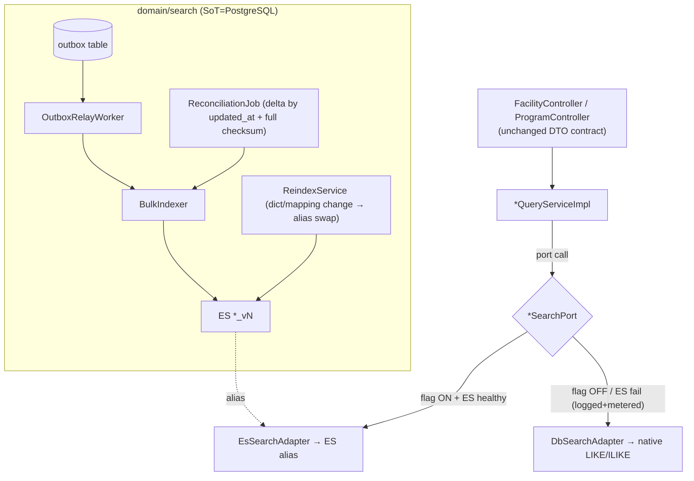

# Plan C — SECURITY & CORRECTNESS

> Planner-C. Migration of **autocomplete only** (`GET /facilities/search`, `GET /programs/search`) from `LIKE`/`ILIKE` to self-managed **Elasticsearch 8.x + Nori**. D1=A fixed. Viewport stays on PostgreSQL/PostGIS.
> Philosophy: a security reviewer AND a rigorous correctness reviewer must be able to sign this off. No silent data holes, no silent security holes, no swallowed failures. Every failure mode is logged **and** metered. ES is a *derived* index; PostgreSQL is Source-of-Truth; "consistent" has an explicit, bounded definition.

The load-bearing grounding facts (cite before designing):
- Java **17** (not 21), Spring Boot 3.5.7. No ES dep on classpath. `build.gradle:17,32,59-60`.
- Facility search: native `LIKE '%kw%'` on `name`/`facility_subtype`, `LIMIT 30`, no pagination, **case-sensitive**, no normalization. `FacilityRepository.java:16-17`, `FacilityQueryServiceImpl:105-112`.
- Program search: native `ILIKE :keyword` (`keyword + "%"`, prefix, one-sided) on **DB-generated STORED** cols `name_normalized`/`facility_name_normalized`, cursor `id > :cursor`, `ORDER BY id ASC LIMIT :size`. `ProgramRepositoryCustomImpl.java:491-542`. Normalization = `keyword.replaceAll("\\s+","")` (`ProgramSearchByKeywordRequest.java:28-31`).
- **No runtime write path** for facility/program base rows — populated by Flyway (`V3.*`,`V4.*`,`V5.*`,`V14.*`). Only live `@Transactional` mutations are bookmark toggles (`FacilityCommandServiceImpl:28,41`, `ProgramCommandServiceImpl:24,37`) + review writes — none change indexable fields. `01-codebase-facts.md §4`.
- Both `/search` require JWT (NOT in `AUTH_WHITELIST`). `SecurityConfig.java:35-39,71`. CSRF off, stateless.
- Secrets: `application-*.yml` are **gitignored**; only `application.yml` checked in. `.gitignore` / `01-codebase-facts.md §6`.
- Zero tests exercise search; Testcontainers declared but unused. `§7`.
- Autocomplete DTOs: Facility `{id,name,facilityType,facilitySubtype,address}`; Program `{id,programName,facilityName,facilitySubtype,address}` + `nextCursor,hasNext,currentSize`. `§1`.

---

## 1. Package / class layout — a search PORT, engine kept swappable

The repo is strictly domain-first (`controller/dto/entity/repository/service`), no ports/adapters today (`§8`). The correctness lens demands ONE thing here: **the ES document type must never leak past an interface into the controller or the existing `*QueryService`**. So I introduce a thin *search port* per domain, implemented by an ES adapter, and leave the DB path in place as the fallback implementation. This is the minimum abstraction that makes ES swappable and keeps the API contract engine-agnostic — not full hexagonal.

```
org.wemightmove.movemap
├─ domain/facility/
│   ├─ controller/FacilityController.java          (UNCHANGED signature/DTO)
│   ├─ service/FacilityQueryService.java           (UNCHANGED interface)
│   ├─ service/FacilityQueryServiceImpl.java        → delegates keyword search to FacilitySearchPort
│   └─ search/                                       ← NEW (domain-local, matches convention)
│        ├─ FacilitySearchPort.java                 interface: search(SearchQuery)->SearchHits<FacilitySimpleInfo>
│        ├─ EsFacilitySearchAdapter.java            ES impl (primary when flag on)
│        ├─ DbFacilitySearchAdapter.java            wraps existing native LIKE query (fallback)
│        └─ FacilitySearchDocument.java             @Document — NEVER referenced by controller/DTO
├─ domain/program/  (same shape: ProgramSearchPort, EsProgramSearchAdapter, DbProgramSearchAdapter, ProgramSearchDocument)
├─ domain/search/                                    ← NEW cross-domain indexing/sync (only place that knows "outbox")
│   ├─ outbox/OutboxEvent.java  OutboxEventRepository.java  OutboxRelayWorker.java
│   ├─ index/BulkIndexer.java   ReindexService.java   ReconciliationJob.java
│   └─ SearchQuery.java          KeywordValidator.java   (shared, injection-safe input model)
└─ global/config/
     ├─ ElasticsearchConfig.java     (client bean, TLS + API key, from properties)
     ├─ SearchFeatureProperties.java  (feature flag, per-domain)
     └─ SearchMetrics.java            (Micrometer counters/timers — one home for all failure meters)
```

**Boundary rule (enforced in review):** `FacilitySearchDocument`/`ProgramSearchDocument` live under `domain/*/search/` and are `package-private`-visible to the adapter only; the adapter maps document → existing `FacilitySimpleInfo`/`ProgramSimpleItem` before returning. Controllers and response DTOs are byte-for-byte unchanged. This is the "don't leak ES types into controllers" invariant made structural.



---

## 2. ES index mappings (A scope: text search only — no geo/filter/bitmask)

Two indices, versioned, behind fixed aliases `facility_search` / `program_search`. A-scope documents carry **only** searchable/display text. Denormalized `facility_name`/`facility_subtype`/`address` are included because the current queries already search across them.

`program_v1` (settings + mappings). Facility is identical minus `program_name` semantics (facility doc's searchable name is the facility name itself).

```jsonc
{
  "settings": {
    "number_of_shards": 1,
    "number_of_replicas": 1,                       // >=1 so a node loss ≠ data loss (self-host)
    "index.max_result_window": 10000,              // hard ceiling; we never page beyond via search_after anyway
    "analysis": {
      "tokenizer": {
        "nori_user": {
          "type": "nori_tokenizer",
          "decompound_mode": "mixed",              // D3 confirmed
          "user_dictionary": "userdict_ko.txt"     // file-based → dict change = reindex (D4)
        }
      },
      "filter": {
        "nori_pos": {
          "type": "nori_part_of_speech",
          // XPN(접두사) removed from stoptags so "비회원/무산소" not corrupted (D3 warning)
          "stoptags": ["E","IC","J","MAG","MAJ","MM","SP","SSC","SSO","SC","SE","VCP","VCN","XSA","XSN","XSV"]
        },
        "nori_readingform": { "type": "nori_readingform" },
        "edge_ngram_filter": { "type": "edge_ngram", "min_gram": 1, "max_gram": 20 }
      },
      "analyzer": {
        "nori_index":  { "type":"custom","tokenizer":"nori_user","filter":["nori_pos","nori_readingform","lowercase"] },
        "nori_search": { "type":"custom","tokenizer":"nori_user","filter":["nori_pos","nori_readingform","lowercase"] },
        "autocomplete_index": { "type":"custom","tokenizer":"standard","filter":["lowercase","edge_ngram_filter"] },
        "autocomplete_search":{ "type":"custom","tokenizer":"standard","filter":["lowercase"] }   // NO edge_ngram at search time (prevents over-match)
      }
    }
  },
  "mappings": {
    "dynamic": "strict",                            // reject unexpected fields → schema drift is a hard error, not silent
    "properties": {
      "id":               { "type": "long" },
      "name": {                                     // program_name (program) / facility name (facility)
        "type": "text", "analyzer": "nori_index", "search_analyzer": "nori_search",
        "fields": {
          "keyword":      { "type": "keyword", "ignore_above": 256 },
          "autocomplete": { "type": "text", "analyzer": "autocomplete_index", "search_analyzer": "autocomplete_search" }
        }
      },
      "facility_name": {
        "type": "text", "analyzer": "nori_index", "search_analyzer": "nori_search",
        "fields": { "keyword": { "type":"keyword","ignore_above":256 } }
      },
      "facility_subtype": { "type": "keyword" },     // small enum-ish set; exact/keyword is correct here
      "address":          { "type": "text", "analyzer": "nori_index", "search_analyzer": "nori_search" },
      "suggest":          { "type": "completion", "analyzer": "nori_index" },   // D5 completion suggester
      // ---- correctness/idempotency control fields (NOT returned to client) ----
      "source_updated_at":{ "type": "date" },        // mirrors PG updated_at; reconciliation key
      "content_hash":     { "type": "keyword" }       // sha256 of indexable fields; drift detection
    }
  }
}
```

Notes tying to correctness:
- `dynamic: strict` — an unexpected field fails the index request loudly instead of silently creating an un-searchable field.
- `content_hash` + `source_updated_at` are the backbone of §5 reconciliation and idempotency; they are internal (adapter strips them before returning `FacilitySimpleInfo`).
- No `location`/`price`/`weekdays`/`region_cd` — out of A scope (design D2), which also removes the bitmask-decode correctness risk entirely from this migration.

---

## 3. Client & config — chosen on security/control grounds

**Choice: Spring Data Elasticsearch 5.x (`ElasticsearchClient` under the hood), configured explicitly — NOT auto-config from a bare URL.** (`build.gradle` add: `implementation 'org.springframework.boot:spring-boot-starter-data-elasticsearch'`, Boot 3.5.7 already pins a compatible 5.x.)

Why this over the low-level client only: it gives a typed, review-friendly config bean while still exposing the native `ElasticsearchClient` for the hand-written injection-safe queries (§4). Security rationale: one `@Configuration` is the single audited chokepoint for **TLS truststore + API-key auth**, so credentials never spread.

ES 8 ships security ON by default (TLS + auth). We do NOT disable it. Config shape (properties bound from a **gitignored** `application-es.yml`, matching the existing gitignored-secrets convention `§6` — never commit creds):

```java
@Configuration
class ElasticsearchConfig extends ElasticsearchConfiguration {
  private final EsProps p;   // @ConfigurationProperties("movemap.es")
  @Override public ClientConfiguration clientConfiguration() {
    return ClientConfiguration.builder()
      .connectedTo(p.host())                       // e.g. es.internal:9200 — PRIVATE DNS, never public
      .usingSsl(TrustStores.load(p.caPath()))       // pin cluster CA; no "trust all"
      .withHeaders(() -> Map.of("Authorization", "ApiKey " + p.apiKey()))  // least-priv API key
      .withConnectTimeout(Duration.ofMillis(500))
      .withSocketTimeout(Duration.ofSeconds(3))     // bounded → ES slowness can't hang request threads
      .build();
  }
}
```

```yaml
# application-es.yml  (GITIGNORED — same pattern as application-develop.yml et al.)
movemap:
  es:
    host: ${ES_HOST}            # injected from env/secret manager, not literal
    api-key: ${ES_API_KEY}      # search-app key: read on aliases + write on *_v* only
    ca-path: ${ES_CA_PATH}
```

- Add `application-es.yml` and `ES_*` to `.gitignore` in the same block as the existing secrets. Provide `application-es.yml.example` with placeholders (checked in) so drift is documented, not guessed.
- Bounded connect/socket timeouts are a **correctness** control: they convert "ES hung" into a fast, catchable exception that triggers the metered fallback (§6) instead of exhausting the Tomcat thread pool.

---

## 4. Query implementation — INJECTION-SAFE construction (the security centerpiece of the read path)

The user `keyword` is attacker-controlled (any authenticated user). The single most important rule: **the raw keyword is only ever a bound value inside a structured query builder — never concatenated into a `query_string`/`simple_query_string`/Lucene syntax, never into a `wildcard`/`regexp`, never into a script.** Structured builders (`match`, `match_phrase_prefix`, `term`, completion `prefix`) treat the term as data; they parse no operators. This is the ES analogue of a bound SQL parameter.

### 4a. Input validation (fail-closed, before touching ES)

`KeywordValidator` enforced in `SearchQuery` factory (and mirrored as bean-validation on request DTOs so it's rejected at the controller edge with 400):

| Rule | Value | Why |
|---|---|---|
| Not blank after trim | required | Program already `@NotBlank`; apply same to facility (today facility keyword is `required=false` → NPE/whole-table risk). |
| Max length | Facility ≤ 50, Program ≤ 100 | Design bound; caps token blow-up / ReDoS-style analyzer cost. |
| Reject control chars | `\p{Cntrl}` except none allowed | Avoid log-injection + weird tokenizer input. |
| `size` clamp | 1..100 (program), fixed 30 (facility) | Prevents large-`size` resource abuse. Matches current `LIMIT 30`. |
| `search_after` cursor | opaque, server-validated shape (`[score/id]`), reject if malformed | Deep-pagination / forged-cursor abuse; never eval client JSON blindly. |
| No wildcard/regex passthrough | `*?~^` treated as literal chars (they are, in `match`) | Leading-wildcard DoS impossible because we never build wildcard queries. |

Normalization parity: Program path must replicate `keyword.replaceAll("\\s+","")` semantics **as an analyzer/field choice**, not by hand-mangling then concatenating — feed the raw term to `match`/completion; the whitespace-insensitivity comes from tokenization, and the "conscious difference" (PG stripped only literal space; Nori tokenizes) is documented per D12.

### 4b. The queries (native `ElasticsearchClient`, term as bound `.query(keyword)`)

Program `/search` (relevance-ranked, `search_after`, id tie-breaker):

```java
Query q = BoolQuery.of(b -> b.should(
    MatchQuery.of(m -> m.field("name").query(keyword).boost(2f))._toQuery(),       // keyword is DATA, not DSL
    MatchQuery.of(m -> m.field("facility_name").query(keyword))._toQuery(),
    MatchPhrasePrefixQuery.of(m -> m.field("name.autocomplete").query(keyword))._toQuery()
).minimumShouldMatch("1"))._toQuery();

SearchRequest req = SearchRequest.of(s -> s
    .index("program_search")                        // alias only
    .query(q)
    .size(clampedSize)
    .sort(so -> so.score(sc -> sc.order(SortOrder.Desc)))
    .sort(so -> so.field(f -> f.field("id").order(SortOrder.Asc)))   // tie-breaker → stable cursor
    .searchAfter(decodedCursor)                      // null on first page
    .trackTotalHits(t -> t.enabled(false)));         // no deep-count cost
```

Facility `/search`: same shape, `size=30`, no cursor (keeps "30 fixed" contract). Completion suggester is used for the type-ahead dropdown variant if the FE calls it; the array response maps to the existing simple DTOs.

Security properties, explicit:
- Injection: impossible via `match`/`match_phrase_prefix` — no query parser sees the term.
- Leading-wildcard / regex DoS: not reachable — those query types are never constructed.
- Deep-pagination abuse: `search_after` only + `trackTotalHits:false` + `size≤100`; no `from` paging, `max_result_window` untouched-but-irrelevant.
- Result field control: adapter returns only the 4–5 DTO fields; `content_hash`/`source_updated_at` never serialized outward.

---

## 5. Indexing / sync — correctness-first, given there is NO runtime write path today

This is where the correctness reviewer's hardest question lives (brief §CRITICAL): **base rows are Flyway-loaded; bookmark/review writes don't touch indexable fields (`§4`). So how does ES avoid silent drift RIGHT NOW?** Honest answer, staged:

**Reality check (must be stated, not glossed):** With today's code, the Outbox pattern (design D7) has **no producer** — nothing in the app mutates `facility.name`/`program.name`. So on day one, ES correctness rests on (a) a **full initial reindex** from PG, and (b) **reconciliation**, NOT on live events. The Outbox is built and wired but is *dormant until a real write path exists*. Pretending Outbox alone guarantees consistency would be the silent hole. Concretely:

### 5a. Initial + ongoing load
1. **Full reindex batch** (`ReindexService`): stream PG rows (keyset by id), compute `content_hash`, `bulk` into a fresh `*_vN`, then atomic alias swap (§9). This is the actual source of truth transfer.
2. **Migration-driven refresh:** because base rows change only via Flyway migrations, wire a post-migration reindex trigger (a Flyway callback `afterMigrate` or an ops runbook step) so a data-loading migration is *always* followed by reindex-or-reconcile. This closes the "new V-script inserted 10k programs, ES never learned" drift path that Outbox cannot catch.
3. **Outbox for the future write path:** ship `outbox` table + `OutboxRelayWorker` + a single `SearchIndexEvents.publish(...)` hook that bookmark/review services do NOT call today, but that any future facility/program CRUD MUST call in-transaction. Documented as the extension point. This is not gold-plating *only if* we keep it minimal (table + worker + one publish method); see §11 self-critique.

### 5b. Idempotency & ordering (retries must not resurrect deleted docs)
- Index by **document id = PG primary key** (deterministic; re-indexing same row is a no-op-equivalent overwrite).
- Use **external versioning**: `version_type=external`, `version = source_updated_at` epoch-millis (or a monotonic outbox seq). ES rejects an older version → a delayed retry cannot overwrite a newer state, and a delete (tombstone with higher version) cannot be resurrected by a stale re-add.
- Deletes: soft-delete via versioned `delete` keyed by id; reconciliation treats "in ES, absent in PG, older version" as delete.

### 5c. Partial-bulk-failure handling (NO swallowing)
The classic silent failure: a `bulk` call returns HTTP 200 but individual items failed. Mandate:

```java
BulkResponse resp = client.bulk(req);
if (resp.errors()) {                                    // MUST check — 200 ≠ success
  var failed = resp.items().stream().filter(i -> i.error()!=null).toList();
  failed.forEach(i -> log.error("ES bulk item failed id={} type={} reason={}",
        i.id(), i.error().type(), i.error().reason()));
  searchMetrics.bulkItemFailures().increment(failed.size());   // metric → alert
  retryQueue.enqueue(failed);                            // bounded retry; then dead-letter table
}
```
- No empty catch anywhere. Every catch either rethrows a domain `SearchIndexException` or logs+meters+enqueues.
- Retry with backoff (reuse existing `spring-retry`, `build.gradle:158`); after N attempts → `search_index_dead_letter` table (visible, queryable) — never `catch{}`.

### 5d. Reconciliation as the safety net (the real guarantee)
`ReconciliationJob` (`@Scheduled`, e.g. every 15 min + nightly full):
- **Delta pass:** PG rows with `updated_at > lastRun` → re-hash → upsert if `content_hash` differs.
- **Full checksum pass (nightly):** compare `count(PG)` vs `count(ES)`, and a sampled/full `id → content_hash` diff. Any mismatch: log at WARN with counts, increment `reconciliation_drift` gauge, auto-heal (reindex the diverged ids).
- Emits `search_reconciliation_last_success_timestamp` gauge → alert if stale (job silently dying is itself a monitored failure).

**Consistency invariant (stated explicitly for the reviewer):**
> SoT = PostgreSQL. ES = derived read model. "Consistent" = for every non-deleted PG row, ES holds a document with matching `content_hash`, and holds no document whose id is absent from PG. **Staleness bound = reconciliation interval (≤15 min delta, ≤24 h full) today**, tightening to seconds once a live write path + Outbox producer exists. This bound is published, not implied.

---

## 6. Rollout & fallback — observable, logged, metered, NEVER silent

Feature flag per domain (`movemap.search.facility.engine = ES|DB`, `...program.engine`), default `DB`. The port (§1) selects the adapter.

**Fallback rule (the anti-silent-downgrade mandate):** if `engine=ES` and an ES call fails (timeout, 5xx, circuit open), the port falls back to `DbSearchAdapter` **and**:
```java
catch (ElasticsearchException | IOException e) {
  log.warn("ES search fallback→DB domain={} keyword_len={} cause={}", domain, kw.length(), e.toString());
  searchMetrics.esFallback(domain).increment();          // Counter → alert if rate>threshold
  return dbAdapter.search(query);                         // correctness preserved, degradation VISIBLE
}
```
- Fallback is **counted and alertable**; a spike means ES is unhealthy — the opposite of a silent downgrade.
- Fallback logs `keyword_len`, never the raw keyword at WARN (PII/log-injection hygiene; raw term only at DEBUG if ever).
- Fallback path uses the **same JWT-authenticated request context** — it cannot become an auth bypass because auth is already enforced upstream in `SecurityConfig` before the controller; the port never re-authenticates or relaxes anything.
- Rollout order: shadow/dark-read (call ES, log intent-test deltas, still serve DB) → program `/search` (the measured bottleneck) → facility `/search`. Flip via config, no redeploy. Rollback = flip flag to `DB`.

---

## 7. Testing — Testcontainers ES(+Nori), security & correctness cases as GATES

Add real integration tests (there are none, `§7`). Testcontainers ES image must include the Nori plugin — build a small custom image (`elasticsearch:8.x` + `bin/elasticsearch-plugin install analysis-nori`) or use a prebuilt Nori image; **confirm plugin presence in an `@BeforeAll` assertion** (the design flagged this as "확인 필요"). Per D12: intent tests + conscious-difference list, NOT equivalence pinning.

Mandatory cases (each is a merge gate):
1. **Injection attempt** — keyword = `name:(x) OR _exists_:*` and `강남*` and `a AND b` → assert results are treated as literal text (no Lucene parse, no error, no whole-index dump). Proves §4 binding.
2. **ES-down fallback asserts a log + metric** — stop the container mid-test (or point client at dead port); assert `esFallback` counter incremented AND a WARN logged (use an `OutputCaptureExtension` / log appender) AND DB result returned. Fails if fallback is silent.
3. **Partial bulk failure surfaced** — force one bad doc (e.g. mapping violation under `dynamic:strict`); assert `bulkItemFailures>0`, dead-letter row written, NOT swallowed.
4. **Alias swap atomicity** — reindex v1→v2 while a concurrent search loop runs; assert zero requests error and zero see "no such index".
5. **Idempotency/versioning** — index id=1 at v(t2), then replay stale v(t1); assert ES keeps t2 (external version wins). Then delete id=1, replay stale add; assert stays deleted (no resurrection).
6. **Reconciliation heals drift** — manually delete a doc from ES behind its back; run job; assert restored + `reconciliation_drift` incremented.
7. **Input validation** — over-length (51/101 chars), blank, control-char keyword → 400 at controller, ES never called.
8. **Intent tests (D12)** — "수영" → 수영장 present; "강남 축구" (the `FIXME` at `FacilityController:167-169`) → relevant results present. Inclusion, not equivalence.
9. **API contract unchanged** — response JSON schema of `/facilities/search` & `/programs/search` byte-identical fields to DB path (proves no ES type leaked, §1).

`@DataJpaTest` stays the DB-path baseline; ES tests are `@SpringBootTest` + `@Testcontainers`.

---

## 8. Security posture — THREAT MODEL (centerpiece)

| # | Threat | Vector | Mitigation | Enforced where |
|---|---|---|---|---|
| T1 | Query/Lucene injection | Malicious `keyword` (`query_string` operators, `_exists_`, boosting, regex) | Only `match`/`match_phrase_prefix`/completion with term as **bound value**; never `query_string`/`wildcard`/`regexp`/script | §4b `EsSearchAdapter`; Test #1 |
| T2 | Leading-wildcard / ReDoS DoS | `*a`, huge regex, giant term | Those query types never built; length ≤50/≤100; control-char reject | §4a `KeywordValidator`; DTO bean-validation; Test #7 |
| T3 | Deep-pagination / large-size resource abuse | `size=100000`, forged deep cursor | `size` clamp; `search_after` only (no `from`); `trackTotalHits:false`; opaque server-validated cursor | §4a/§4b; Test #7 |
| T4 | ES cluster exposed to internet | Public bind / no auth | Private subnet/DNS only; ES8 security ON (TLS + API key); app key = read aliases + write `*_v*` **only** (least privilege) | §3 config; §9 roles; network/infra |
| T5 | Credential leak via yml drift | Secrets committed like a real yml | `application-es.yml` gitignored (matches existing pattern `§6`); env/secret-manager injection; `.example` template only | §3; `.gitignore` |
| T6 | TLS MITM / rogue cluster | "trust all" / plaintext | Pin cluster CA truststore; `usingSsl(...)`; no trust-all | §3 `ElasticsearchConfig` |
| T7 | Actuator/Prometheus leak | `/actuator/prometheus` exposed for §metrics | Keep OFF whitelist; separate management port OR authorize; never public. (Perf doc suggested whitelisting — do NOT do that in prod) | `SecurityConfig`; management config |
| T8 | Silent fallback = hidden downgrade | ES fails, users quietly on DB | Fallback logged (WARN) + metered (`esFallback` counter) + alert; dark-read before cutover | §6; Test #2 |
| T9 | Silent data drift | Bulk partial fail / missed migration / lost event | `BulkResponse.errors()` checked; dead-letter table; post-migration reindex hook; reconciliation + freshness gauge | §5c/§5d; Tests #3,#6 |
| T10 | Stale retry corrupts state / resurrects deletes | Out-of-order relay/retry | External versioning by `source_updated_at`/seq; delete tombstone version | §5b; Test #5 |
| T11 | Auth bypass via new path | `/search` reachable unauth | Not whitelisted → JWT enforced (`SecurityConfig:71`); port runs post-auth; fallback doesn't re-auth | `SecurityConfig`; §6 |
| T12 | PII exposure / right-to-erasure | Indexing personal data | A-scope indexes only facility/program **names+subtype+address** = public facility catalog data, NOT user PII. **Reviews NOT indexed in A scope** → no user-generated content, no erasure obligation introduced. If reviews added later: index author-less text or honor deletes via versioned tombstone | §2 (no review fields); §10 |
| T13 | Log injection / keyword in logs | CRLF/PII in `keyword` logged | Log `keyword_len` not raw term at WARN; control-chars rejected pre-log | §4a; §6 |

---

## 9. Ops — alias/reindex safely, secrets, least-privilege roles, failure observability

- **Aliases:** app reads `facility_search`/`program_search` only. Reindex: create `*_v(N+1)` → bulk → verify count+sample hashes → single atomic `POST _aliases` `{remove old, add new}`. Never a window with 0 or 2 write targets. Keep `v(N)` one cycle for instant rollback. (D10)
- **Least-privilege ES roles (two keys):**
  - *app key*: `read` + `view_index_metadata` on aliases; `write`/`create_index` on `program_v*`,`facility_v*` pattern only. No cluster-admin, no delete-index.
  - *ops/reindex key*: separate, used by `ReindexService`/CI, has `manage` on the `*_v*` pattern. Not shipped in the app runtime.
- **Secrets:** env → secret manager; gitignored yml; rotate API keys; `.example` documents shape. No creds in `perf/` artifacts either.
- **Observability of FAILURES (all Micrometer, one `SearchMetrics`):** `esFallback{domain}`, `bulkItemFailures`, `search_index_dead_letter_size`, `reconciliation_drift`, `search_reconciliation_last_success_timestamp` (staleness alert), `es_search_latency` timer, `outbox_relay_lag`. Alerts on fallback-rate spike and stale reconciliation. Metrics endpoint secured (T7).
- **Runbooks:** "dict changed → reindex+swap", "drift alert → run full reconcile", "fallback spike → check ES health/roll flag to DB".

---

## 10. Open-item resolutions (recommendation + confidence)

| Item | Recommendation | Confidence | Security/correctness rationale |
|---|---|---|---|
| **Self-host vs managed ES** | **Managed (Elastic Cloud) for a solo/portfolio operator; self-host only if cost-forced** | 70% | Security: managed = TLS/auth/patching/snapshots handled → smaller attack surface for a one-person ops team. Self-hosting ES8 securely (cert rotation, network isolation, node hardening) is the single biggest way to *introduce* a hole here. If self-hosted: mandatory private subnet, security plugin ON, no `9200` public — never default-open. |
| **Review-search inclusion (PII angle)** | **Exclude from A scope. Defer.** | 85% | Reviews are user-generated → indexing them creates PII + right-to-erasure obligations (T12) with zero relation to the measured bottleneck (programs autocomplete). Adding it now is scope creep that imports a compliance surface. Revisit only with a deletion-propagation design. |
| **D4 dictionary curation** | **Semi-automatic: extract candidate compound nouns from existing facility/program names, human-approve, commit `userdict_ko.txt`; treat dict change as reindex** | 65% | Manual-only doesn't scale as catalog grows; fully-auto risks bad tokenization silently degrading recall. Human gate = correctness checkpoint. File-based (not inline) for version control + reindex pipeline (D4). |
| **decompound `mixed` vs `discard`+dict** | Start `mixed` (per D3), let intent tests (§7 #8) drive tuning; customize `nori_pos` stoptags to keep XPN | 70% | Correctness via test-driven analyzer tuning, not guesswork; XPN fix prevents meaning-reversal bug. |
| **Sync mechanism today** | Build Outbox (dormant) but rely on **initial reindex + reconciliation + post-migration hook** for actual guarantee | 80% | Honest: Outbox has no producer now (`§4`); claiming it as the guarantee would be the silent hole. Reconciliation is the real safety net. |

---

## 11. Effort, risks, TRADEOFFS accepted, self-critique

**Effort (relative, solo dev):**
- P1 infra (client, TLS/key config, mappings, alias): ~2–3 d.
- P2 indexing (reindex batch, bulk+partial-fail handling, versioning, reconciliation, outbox scaffold): ~4–5 d. ← the security/correctness weight lives here.
- P3 read path (port, adapters, injection-safe queries, validation, feature flag, fallback+metrics): ~3 d.
- P4 tests (Testcontainers+Nori, 9 gate cases): ~3–4 d.
- Security/ops (roles, secrets, threat-model verification, actuator hardening): ~2 d.
- **Total ≈ 14–17 dev-days.**

**Risks:** Testcontainers+Nori image assembly (flagged unconfirmed); self-hosted ES hardening burden if managed rejected; reconciliation cost at 55k facilities / 228k programs (mitigate: keyset streaming + hash compare, nightly full only).

**Tradeoffs my security-first choices accept (explicit velocity cost):**
1. **Reconciliation + versioning + dead-letter + post-migration hook** are real code with no live write path today → looks like machinery for a producer that doesn't exist yet. **Cost:** ~3–4 extra days vs a naive "reindex and hope". **Justification:** without it, drift after any future data migration is silent and undetectable — the exact class of bug the correctness lens exists to prevent. I keep it minimal (reconciliation is the load-bearing part; Outbox is a documented dormant hook).
2. **Managed ES recommendation** trades infra "ownership" learning + cost for a smaller attack surface. **Cost:** monthly $ + less self-host portfolio story. **Justification:** a solo operator self-hosting ES8 securely is the likeliest source of an actual breach here.
3. **Hard input validation + no `query_string` ever** forecloses "power-user" query syntax and fuzzy operators. **Cost:** slightly less flexible search UX. **Justification:** `query_string` on user input is a textbook injection/DoS vector; autocomplete doesn't need it.

**Self-critique — gold-plating vs essential:**
- *Essential:* injection-safe query construction (§4), fallback logged+metered (§6/T8), `BulkResponse.errors()` check (§5c), reconciliation + freshness gauge (§5d), TLS+API-key+private network (§3/T4), least-privilege roles (§9), not-whitelisted JWT confirmation (T11), actuator not-public (T7).
- *Borderline / could defer without a hole:* completion suggester (edge_ngram multi-field alone may suffice — D5 65%); nightly **full** checksum reconciliation (delta may be enough at this size); `content_hash` (could diff on `source_updated_at` alone, but hash catches same-timestamp edits — cheap insurance).
- *Likely gold-plating if built now:* Outbox **relay worker** logic beyond the table + one publish method — there is no producer (`§4`), so anything past a documented dormant hook is speculative. Recommend: scaffold table + interface, do NOT build the full polling worker until a real facility/program write path lands. Dead-letter table can start as "log + manual re-run" rather than an automated DLQ consumer.

---

### One-line consistency contract (put in the PR description)
> PostgreSQL is the source of truth; Elasticsearch is a derived autocomplete index. A document is *consistent* when its `content_hash` matches its PG row and no orphan documents exist. Max staleness = reconciliation interval (≤15 min delta / ≤24 h full) until a live write path enables Outbox-driven near-real-time. Every fallback to DB and every indexing failure is logged AND metered — there are no silent downgrades and no silent drops.
