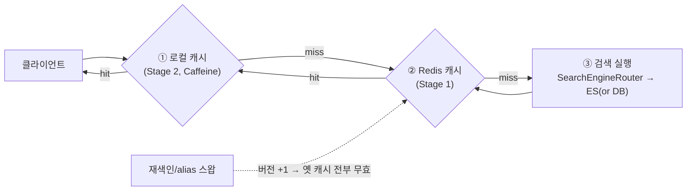
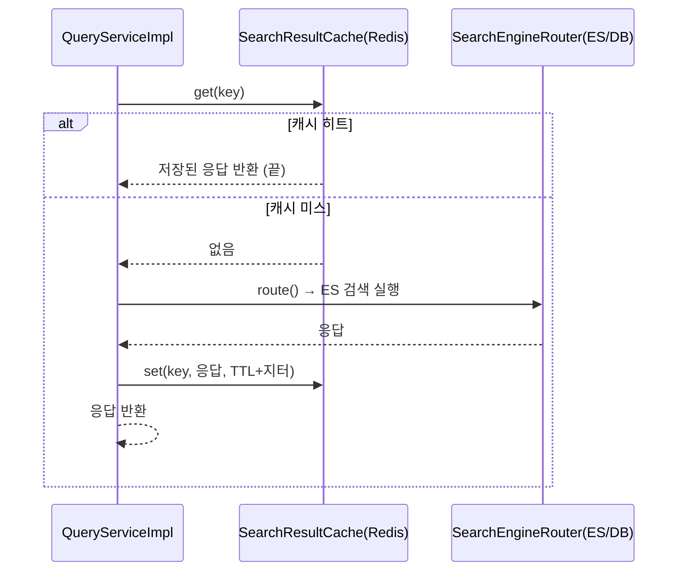
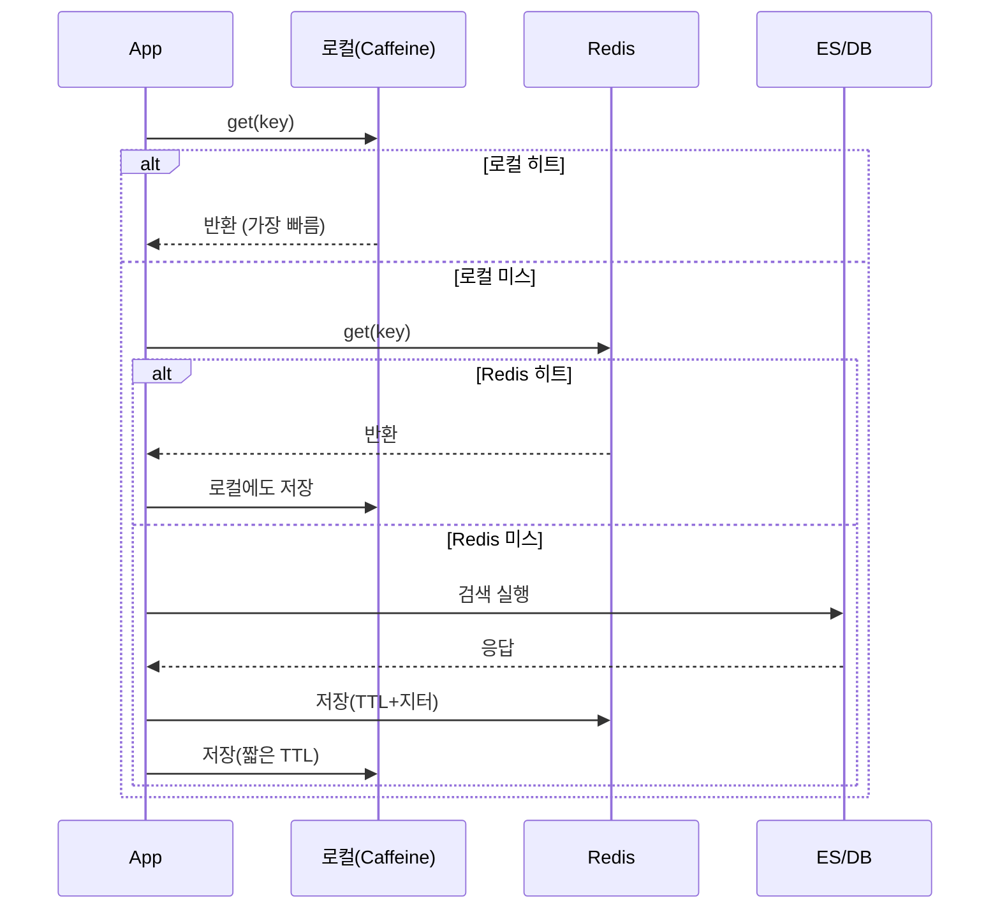
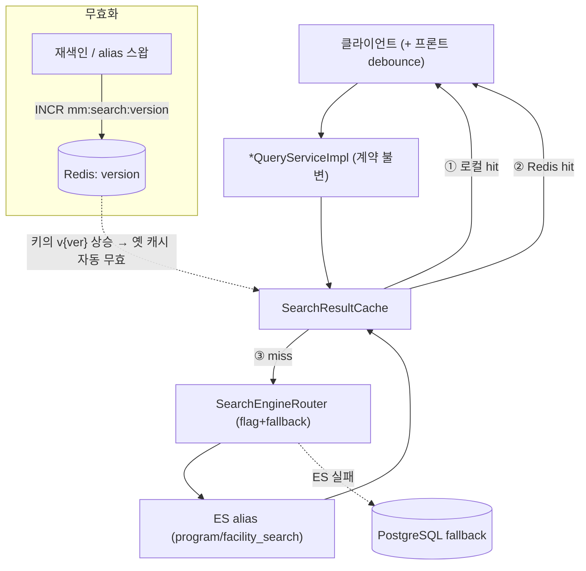

# MoveMap 검색 캐시 설계 문서 (Redis) — Stage 1 + Stage 2

> 대상: MoveMap-Back (Java 17 / Spring Boot 3.5.7). 이미 `/facilities/search`·`/programs/search`가 Elasticsearch로 서빙되고 있고(별도 문서 `docs/es-migration-implementation-plan.md`), 그 **위에 Redis 캐시**를 얹는 설계다.
> 목표: **읽기(검색) 응답을 캐시해서 ES 부하와 p99 꼬리를 줄인다.** 백엔드(Redis) 중심. Stage 1(Redis) → Stage 2(로컬+Redis 2-tier)까지.
> 난이도: **인턴도 이해할 수 있게** 개념부터 쉽게 설명한다.
> 참고 근거: 배민·올리브영·토스·화해 기술블로그(부록 출처).

---

## 0. 한 장 요약 (TL;DR)

- **무엇을**: `/search` 응답(자동완성 결과 DTO)을 Redis에 캐시. 같은 검색어는 ES 안 거치고 Redis에서 즉답.
- **왜 지금 해도 되나**: MoveMap 검색은 **① 결과가 개인화 안 됨(전 유저 공유 가능) ② 검색어가 소수에 쏠림("수영" 등 핫키) ③ 데이터가 재색인 때만 바뀜(무효화가 거의 공짜)** → **캐싱 최적 조건**.
- **전략은 "남들이 쓰니까"가 아니라 우리 상황으로 골랐다(§4.0)**: 여러 캐싱 전략(읽기 cache-aside/read-through, 쓰기 write-through/behind/around) 중, MoveMap은 **런타임 쓰기 경로가 없어(데이터가 재색인 때만 변경)** 쓰기 전략 논쟁 자체가 무의미 → 실제 선택지는 **"읽기 채우기 + 무효화" 두 개뿐**. 여기서 **읽기=cache-aside(제어권), 무효화=재색인 시 버전 +1**을 트레이드오프 근거로 채택.
- **Stage 1**: Redis 단일 계층 cache-aside + 버전 기반 무효화 + TTL 지터 + 빈결과(negative) 캐싱 + Redis 장애 시 graceful fallback.
- **Stage 2**: 그 앞에 **로컬 캐시(Caffeine)** 를 한 겹 더 → 핫키는 앱 메모리에서 즉답, Redis 왕복·부하까지 절감(2-tier).
- **핵심 트릭**: 캐시 무효화를 **"버전 번호 1 증가"** 로 처리 → 재색인 한 번에 옛 캐시 전부 무효(스캔·삭제 불필요).



---

## 1. 왜 캐시를 다는가 (인턴용 5분)

> 🧑‍🏫 **쉽게 말하면**: 캐시 = **"자주 나오는 질문의 답을 포스트잇에 미리 적어두는 것"**. 손님이 "수영 뭐 있어요?" 물으면, 매번 창고(ES)까지 뛰어가지 않고 포스트잇(Redis)에 적힌 답을 바로 준다.

**이득 3가지**
1. **속도** — 같은 검색어는 ES를 안 거치니 더 빠르다(그리고 **캐시 히트는 JVM/GC를 안 타서 p99 꼬리를 줄인다**).
2. **ES 부하↓** — 인기 검색어 요청이 ES에 안 감 → ES가 여유로워지고 확장 여력↑.
3. **안정성** — ES가 잠깐 느려도 캐시된 인기 검색어는 영향 안 받음.

**솔직한 전제**: 지금 ES는 이미 p95 13ms로 충분히 빠르다. 그래서 캐시는 **"고장 수리"가 아니라 "다음 단계 최적화"**다 — RPS가 크게 오르거나, p99를 더 조이거나, ES 비용을 줄이고 싶을 때 켠다. 이 문서는 **그때 바로 적용할 수 있게** 설계를 미리 확정해 둔다.

---

## 2. 캐시 기본 개념 (용어부터)

| 용어 | 쉽게 | MoveMap에서 |
|---|---|---|
| **캐시 히트/미스** | 포스트잇에 답이 있음/없음 | Redis에 그 검색어 결과가 있음/없음 |
| **Cache-aside(look-aside)** | 포스트잇 먼저 보고, 없으면 창고 갔다 와서 포스트잇에 적기 | Redis 조회 → 없으면 ES 실행 → 결과를 Redis에 저장 |
| **TTL(유효기간)** | 포스트잇에 "이 답은 10분만 유효" | 캐시 항목 10분 뒤 자동 삭제 |
| **무효화(invalidation)** | 메뉴가 바뀌면 옛 포스트잇 버리기 | 재색인되면 옛 캐시 버리기 |
| **핫키(hot key)** | 유난히 자주 묻는 질문("수영") | 최빈 검색어 |
| **스탬피드(쇄도)** | 포스트잇이 동시에 다 만료돼서 다들 창고로 우르르 | 캐시 동시 만료 → ES로 요청 쏠림 |
| **Negative 캐싱** | "그런 메뉴 없어요"도 포스트잇에 적어두기 | 빈 결과도 짧게 캐시(오타·스팸 방어) |

---

## 3. MoveMap에 맞춘 설계 원칙 (왜 이렇게 하나)

1. **결과가 개인화되지 않는다** — `/search` 응답 DTO는 `id·이름·주소·종류`뿐(유저별 필드 없음). → **캐시를 전 유저가 공유**해도 안전. (개인화 데이터였다면 캐시가 훨씬 까다로웠을 것)
2. **원본은 PostgreSQL, ES는 파생, 캐시는 그 위 파생** — 데이터 신선도 순서: PG(최신) → ES(재색인 시점) → 캐시(TTL/버전). 캐시는 **"조금 오래된 답도 허용"**하는 계층.
3. **데이터가 재색인 때만 바뀐다** → 무효화를 **재색인 이벤트에 딱 한 번** 하면 됨. → **버전 기반 무효화**(§4.4)가 완벽히 들어맞음.
4. **캐시는 있으면 좋고 없어도 되는 층** — Redis가 죽어도 검색은 ES로 그냥 동작해야 함(§4.6 failover).
5. **캐시 키는 이미 검증된 키워드로** — 컨트롤러에서 길이·정규화·제어문자 검증을 통과한 키워드만 키로 쓴다 → 키 폭증·인젝션도 같이 방어.

---

## 4. Stage 1 — Redis 캐시: 전략 선택과 구현

### 4.0 먼저 — "우리가 이걸 꼭 이렇게 해야 하나?" (전략 비교 · 실무 관점)

> ⚠️ **주의**: "배민·토스가 cache-aside 쓰니까 우리도"는 근거가 아니다. **우리 상황에 맞는지**부터, **어떤 선택지가 있고 왜 이걸 고르는지** 트레이드오프로 따진다.

**(1) 캐시 자체가 MoveMap에 맞나? — 적합성 체크**

| 질문 | MoveMap | 판정 |
|---|---|---|
| 읽기 위주인가? | `/search`는 순수 읽기 | ✅ 캐시 유리 |
| 같은 걸 반복 조회하나?(핫키) | 검색어 극단 쏠림("수영") | ✅ 히트율 높음 |
| 결과가 개인화되나? | 비개인화(id·이름·주소·종류) | ✅ 전 유저 공유 가능 |
| 무효화가 쉬운가? | 재색인 때만 데이터 변경 | ✅ 거의 공짜 |
| **원본이 이미 느린가?** | **ES p95 13ms — 이미 빠름** | ⚠️ **"고장 수리"가 아니라 최적화** |

→ **판정: 캐시가 잘 맞는 상황은 맞다. 단 "지금 당장 필수"는 아니다.** RPS 급증·p99 추가 개선·ES 비용 절감이 필요해질 때 켜는 최적화다(이 문서는 그때 바로 쓰려는 설계). **원본이 이미 빠르면 캐시가 오히려 무효화·정합성 복잡도만 늘릴 수 있다는 점을 인지하고 시작한다.**

**(2) 캐싱 "전략"에는 뭐가 있나 — 두 축(읽기/쓰기)**

*읽기(read) — 캐시에 언제·어떻게 채우나:*
| 전략 | 방식 | 장점 | 단점 |
|---|---|---|---|
| **Cache-aside(look-aside)** | 앱이 캐시 확인 → 미스면 원본 읽어 캐시에 채움 | 단순 · **캐시 죽어도 우회 가능(장애 격리)** · 요청된 것만 캐시 · TTL/키/무효화 **직접 제어** | 첫 요청 미스(콜드) · 무효화를 앱이 책임 · 앱에 캐시 코드 |
| **Read-through** | 앱은 캐시만 보고, 미스는 캐시가 로더로 원본 조회(`@Cacheable`) | 앱 코드 깔끔(선언적) · 일관 | 캐시 추상화에 결합 · **커스텀 TTL 지터·negative·버전키·우회 제어가 번거로움** |
| **Refresh-ahead** | 만료 전 인기 항목 미리 갱신 | 만료 순간 지연 없음 | 무엇을 미리 갱신할지 예측 필요(§7 PER) |

*쓰기(write) — 원본이 바뀔 때 캐시를 어떻게 맞추나:*
| 전략 | 방식 | 언제 쓰나 |
|---|---|---|
| Write-through | 쓸 때 캐시+원본 동시 기록 | 항상 최신 필요 · 쓰기 잦음 |
| Write-behind(back) | 캐시 먼저, 원본은 나중 비동기 | 쓰기 폭주 흡수(유실 위험·복잡) |
| Write-around | 원본만 쓰고 캐시는 읽을 때만 채움 | 쓰기-후-즉시조회가 드물 때 |

**(3) MoveMap 관점으로 걸러내기 — 결정적 통찰**

> 💡 **핵심 사실**: MoveMap엔 **facility/program을 실시간으로 바꾸는 런타임 쓰기 경로가 없다**(Flyway/재색인으로만 적재 — ES 이관 문서 §코드사실에서 확인). **그래서 쓰기 전략(write-through/behind/around) 논쟁 자체가 우리에겐 거의 무의미하다.** 앱이 실시간으로 바꾸는 데이터가 없으니 "쓸 때 캐시를 어떻게 동기화하나"라는 문제가 성립하지 않는다.

→ 남는 **실제 선택은 두 개뿐**:
- **읽기 채우기**: cache-aside vs read-through(`@Cacheable`).
- **무효화**: 데이터가 바뀌는 유일한 사건 = **재색인** → 그 시점에 무효화(§4.4 버전 기반).

**(4) 그래서 우리의 선택과 근거(트레이드오프)**

| 축 | 채택 | 왜(트레이드오프) |
|---|---|---|
| 읽기 | **Cache-aside** | Redis 장애 시 **조용히 우회(failover)** + **TTL 지터·negative·버전키** 같은 커스텀 제어가 필요. read-through(`@Cacheable`)는 선언적이라 깔끔하지만 이 커스터마이징이 번거로움 → **제어권을 위해 명시적 cache-aside**. (로컬 계층은 원하면 Caffeine `LoadingCache`로 read-through처럼 써도 됨 — §5) |
| 쓰기 | **(사실상) Write-around** | 런타임 쓰기가 없어 "원본(ES)만 바뀌고 캐시는 읽을 때만 채워지는" 형태가 자동으로 성립 → 별도 write 전략 **불필요**. |
| 무효화 | **이벤트/버전 기반** | 재색인이라는 **명확한 단일 사건**에 `INCR`(§4.4). TTL은 안전망. (write가 없어 실시간 무효화가 필요 없음) |

> **한 줄 결론**: *"우리 데이터는 앱이 실시간으로 안 바꾸고 재색인 때만 바뀐다. 그래서 복잡한 write 전략은 필요 없고, **읽기는 제어권을 위해 cache-aside, 무효화는 재색인 이벤트에 버전 +1** 이 가장 단순하면서 정확한 조합이다."* — 이것이 "배민이 써서"가 아니라 **우리 쓰기 부재(write-less) 특성**에서 도출된 선택이다.

### 4.1 흐름 (cache-aside)



> 🧑‍🏫 **핵심**: "**있으면 그거 주고, 없으면 만들어서 저장하고 준다.**" 이게 cache-aside. 배민·토스도 이 방식이 기본이다.

### 4.2 캐시 키 설계

- **program**: `mm:search:v{ver}:program:{engine}:{kw}:{cursor}:{size}`
- **facility**: `mm:search:v{ver}:facility:{engine}:{kw}` (facility는 size=30 고정·커서 없음)

각 조각의 의미:
- `v{ver}` = **전역 버전 번호**(§4.4 무효화의 핵심).
- `{engine}` = `es`/`db`. 엔진마다 결과가 다를 수 있어(형태소) 키에 포함 → 롤아웃 중 섞이지 않음.
- `{kw}` = **정규화된 키워드**. program은 기존 `normalizedKeyword()`(공백 제거), 공통으로 **소문자화+trim**까지 적용.
  - 👉 ES 검색이 대소문자 무시이므로, 키도 소문자화하면 "YOGA"와 "yoga"가 **같은 캐시 항목**을 공유 → 히트율↑. (같은 결과를 주는 입력은 같은 키로)
- `{cursor}`,`{size}` = 페이지 구분(program).

> 🧑‍🏫 **왜 키를 정규화?** "수영 "(뒤 공백)과 "수영"이 다른 포스트잇이 되면 낭비다. **같은 답이 나오는 입력은 같은 키**로 묶어야 포스트잇이 잘 재사용된다.

### 4.3 값(value)과 TTL

- **값** = 응답 DTO(`ProgramSimpleListResponse`/`FacilitySimpleListResponse`)를 **JSON 직렬화**해서 저장(Jackson + `RedisTemplate<String,String>` 또는 `GenericJackson2JsonRedisSerializer`).
- **TTL** = 예: **10분 + 지터(0~60초 랜덤)**.
  - 지터 이유(토스): 여러 키가 **정확히 동시에 만료**되면 그 순간 ES로 요청이 쏠린다(스탬피드). 만료 시각을 조금씩 흩뿌리면 부하가 퍼진다.
  - MoveMap은 재색인 무효화(§4.4)가 있으니 TTL은 **안전망** 역할(재색인을 깜빡해도 최대 10분 뒤 갱신).

### 4.4 무효화 = "버전 번호 1 증가" (제일 중요한 트릭)

> 🧑‍🏫 **쉽게 말하면**: 메뉴판을 **버전으로 관리**한다. 지금 v3이면 모든 포스트잇에 "v3" 도장이 찍혀 있다. 메뉴가 바뀌면(재색인) **v4로 올린다.** 그러면 앱은 이제 v4 포스트잇만 찾으니, v3 포스트잇들은 **아무도 안 보고 TTL로 알아서 사라진다.** 하나하나 찾아 버릴 필요가 없다.

- Redis에 전역 키 `mm:search:version`(정수) 하나를 둔다.
- **읽을 때**: 현재 버전을 읽어 키에 붙인다(`v{ver}`). (버전 자체도 잠깐 로컬 캐시해 매 요청 Redis 안 가게 함)
- **재색인/alias 스왑이 끝나면**: `INCR mm:search:version` → 버전 +1.
- 효과: **옛 버전 키는 즉시 도달 불가**(새 요청은 새 버전 키만 조회) + TTL로 청소. **SCAN/DEL로 수만 개 키를 지우는 부담 없음.** (올리브영·배민이 쓰는 버전/순차 갱신 아이디어)
- 연결 지점: 기존 `BulkReindexer`의 재색인 완료 / `IndexBootstrapper`의 alias 스왑 직후에 `INCR` 한 줄.

### 4.5 Negative 캐싱 (빈 결과도 캐시)

- ES가 **빈 결과**를 주면, 그 빈 응답도 **짧은 TTL(예: 30초)**로 캐시.
- 이유(토스, 캐시 관통): 오타·인젝션 시도·존재하지 않는 키워드가 반복되면 매번 ES를 때린다. "없음"도 잠깐 기억하면 ES를 지켜준다.
- 짧은 TTL인 이유: 진짜 데이터가 재색인으로 생겼을 때 너무 오래 "없음"으로 남지 않게.

### 4.6 Failover — Redis가 죽어도 검색은 된다

> 🧑‍🏫 **원칙(토스)**: 캐시는 **있으면 좋은 부가 기능**. 죽으면 **핵심 기능(검색)은 원천(ES)으로 그냥 동작**해야 한다.

- 캐시 조회/저장을 `try/catch`로 감싸고, Redis 예외 시 **로그+메트릭 후 그냥 통과**(라우터로 직접 검색).
- 이건 기존 **엔진 fallback(ES 실패→DB)과 똑같은 철학** — 계층이 하나 늘었을 뿐. 조용한 실패 금지(hit/miss/error 다 계측).
- ⚠️ **전제조건(실측으로 확인): 짧은 Redis 커맨드 타임아웃 필수.** `spring.data.redis.timeout`/`connect-timeout`을 짧게(예: **250ms**) 설정하지 않으면, Redis가 죽었을 때 Lettuce 기본값 때문에 요청이 **20초+ 블록**되어 "graceful"이 무너진다(타임아웃 설정 후 0.3초 우회 확인). → **`cache.enabled=true`를 켜는 모든 프로파일은 이 타임아웃을 반드시 함께 설정**한다(캐시 켜기의 롤아웃 전제조건).

### 4.7 어디에, 어떻게 끼우나 (코드 스케치)

기존: `Controller → *QueryServiceImpl → SearchEngineRouter.route(...) → ES/DB`.
캐시 계층을 **서비스와 라우터 사이**에 한 곳으로 추가.

```java
// global/search/cache/SearchResultCache.java  (새 컴포넌트)
@Component
@RequiredArgsConstructor
public class SearchResultCache {
    private final StringRedisTemplate redis;
    private final SearchCacheProperties props;   // enabled, ttl, jitter, negativeTtl
    private final SearchMetrics metrics;
    private final ObjectMapper om;

    /** cache-aside: 있으면 반환, 없으면 loader 실행 후 저장 */
    public <T> T getOrLoad(String key, Class<T> type, Supplier<T> loader) {
        if (!props.enabled()) return loader.get();
        try {
            String cached = redis.opsForValue().get(key);
            if (cached != null) { metrics.cacheHit(); return om.readValue(cached, type); }
        } catch (Exception e) { metrics.cacheError(); log.warn("검색 캐시 read 실패 → 통과", e); }

        metrics.cacheMiss();
        T result = loader.get();                              // ES/DB 실행
        try {
            boolean empty = isEmpty(result);
            Duration ttl = empty ? props.negativeTtl()        // 빈 결과는 짧게
                                 : props.ttl().plusSeconds(jitter());  // 지터
            redis.opsForValue().set(key, om.writeValueAsString(result), ttl);
        } catch (Exception e) { metrics.cacheError(); log.warn("검색 캐시 write 실패 → 무시", e); }
        return result;
    }
}
```

```java
// ProgramQueryServiceImpl.searchPrograms(...) 안에서
String key = SearchCacheKey.program(version.current(), engine, req);  // v{ver}:program:...
return searchResultCache.getOrLoad(key, ProgramSimpleListResponse.class,
        () -> searchEngineRouter.route(engine, DOMAIN, kwLen, esAdapter::..., dbAdapter::...));
```

- `version.current()` = Redis `mm:search:version`을 읽되, 앱에서 몇 초 로컬 캐시(§Stage2와 자연 연결).
- 컨트롤러/DTO/라우터 **시그니처 불변** — 서비스 impl 한 줄만 캐시 경유로.

### 4.8 설정(프로퍼티)과 메트릭

```yaml
movemap:
  search:
    cache:
      enabled: false          # 기본 off (플래그로 켠다 — 롤아웃 안전)
      ttl: 10m
      jitter: 60s             # 0~60초 랜덤 추가
      negative-ttl: 30s       # 빈 결과 TTL
```
- 메트릭(기존 `SearchMetrics` 확장): `search_cache_hit_total`, `_miss_total`, `_error_total`, 히트율 게이지. → 히트율이 낮으면 키 정규화/대상 재검토.

---

## 5. Stage 2 — 로컬(Caffeine) + Redis 2-tier

> 🧑‍🏫 **쉽게 말하면**: 포스트잇(Redis)은 **사무실 공용 화이트보드**다. 매번 화이트보드까지 걸어가는 것도 아까우니, **내 책상에도 작은 메모지(로컬 캐시)** 를 둔다. 제일 자주 묻는 "수영"은 내 책상 메모지에서 즉답. (올리브영이 이 방식으로 Redis 송신량 −99%)

### 5.1 왜 한 겹 더?

- MoveMap 검색어는 **극단적으로 쏠린다**(핫키). 그 소수 키워드를 **앱 메모리(로컬)** 에서 처리하면:
  - Redis 네트워크 왕복도 제거 → 더 빠르고 p99 더 안정.
  - Redis 부하·송신량↓ (Redis가 핫해지는 것 방지).
- 대상은 **가장 뜨거운 소수**만(전체를 로컬에 담지 않음).

### 5.2 흐름 (2-tier lookup)



### 5.3 Caffeine 설정 & 로컬 무효화

```java
// global/search/cache/LocalSearchCacheConfig.java
@Bean
Cache<String, String> localSearchCache() {
    return Caffeine.newBuilder()
        .maximumSize(1_000)              // 뜨거운 소수만 (LRU 퇴출)
        .expireAfterWrite(Duration.ofSeconds(60))  // 로컬 신선도: 최대 60초 (올리브영 패턴)
        .recordStats()
        .build();
}
```

- **로컬 무효화도 버전으로 자동 처리**: 키에 `v{ver}`가 들어있으니, 재색인으로 버전이 오르면 **로컬의 옛 버전 키는 자동으로 아무도 안 찾게 됨**(+60초 TTL로 청소). → Stage 1의 버전 트릭이 로컬에도 그대로 적용된다(핵심 장점).
- **주의(정직)**: 로컬 캐시는 **인스턴스마다 따로**라, 서버가 여러 대면 **최대 60초의 인스턴스 간 편차**가 생길 수 있다. 결과가 비개인화 + 자주 안 바뀌므로 **허용 가능한 staleness**로 본다(이걸 못 받는 데이터면 로컬 캐시 쓰면 안 됨).

### 5.4 통합 (SearchResultCache에 로컬 한 겹 추가)

`SearchResultCache.getOrLoad`를 **로컬 → Redis → loader** 순으로 확장. 로직은 §5.2 시퀀스대로. 로컬 on/off도 프로퍼티(`cache.local.enabled`)로.

```yaml
movemap:
  search:
    cache:
      local:
        enabled: false        # Stage 2 (기본 off — Redis만으로 부족할 때 켠다)
        max-size: 1000
        ttl: 60s
```

---

## 6. 스탬피드/핫키 심화 대응 (필요해지면)

지금은 **지터 + negative 캐싱**으로 시작(간단). 최빈 키워드 만료 순간 ES 스파이크가 **p99에 실제로 보이면** 그때 추가:

| 기법 | 아이디어 | 출처 |
|---|---|---|
| **핫키 분산 락** | 캐시 미스 시 락 잡은 1개 요청만 ES 조회·저장, 나머지는 대기 후 캐시 읽음("한 번만 쓰기") | 토스 |
| **PER(확률적 조기 재계산)** | 만료 **전에** 확률적으로 미리 백그라운드 갱신, 기존 값은 계속 반환(응답지연 0). `확률=ln(rand())/(δ·λ·TTL)` | 화해 |

> 판단: ES가 이미 13ms로 빠르므로 스탬피드 피해가 DB 때만큼 크지 않다. **측정(캐시 미스 시 ES p99 스파이크)을 보고** 도입 — 과설계 지양.

---

## 7. 전체 아키텍처 (한 장)



---

## 8. 테스트 계획 (동등성 회귀 아님 — 동작/정합성)

- **히트/미스**: 같은 키워드 2회 → 2번째는 loader 미호출(캐시 히트), 결과 동일.
- **버전 무효화**: 캐시 채운 뒤 `version` INCR → 다음 조회는 **미스**(옛 버전 키 안 봄) → loader 재호출.
- **Negative**: 빈 결과가 캐시되고 짧은 TTL 뒤 만료.
- **Failover**: Redis 다운(잘못된 host/락) → 예외 없이 loader로 통과 + `cache_error` 증가.
- **2-tier**: 로컬 히트 시 Redis 미조회; 로컬 미스·Redis 히트 시 로컬에 채워짐.
- **키 정규화**: "YOGA"/"yoga"/"수영 "/"수영"이 의도대로 같은 키에 매핑.
- 도구: Testcontainers Redis(+기존 ES 테스트 인프라 재사용).

## 9. 롤아웃

1. `cache.enabled=false`로 배포(무영향) → 2. Redis 준비 확인 → 3. `enabled=true`(Stage 1) + 히트율/에러율 모니터 → 4. 재색인 시 `INCR` 훅 동작 확인 → 5. 필요 시 `local.enabled=true`(Stage 2) → 6. 핫키 스파이크 보이면 §6.

## 10. 트레이드오프 · 한계 · 향후

- **수용하는 것**: 최대 TTL만큼의 staleness(재색인 무효화로 대부분 즉시 갱신), Stage 2의 인스턴스 간 최대 60초 편차, Redis 메모리(핫키만이라 작음), 코드 한 계층 추가.
- **하지 않는 것(YAGNI)**: 전체 검색어 캐시(핫키만), CDN/HTTP 캐시(인증 필요), 개인화 캐시(대상 아님).
- **선행 조건**: 캐시 키 = **검증된 정규화 키워드**(길이·제어문자·정규화)여야 안전 — 이미 구현됨.
- **정직한 판단**: 지금은 ES가 충분히 빨라 **보류가 맞다**. 이 문서는 "필요해지는 신호(RPS↑·p99·ES비용)"가 오면 **Stage 1부터 즉시 적용**하기 위한 설계다.

---

## 부록. 참고 출처 (실제 기업 패턴)
- 배민 가게노출(Redis 계층 cache-aside·순차 갱신): https://techblog.woowahan.com/2667/
- 올리브영 로컬+Redis 2-tier(TPS +478%, Redis 송신 −99%): https://oliveyoung.tech/2024-12-10/present-promotion-multi-layer-cache/
- 토스 캐시 가이드(지터·negative·failover·핫키락): https://toss.tech/article/cache-traffic-tip
- 화해 PER(스탬피드 확률적 조기 재계산): https://blog.hwahae.co.kr/all/tech/14003
