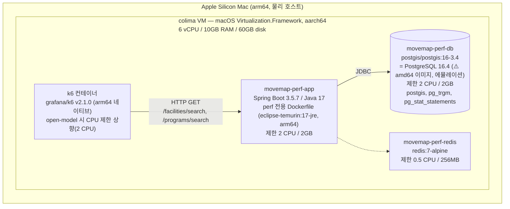
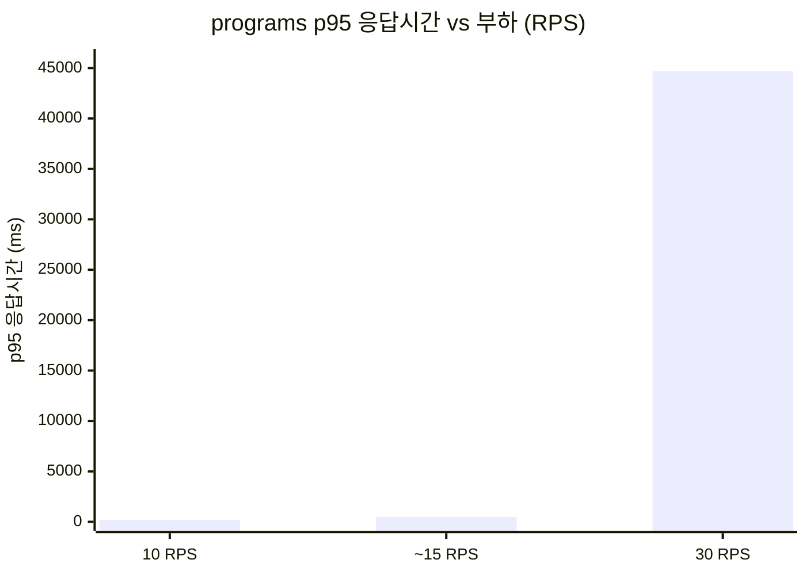

# MoveMap 검색 성능/부하 테스트 — AS-IS 기준선(Baseline) 리포트

> **이 문서는 무엇인가**: 지금 배포되어 있는 검색 기능(`/facilities/search`, `/programs/search`)을 "있는 그대로" 부하 테스트한 결과다. 나중에 검색엔진(ES 등)으로 바꾼 뒤 **같은 방식으로 다시 측정해서 이 문서와 비교**하기 위한 **기준선(baseline)** 이다.
>
> 모든 수치는 `perf/out/summary_*.json`, `pgstat_*.txt`, `explain_*.txt`, `dockerstats_*.txt` 원본 파일에서 `jq`/`cat`으로 직접 뽑아 확인했다. 지어낸 숫자는 없다. 가정이 들어간 부분(부하 크기 산정 등)은 "가정"이라고 표시했다.

---

## 0. 결론 요약 (TL;DR)

- **`/facilities/search`는 어떤 부하(10~30 RPS)에서도 빠르다.** p95 27~39ms 수준으로 항상 여유 있게 통과.
- **`/programs/search`는 부하가 오르면 무너진다.** 10 RPS에서는 통과(p95 198ms)하지만, 30 RPS에서는 **p95가 44.7초까지 치솟고 실제 처리량도 목표(30 RPS)에 못 미치는 19.1 RPS로 주저앉는다(붕괴).**
- 원인은 **애플리케이션이 아니라 DB**다. 30 RPS 구간에서 앱 서버 CPU는 3~5%로 놀고 있는데 DB CPU는 컨테이너에 할당된 2코어를 100% 다 쓴다(약 200%).
- 더 좁혀 보면 **programs 검색 쿼리 하나**가 원인이다. `program.name_normalized ILIKE '검색어%'` 패턴은 228만 행 테이블에서 텍스트 인덱스를 타지 못하고 PK 순서로 스캔하며, 동시 요청이 늘수록 DB CPU 경합이 기하급수적으로 커진다.
- **"지금 당장 느리다"는 아니다.** 이 서비스의 예상 피크 부하(도메인 유사 서비스 역산, 가정치 range 0.3~12.5 RPS, 중앙값 ~3 RPS)에서는 여유 있게 통과한다. 문제는 **"확장 여유가 얼마 없다"**는 것 — 10 RPS까지는 괜찮지만 그 조금 위(15 RPS)부터 이미 저하가 시작되고 30 RPS에서는 완전히 무너진다.

---

## 1. 측정 환경 사양 (포트폴리오 핵심 — 꼼꼼히)

### 1-1. 왜 환경 사양이 중요한가

이 리포트의 절대 수치(ms, RPS)는 **"실제 운영 서버에서 몇 명이 동시접속 가능한가"를 말해주는 숫자가 아니다.** 아래에서 보듯 부하기(k6)와 테스트 대상(앱+DB)이 **같은 노트북 한 대** 안에서, 그것도 **가상머신 안의 컨테이너**로 실행됐다. 이런 환경은:

- CPU를 컨테이너별로 나눠 쓰기 때문에 **"컨테이너 자원 제한 환경에서의 상대 비교"**로만 의미가 있고,
- 절대 응답시간은 실제 클라우드 서버(전용 vCPU, 전용 네트워크)보다 나쁘게 나올 수도, 우연히 좋게 나올 수도 있다.

그래서 이 문서가 주는 신뢰할 수 있는 결론은 **"facilities보다 programs가 훨씬 느리고, 부하가 오를수록 격차가 벌어진다"** 같은 **상대적 패턴**이지, "우리 서비스는 초당 30명까지 버틴다" 같은 **절대 스펙**이 아니다. (§1-4에 한계를 다시 정리했다.)

### 1-2. 구성도



### 1-3. 사양 표 (실측/확인 완료)

| 구분 | 값 | 확인 방법 |
|---|---|---|
| 호스트 | Apple Silicon Mac (arm64) | — |
| colima VM | **6 vCPU / 10GB RAM / 60GB disk**, macOS Virtualization.Framework, arch **aarch64** | `colima list`, `~/.colima/default/colima.yaml` 직접 조회로 재확인 (docker-compose.yml 주석엔 "4CPU/8GB"로 낡은 값이 남아있으나, 실측값은 6vCPU/10GB) |
| Docker | server **28.4.0** | `docker version` |
| app 컨테이너 | `movemap-perf-app` — Spring Boot **3.5.7** / Java 17, perf 전용 `perf/Dockerfile`(base `eclipse-temurin:17-jre`, arm64 네이티브 실행) | `build.gradle`, `perf/Dockerfile` |
| app 리소스 제한 | **2 CPU / 2GB** | `perf/docker-compose.yml` |
| db 컨테이너 | `movemap-perf-db` — `postgis/postgis:16-3.4` = **PostgreSQL 16.4** | `SELECT version()` 직접 실행 |
| db 이미지 아키텍처 | ⚠️ **amd64 전용 이미지 — arm64 호스트에서 에뮬레이션 실행** | `docker image inspect postgis/postgis:16-3.4` → `amd64` |
| db 확장 | postgis 3.4.3, pg_trgm 1.6, pg_stat_statements 1.10 | `\dx` 직접 조회 |
| db 리소스 제한 | **2 CPU / 2GB** | `perf/docker-compose.yml` |
| redis | `redis:7-alpine`, 제한 **0.5 CPU / 256MB** | `perf/docker-compose.yml` |
| 부하기 | grafana/**k6 v2.1.0**(arm64 네이티브), 컨테이너로 실행. **SUT(앱+DB)와 같은 호스트** (별도 부하 서버 아님) | `perf/k6/run.sh` — 기본 1 CPU, 스크립트 주석상 고RPS 테스트는 K6_CPUS 2~3 권장, open-model 측정은 2 CPU로 실행 |
| 데이터 | facility **55,372행** / program **228,460행** (Flyway **90개** 마이그레이션으로 시드된 실제 데이터) | `SELECT count(*)`, `SELECT count(*) FROM flyway_schema_history` 직접 조회 |

### 1-4. 정직한 한계 (반드시 함께 읽을 것)

1. **부하기와 SUT가 같은 물리 호스트다.** 별도의 독립 서버에서 부하를 쏜 게 아니라, k6 컨테이너도 같은 colima VM(6 vCPU) 안에서 CPU를 나눠 쓴다. 부하기가 자원을 일부 갉아먹었을 가능성이 있다(단, k6 컨테이너 CPU를 제한해 SUT 자원을 침범하지 않도록 설계함).
2. **가상화가 2겹이다**: macOS → colima VM(Virtualization.Framework) → Docker 컨테이너. 실제 클라우드 서버(예: EC2)보다 오버헤드가 더 낄 수 있다.
3. **DB 이미지가 amd64라 arm64에서 에뮬레이션된다.** 이는 DB 성능을 실제보다 **나쁘게** 보이게 할 수 있는 요인이다 (반대로 말하면 "지금 결과보다 실서버에선 DB가 더 빠를 가능성"이 있다는 뜻이기도 하다).
4. 그래서 이 리포트의 목적은 **"prod에서 초당 N명까지 버틴다"는 절대 스펙 산정이 아니라, "같은 환경에서 A(현재 구현) 대비 B(ES 등)가 얼마나 개선되는가"를 재는 상대 비교의 기준선(baseline)을 만드는 것**이다.

---

## 2. 측정 방법 & 부하 시나리오 근거

### 2-1. 용어부터: p95, p99가 뭔가

- 100개의 요청을 처리했다고 하자. 응답시간을 빠른 순서로 줄 세운다.
- **p95(95번째 백분위수)** = 95번째로 빠른(=상위 5%가 이보다 느린) 요청의 응답시간. "느린 5%를 빼면 다들 이 정도 시간 안에 응답받는다"는 뜻.
- **p99** = 상위 1%가 이보다 느린 지점. "가장 재수 없는 손님 100명 중 1명"의 체감 속도.
- 평균(avg)만 보면 소수의 아주 느린 요청(꼬리, tail)이 묻혀서 안 보인다. 그래서 성능 테스트에서는 **p95/p99을 반드시 같이 본다.**
- **med(중앙값)** = 딱 중간에 있는 값. "가장 흔하게 체감하는 속도"에 가깝다.

### 2-2. 도구와 SLO(서비스 수준 목표)

- **도구**: k6 (grafana/k6 v2.1.0)
- **두 가지 부하 모델**을 함께 사용:
  - **open model** (`constant-arrival-rate`, `perf/k6/search_perf.js`): "초당 N개 요청을 무조건 쏜다." 서버가 느려져도 요청 속도는 줄지 않는다 — **실제 사용자 유입 패턴에 더 가까운 모델.** 워밍업 없이 바로 목표 RPS로 시작, **본측정 3분**(10 RPS: 1,800회/10 = 180초, 30 RPS: 5,400회/30 = 180초로 원본 파일에서 확인).
  - **closed model** (`ramping-vus`, `perf/k6/search_test.js`): "가상 유저(VU) N명이 요청→응답 받고 나서 1초 쉬고 다시 요청." 워밍업 30초(분석에서 제외) + 본측정 2분. 동시 사용자 수 기준 테스트라 참고용으로 병행.
- **SLO 기준**: **p95 < 500ms, p99 < 1s, 에러율 < 1%**
  - 근거: 공개 API에서 통용되는 경험적 기준 + Jakob Nielsen의 "응답 1초는 사용자가 흐름이 끊기지 않는다고 느끼는 체감 한계"(1993, *Response Times: The Three Important Limits*)라는 UX 통념을 참고. **엄밀한 벤치마크 표준은 아니고 실무 관행 기준**이다.
- 검색어: `perf/k6/keywords.json`의 **22개 고정 검색어** (1글자 "강", "수" 부터 "국민체육센터" 같은 복합어까지 섞음).

### 2-3. 부하 크기(RPS)를 왜 이렇게 잡았나 — "다짐" 역산 (전부 가정치)

MoveMap은 아직 실사용 트래픽 데이터가 없다. 그래서 도메인이 가장 비슷한 서비스인 **"다짐"(피트니스 예약 앱, 누적 다운로드 약 100만 — 외부 검증 없이 인용된 참고치)**을 기준으로 피크 시간대 검색 RPS를 역산했다. **아래 계수는 전부 가정이며, 실측이 아니다.**

| 단계 | 가정/계산 | 결과 (범위) |
|---|---|---|
| 1. 누적 가입자 | 다짐 공개 지표(가정) | 100만 |
| 2. 활성률 | 5~15%(가정) | MAU 5만~15만 |
| 3. Stickiness(DAU/MAU) | 5~15%(가정) | DAU 중앙값 약 1만 |
| 4. 1인당 일 검색 횟수 | 5회(가정) | 일 검색량 약 5만 회 |
| 5. Peak Hour Factor | 0.2(가정 — 특정 시간대 집중도) | 피크 시 초당 요청 |
| **결과** | — | **peak RPS 중앙값 약 3, 범위 0.3~12.5** |

- **결론**: 예상 실서비스 피크는 **약 0.3~12.5 RPS (중앙값 ~3 RPS)** 로 추정된다(가정).
- 테스트 부하는 이 추정 범위를 확실히 덮도록 **10 RPS(현실 peak 근사~여유), ~15 RPS(참고), 30 RPS(스트레스/한계 확인)** 세 구간으로 잡았다. 30 RPS는 추정 피크 범위를 크게 초과하는 **의도적인 여유값(스트레스 테스트)**이다.

---

## 3. 결과 — 부하별 성능 곡선 (핵심)

> 모든 결과는 **조건 A = 현재 구현 그대로** (별도로 실험했던 trigram 인덱스는 제거한 상태). `facility.name`/`facility_subtype`엔 텍스트 인덱스가 없고, `program.name_normalized`엔 B-tree 인덱스가 있지만 아래 §4에서 보듯 ILIKE 쿼리에는 사용되지 않는다.

### 3-1. 10 RPS (open model — 예상 피크 근처, 여유 있는 구간)

| 엔드포인트 | med | p95 | p99 | avg | 실제 RPS | dropped | 에러율 | SLO 판정 |
|---|---|---|---|---|---|---|---|---|
| `/facilities/search` | 9.3ms | 39.1ms | 44.7ms | 14.3ms | 10.0 | 0 | 0% | **PASS** |
| `/programs/search` | 13.5ms | 198.2ms | 211.9ms | 73.9ms | 10.0 | 0 | 0% | **PASS** (p95 기준 여유 약 2.5배) |

- DB 평균 처리시간(pg_stat_statements): facilities **9.35ms**, programs **71.35ms** — 즉 이 구간에서도 이미 programs 쿼리가 facilities보다 **약 7.6배** 느리다.
- 리소스: app CPU 2~3%, db CPU 37~71% (`dockerstats_rps10.txt`, 3회 스냅샷).

```
p95 응답시간 (10 RPS, 단위 ms)
facilities │███ 39.1ms
programs   │███████████████████████ 198.2ms
           └──────────────────────────────── SLO 기준선(500ms)까지 아직 여유
```

### 3-2. ~14~16 RPS (closed model, 20 VU — 참고용)

- 20 VU 고정, 워밍업 30초(제외) + 본측정 2분, 3회 반복 후 **지표별 중앙값(median-of-3)** 채택 (아래는 `summary_baseline_*_r1/r2/r3.json` 3회 실측에서 산출).

| 엔드포인트 | med | p95 | p99 | 실제 RPS | 3회 범위(참고) |
|---|---|---|---|---|---|
| `/facilities/search` | 6.3ms | 33.1ms | 41.2ms | ~15.7 | p95 30.1~33.2ms |
| `/programs/search` | 19.2ms | **486.1ms** | 848.7ms | ~14.2 | p95 320.7~498.2ms (회차 편차 있음) |

- programs의 DB 평균 처리시간(pg_stat_statements): **115.8ms** — 10 RPS 대비 이미 1.6배 상승.
- programs p95(486ms)는 SLO(500ms) **바로 턱밑까지** 붙었다. 즉 **15 RPS 부근이 이 구조의 사실상 한계선**이라는 신호.

### 3-3. 30 RPS (open model — 스트레스/한계 확인)

| 엔드포인트 | med | p95 | p99 | avg | 목표 RPS | 실제 RPS | dropped | 에러율 | SLO 판정 |
|---|---|---|---|---|---|---|---|---|---|
| `/facilities/search` | 4.5ms | 26.7ms | 33.3ms | 8.8ms | 30 | 29.999 | 0 | 0% | **PASS** |
| `/programs/search` | **24.2초** | **44.69초** | **50.1초** | 23.4초 | 30 | **19.1** (목표 미달) | **1,184** | 0.224% | **FAIL (붕괴)** |

- DB 평균 처리시간: facilities **6.83ms**(오히려 더 빠름 — 캐시/버퍼 안정화 영향으로 추정), programs **511.15ms**.
- 리소스: db CPU **약 200%**(2코어 컨테이너를 풀로 사용, 3회 스냅샷 199.6~201.2%), app CPU **3~5%**(사실상 유휴).
- `dropped_iterations`가 1,184건 발생 — k6가 열려는 요청을 db 지연 때문에 미처 열지도 못하고 버린 것. 요청 하나 처리에 평균 23초가 걸리니, 30 RPS(0.033초 간격)로 밀려드는 요청이 쌓이고 쌓여 k6에 할당된 VU 상한을 넘겨버린 결과다. **"에러"가 아니라 "큐가 감당 못 해서 아예 시도조차 못 한 요청"**이라는 뜻 — 상황이 더 나쁘다는 신호로 읽어야 한다.

```
programs p95 응답시간 추이 (선형 눈금, 단위: ms → 완전히 다른 자릿수임에 주의)
 10 RPS │██ 198ms
 15 RPS │████ 486ms
 30 RPS │████████████████████████████████████████████████ 44,690ms  (약 45초!)
        └──────────────────────────────────────────────────────────
```



**요약 곡선**: programs 검색은 10 RPS까지 정상(198ms) → 15 RPS 부근에서 SLO 턱밑까지 저하(486ms) → 30 RPS에서 완전 붕괴(44.7초, 목표 처리량 미달). **facilities는 전 구간에서 안정적**(27~39ms).

---

## 4. 병목 분석

### 4-1. 무엇이 느린가 — programs 쿼리, 그리고 오직 programs만

- `facilities`는 3구간(10/15/30 RPS) 전부에서 p95가 27~39ms로 **거의 움직이지 않는다.**
- `programs`만 부하가 오를수록 **기하급수적으로** 나빠진다: p95 기준 198ms → 486ms(2.5배) → 44,687ms(10RPS 대비 **약 225배**).
- 부하 실험 중 앱 서버 CPU는 30 RPS 구간에서도 3~5%로 **거의 놀고 있었다** (`perf/out/dockerstats_openmodel.txt`). 반면 db CPU는 컨테이너에 할당된 2코어를 **100% 다 채운 약 200%**. → **병목은 애플리케이션 코드가 아니라 DB 쿼리 실행 자체다.**

### 4-2. 원인 — 텍스트 인덱스를 못 타는 ILIKE + 큰 테이블

`/facilities/search`가 실행하는 쿼리 (`FacilityRepository.java:16-17`):

```sql
SELECT * FROM facility f
WHERE f.name LIKE CONCAT('%', :keyword, '%')
   OR f.facility_subtype LIKE CONCAT('%', :keyword, '%')
LIMIT 30
```

`/programs/search`가 실행하는 쿼리 (`ProgramRepositoryCustomImpl.java:517-529`, `searchProgramsByKeyword`):

```sql
SELECT p.id, p.name AS program_name, p.facility_name, p.facility_subtype, p.address
FROM program p
WHERE 1=1
  AND (p.name_normalized ILIKE :keyword OR p.facility_name_normalized ILIKE :keyword)  -- :keyword = '검색어%'
ORDER BY p.id ASC
LIMIT :size
```

`EXPLAIN (ANALYZE, BUFFERS)`로 확인한 실제 실행 계획(흔한 키워드 "수영" 기준, `perf/out/explain_A_*.txt`):

| | facility | program |
|---|---|---|
| 스캔 방식 | **Seq Scan** (테이블 전체 순차 스캔) | **Index Scan using `program_pkey`** (PK 순서 스캔, 텍스트 인덱스 아님) |
| 실행시간(단일 쿼리) | 2.46ms | **1.83ms** |
| 사용 가능한 텍스트 인덱스 | 없음 | `idx_program_name_normalized_btree` 존재하지만 **미사용** |

- `program.name_normalized`에는 B-tree 인덱스가 실제로 존재한다. 코드에도 `// ✅ Prefix 검색 (B-Tree 인덱스 활용)`이라는 주석이 달려 있어 **"인덱스를 쓸 것"으로 의도**했던 흔적이 보인다. 그러나 실제 `EXPLAIN`은 **PK 스캔**을 보여준다 — `ILIKE`(대소문자 무시 비교)는 일반 B-tree로 가속되지 않기 때문에(대소문자 무시 비교는 컬럼값을 그대로 정렬한 B-tree로는 인덱스 조건을 만들 수 없다), **의도와 실제 실행 계획이 어긋나 있다.** 이 코드 주석은 정정이 필요하다.
- 그런데도 EXPLAIN 단일 쿼리 실행시간은 1.83ms로 매우 빠르다. **모순처럼 보이지만 이유가 있다**: EXPLAIN은 흔한 키워드("수영") 하나를 **동시성 없이 단독 실행**한 결과다. 실제 부하 테스트에서는 22개 검색어가 무작위로 섞이고(희귀 키워드는 스캔해야 할 행이 더 많음), 무엇보다 **여러 요청이 동시에** PK 스캔을 돌린다. 이 동시성이 늘어날수록 DB CPU 경합이 커지고, 응답시간이 선형이 아니라 폭발적으로 늘어난다 — 이것이 §3-3에서 본 "30 RPS 붕괴"의 정체다.
- `facility` 쪽은 테이블이 더 작고(5.5만 행 vs 22.8만 행) `LIMIT 30`으로 조기 종료가 잘 되기 때문에 Seq Scan이어도 상대적으로 안정적이다.

### 4-3. "인덱스만 추가하면 되지 않나?" — 이미 별도로 실험해봄 (참고: `perf/BENCHMARK_REPORT.md`)

같은 문제의식으로 `pg_trgm` GIN 인덱스(양쪽 와일드카드 `%kw%`도 가속 가능한 인덱스 타입)를 추가해서 별도 실험을 진행했다. 결과 요약(자세한 내용은 `perf/BENCHMARK_REPORT.md` 참고):

- `/facilities/search`: 인덱스를 추가했더니 **오히려 p95가 38ms → 52ms로 38% 악화**됐다(3회 반복 모두 일관 — 우연 아님).
- `/programs/search`: 중앙값은 소폭 개선되는 듯했지만 회차별 p99 편차가 399ms~1494ms로 너무 커서 **"확인 필요"**로 판단 보류.
- 원인: 테이블이 상대적으로 작고(5.5만~22.8만 행) `LIMIT`으로 조기 종료가 되는 상황에서는, PostgreSQL 옵티마이저가 "인덱스를 타는 비용"보다 "그냥 훑는 비용"을 더 싸다고 판단해 **추가한 인덱스를 아예 쓰지 않았다.**
- **결론(이 문서와 연결)**: 단순 인덱스 추가는 이 구조적 문제의 해법이 아니다. 근본 원인은 "인덱스가 없어서"가 아니라 **"텍스트 검색을 관계형 DB의 LIKE/ILIKE로 하고 있다"는 쿼리·아키텍처 구조 자체**에 가깝다 — 이것이 이 baseline 문서 이후 검색엔진(ES 등) 전환을 검토하는 이유다.

---

## 5. HTML 대시보드 (k6 결과 원본)

k6가 직접 생성한 인터랙티브 HTML 리포트. 시계열 그래프, 응답시간 분포 등을 브라우저에서 바로 확인 가능하다.

| 파일 | 내용 |
|---|---|
| `perf/out/report_openmodel_facilities.html` | 30 RPS open-model, facilities |
| `perf/out/report_openmodel_programs.html` | 30 RPS open-model, programs |
| `perf/out/report_facilities.html` | closed-model(20VU), facilities |
| `perf/out/report_programs.html` | closed-model(20VU), programs |

---

## 6. 결론 & ES(검색엔진) 전환 비교 자리 (TO-BE placeholder)

### 6-1. AS-IS 요약

- **현재 구현은 예상 피크 부하(가정 중앙값 ~3 RPS, 범위 0.3~12.5 RPS)에서는 충분히 통과한다.** 지금 당장 사용자가 느려서 불만을 가질 상황은 아니다.
- 하지만 **`/programs/search`는 확장 여유가 매우 좁다.** 10 RPS에서 15 RPS로만 올라가도 이미 SLO 턱밑(486ms/500ms)까지 붙고, 30 RPS에서는 완전히 붕괴한다.
- 이건 "속도가 느리다"보다는 **"쿼리 구조상 동시성에 취약해서, 트래픽이 예상보다 조금만 더 몰려도 급격히 무너지는 설계"**라고 표현하는 게 더 정확하다. 병목은 애플리케이션이 아니라 **DB의 `ILIKE` + PK 스캔 쿼리 구조**다.

### 6-2. TO-BE 비교 표 (검색엔진 전환 후 채울 자리)

> 동일한 조건(10 RPS / ~15 RPS / 30 RPS, 동일 22개 키워드, 동일 컨테이너 리소스 제한)으로 재측정해서 아래 표를 채운다.

| 부하 | 지표 | AS-IS (현재, 본 문서) | TO-BE (ES 등 전환 후) | 개선율 |
|---|---|---|---|---|
| 10 RPS | programs p95 | 198.2ms | *(측정 필요)* | *(측정 필요)* |
| 10 RPS | programs p99 | 211.9ms | *(측정 필요)* | *(측정 필요)* |
| ~15 RPS | programs p95 | 486.1ms | *(측정 필요)* | *(측정 필요)* |
| 30 RPS | programs p95 | 44,687ms | *(측정 필요)* | *(측정 필요)* |
| 30 RPS | programs 실제 RPS(목표 30) | 19.1 (미달) | *(측정 필요)* | *(측정 필요)* |
| 30 RPS | programs dropped_iterations | 1,184 | *(측정 필요)* | *(측정 필요)* |
| 30 RPS | DB CPU (%) | ~200% (2코어 풀) | *(측정 필요)* | *(측정 필요)* |
| 전 구간 | facilities p95 | 27~39ms | *(측정 필요, 참고용)* | *(측정 필요)* |

---

## 7. 부록

### 7-1. 원본 데이터 파일 (`perf/out/`)

- **요약 지표(JSON)**: `summary_rps10_facilities.json`, `summary_rps10_programs.json`(10 RPS open) / `summary_openmodel_facilities.json`, `summary_openmodel_programs.json`(30 RPS open) / `summary_baseline_facilities_r1~r3.json`, `summary_baseline_programs_r1~r3.json`(~15 RPS closed, 3회 반복) / `summary_A_*_r1~r3.json`, `summary_B_*_r1~r3.json`(pg_trgm A/B 실험, `BENCHMARK_REPORT.md` 참고)
- **DB 실행 통계(pg_stat_statements)**: `pgstat_rps10_facilities.txt`, `pgstat_rps10_programs.txt`, `pgstat_openmodel_facilities.txt`, `pgstat_openmodel_programs.txt`, `pgstat_baseline_facilities.txt`, `pgstat_baseline_programs.txt`
- **실행 계획**: `explain_A_facilities.txt`, `explain_A_programs.txt`, `explain_baseline_facilities.txt`, `explain_baseline_programs.txt`
- **컨테이너 리소스 스냅샷**: `dockerstats_rps10.txt`, `dockerstats_openmodel.txt`, `dockerstats_baseline_underload.txt`
- **k6 HTML 대시보드**: `report_openmodel_facilities.html`, `report_openmodel_programs.html`, `report_facilities.html`, `report_programs.html`
- **참고 별도 실험**: `perf/BENCHMARK_REPORT.md` — pg_trgm GIN 인덱스 추가 A/B 실험. "단순 인덱스 추가로는 이 문제가 해결되지 않는다"를 보여준 별도 리포트.

### 7-2. 한계 재정리

1. 부하기(k6)와 SUT(앱+DB)가 같은 물리 호스트 — 독립된 부하 서버가 아니다.
2. colima VM(가상화) 위의 Docker 컨테이너(2중 가상화) — 실제 클라우드 서버와 오버헤드 특성이 다를 수 있다.
3. DB 이미지가 amd64 전용이라 arm64 호스트에서 에뮬레이션 실행됨 — DB 성능이 실제보다 나쁘게 측정됐을 가능성.
4. 부하 크기(RPS) 산정 근거(다짐 역산)는 전부 가정치이며 MoveMap 자체 실사용 데이터로 검증되지 않았다.
5. SLO 기준(p95<500ms, p99<1s)은 업계 통념 기준이며 MoveMap 자체 합의된 SLA는 아니다.
6. **따라서 이 문서의 절대 수치(ms)를 prod 성능 스펙으로 인용하지 말 것.** 유효한 결론은 "facilities vs programs의 상대적 격차", "부하에 따른 저하 패턴", 그리고 **ES 전환 전후 비교의 기준선**이다.
