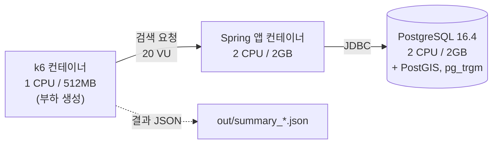
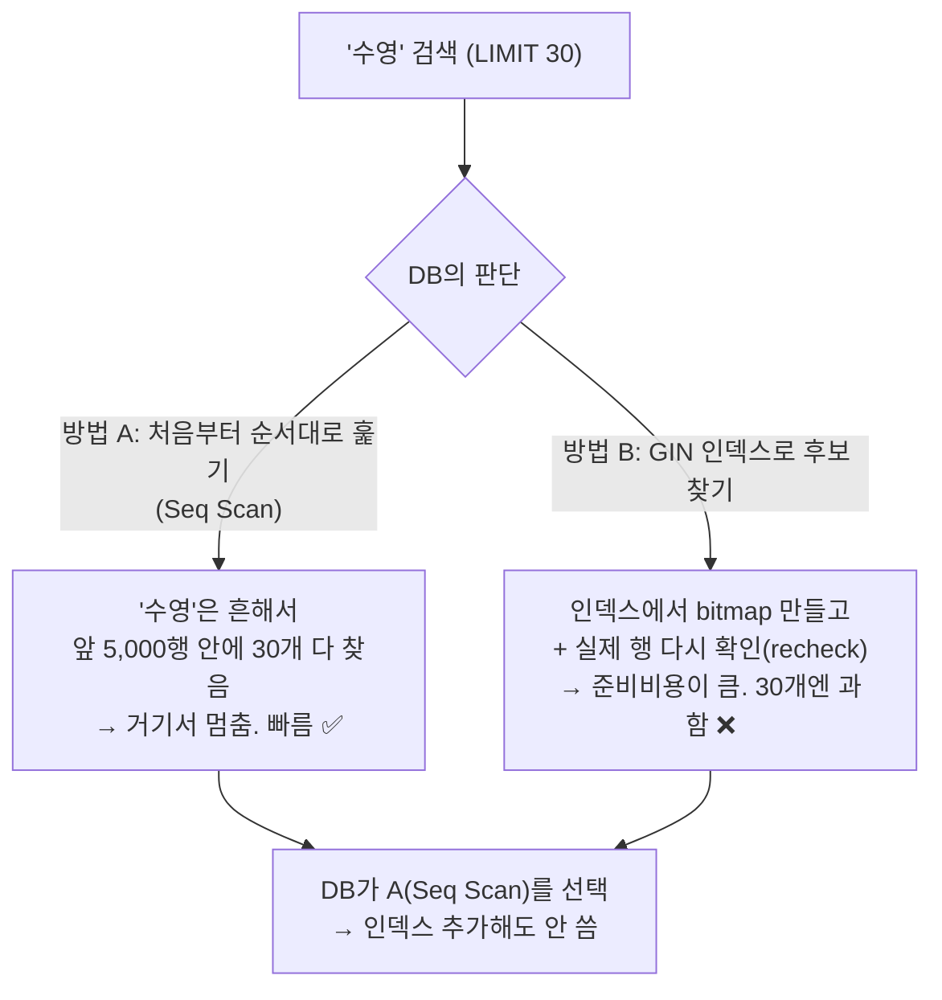

# MoveMap 검색 성능 벤치마크 리포트 — A(현재) vs B(pg_trgm)

> 인턴도 이해할 수 있게 썼다. 결론부터 말하면 **"인덱스를 추가하면 빨라진다"는 예상이 빗나갔고, 왜 그런지가 이 리포트의 핵심**이다.
> 이건 실패가 아니라 **"측정했더니 잘못된 최적화를 막아준"** 좋은 사례다.

---

## 0. TL;DR (한 문단 요약)

`%kw%` 검색이 인덱스를 못 타서 느릴 거라 보고 **pg_trgm GIN 인덱스**를 추가해봤다. 결과는:
- **`/facilities/search`**: B(인덱스)가 A(현재)보다 **오히려 느려짐** (p95 37.6ms → 51.8ms, **+38%**). 3회 모두 일관 → 신뢰도 높음.
- **`/programs/search`**: 중앙값은 소폭 개선처럼 보이나 **회차 편차가 극심**(p99가 399ms\~1494ms) → **판단 보류**.
- **핵심 원인**: 테이블이 작고(5.5만 행) 쿼리에 `LIMIT`이 걸려 있어, DB가 인덱스를 **아예 선택하지 않고** 앞부분만 훑고 조기 종료하는 게 더 빠르기 때문.

**교훈**: "인덱스 = 무조건 빠름"이 아니다. **측정하지 않고 최적화하면 오히려 느려질 수 있다.**

---

## 1. 측정 환경 (반드시 함께 읽을 것)

이건 **prod이 아니라, 리소스를 제한한 컨테이너 환경**에서의 상대 비교다.



| 항목 | 값 |
|---|---|
| 호스트 | Apple Silicon Mac / colima VM (6 CPU, 10GB, arm64) |
| 앱 | Spring Boot 3.5.7 컨테이너 (2 CPU / 2GB) |
| DB | PostgreSQL 16.4 + PostGIS + pg_trgm 컨테이너 (2 CPU / 2GB) |
| 부하기 | k6 컨테이너 (1 CPU / 512MB) — SUT와 같은 호스트 |
| 데이터 | facility **55,372행**, program **228,460행** (실제 시드) |

> 정직한 한계: 부하기와 SUT가 같은 물리 호스트, arm64에서 postgis amd64 에뮬레이션. → "독립 서버"가 아니라 **"리소스 제한 컨테이너 환경의 A/B 상대 비교"**.

---

## 2. 측정 방법 (시나리오)

- **부하**: 20 VU 고정, 워밍업 30초(제외) + 본측정 60초 + 쿨다운 10초
- **엔드포인트 2종**:
  - `/facilities/search` — `name`/`facility_subtype`에 `%kw%` (양쪽 와일드카드) ILIKE
  - `/programs/search` — `name_normalized`에 `kw%` (앞부분/prefix) ILIKE
- **조건 2개 × 3회 반복** (중앙값 사용)
  - **A** = 텍스트 인덱스 없음 (현재 상태)
  - **B** = pg_trgm GIN 인덱스 추가 (실제 필터 컬럼에)
- **검색어**: 22개 고정 리스트 (1글자\~긴 복합어 섞음)
- 모든 run 에러율 **0%** (요청 실패 없음)

---

## 3. 결과

### 3-1. `/facilities/search` — B가 오히려 느려짐 (신뢰도 높음)

| 조건 | med | p95 | p99 | avg | RPS |
|---|---|---|---|---|---|
| **A (현재)** | 8.24 | **37.64** | 44.35 | 12.73 | 15.75 |
| **B (pg_trgm)** | 6.57 | **51.83** | 63.22 | 16.20 | 15.63 |
| 변화 | -20% | **+38% 🔴** | +42% 🔴 | +27% 🔴 | ~같음 |

**p95 응답시간 (낮을수록 좋음, 단위 ms):**
```
A (현재)    │████████████████████ 37.6ms
B (pg_trgm) │███████████████████████████ 51.8ms   ← +38% 악화 🔴
            └────────────────────────────────────
```
> med(중앙값)만 살짝 빨라졌지만, **p95·p99(느린 쪽 꼬리)는 확실히 악화**. 3회가 거의 같은 값이라 우연이 아니다.

### 3-2. `/programs/search` — 편차가 너무 커서 판단 보류

| 조건 | med | p95 | p99 | avg | RPS |
|---|---|---|---|---|---|
| **A (현재)** | 21.32 | 433.76 | 680.09 | 111.70 | 14.21 |
| **B (pg_trgm)** 중앙값 | 14.29 | 326.99 | 677.45 | 101.95 | 14.38 |

**하지만 B의 회차별 p99가 널뛰기:**
```
B r1 │████████████████████████████████████████ 1494ms 🔴 (max 3.3초!)
B r2 │██████████████████ 677ms
B r3 │███████████ 399ms ✅
     └──────────────────────────────────────────
   같은 조건인데 회차마다 4배 차이 → 신뢰 불가
```
> 중앙값만 보면 "B가 조금 나음"이지만, **한 회차(r1)의 이상치가 결론을 뒤집을 수 있어** "확인 필요"로 남긴다. (반복 3회는 부족 → 5회+ 권장)

### 3-3. 두 엔드포인트의 스케일 차이 (진짜 문제는 여기)

```
p95 비교 (A 기준, ms)
/facilities/search  │██ 38ms        ← 이미 충분히 빠름
/programs/search    │████████████████████████ 434ms   ← 10배 이상 느림 🔴
```
> **facilities는 이미 빠르다(38ms).** 느린 건 **programs(434ms, p99는 1초까지)** 다. 최적화가 필요한 진짜 대상은 programs.

---

## 3-4. 잠깐 — 인덱스는 원래 있었나, 내가 추가한 건가? (오해 방지)

| 테이블/컬럼 | 원래(A = 현재 코드) | B에서 추가한 것 |
|---|---|---|
| `facility.name`, `facility_subtype` | **인덱스 없음** | GIN trigram 2개 (내가 추가) |
| `program.name_normalized`, `facility_name_normalized` | **B-tree 있었음**(V14.2/V14.4) — 단 `ILIKE`엔 무용 | GIN trigram 2개 (내가 추가) |

- **B의 GIN trigram 인덱스는 이 실험용으로 내가 만든 것**이고, 프로젝트 코드엔 없다. A는 현재 코드 그대로.
- program에 원래 있던 B-tree는 **`ILIKE`를 가속 못 해** 검색엔 안 쓰이고 있었다.
- **중요**: 실험 결과, **A·B 둘 다 내가 추가한 GIN 인덱스를 DB가 사용하지 않았다** (facilities=Seq Scan, programs=기본키 Index Scan). 왜인지는 §4.

---

## 3-5. 왜 B-tree가 아니라 GIN을 추가했나? (`%kw%` 때문)

당신 말이 정확하다: **일반 B-tree 인덱스는 `검색어%`(앞부분 고정)만 탈 수 있고, `%검색어%`(양쪽 와일드카드)는 못 탄다.**

| 인덱스 종류 | `검색어%` (prefix) | `%검색어%` (양쪽) | 원리 |
|---|---|---|---|
| **B-tree** | ✅ 가능 | ❌ **불가** | 정렬된 트리 → 시작점을 알아야 범위 탐색. `%`로 시작하면 시작점이 없음 |
| **GIN + pg_trgm** | ✅ 가능 | ✅ **가능** | 글자를 3글자 조각(trigram)으로 쪼개 색인 → 조각이 문자열 어디에 있든 찾음 |

- `facility.name LIKE '%수영%'`는 **B-tree로는 절대 못 가속**한다(그래서 B-tree를 만들어도 Seq Scan).
- **GIN + pg_trgm은 바로 이 `%kw%`를 인덱싱하려고 만든 물건**이다:
  - "올림픽수영장" → `올림`,`림픽`,`픽수`,`수영`,`영장`... 3글자 조각으로 쪼개 저장.
  - "수영"으로 검색하면 `수영` 조각을 가진 행을 인덱스에서 바로 찾음. **LIKE·ILIKE 둘 다, 양쪽 와일드카드도 가속 가능.**
- **그래서 내가 B-tree가 아니라 GIN을 골랐다** — `%kw%`를 인덱스로 태울 **유일한 방법**이라서.

### 그럼 효과가 있었나? — 이론상 YES, 이번 실험에선 NO

- GIN이 `%kw%`를 **가속할 수 있는 건 맞다.** 하지만 DB는 "인덱스 쓰는 비용 vs 그냥 훑는 비용"을 비교해 **더 싼 쪽**을 고른다.
- 이번엔 테이블이 작고(5.5만) + `LIMIT 30` + "수영"이 흔해서 → **그냥 훑기(Seq Scan)가 이미 2.5ms로 충분히 쌌다.** GIN은 준비비용(bitmap+recheck)이 오히려 손해 → DB가 GIN을 **안 씀**.
- **GIN이 빛나는 상황**: 테이블이 크거나(수백만 행), `LIMIT` 조기종료가 없거나, 희귀 키워드라 Seq Scan이 비쌀 때.
- 즉 **GIN이 틀린 선택이라기보단, 지금 데이터가 인덱스를 필요로 할 만큼 무겁지 않았다.** (데이터가 커지면 이야기가 달라질 수 있음 → 확인 필요)

---

## 4. 왜 이런 결과가 나왔나? (핵심 — 인턴용 설명)

### 원인 ①: 작은 테이블 + `LIMIT` → 인덱스를 "안 쓰는" 게 더 빠름

`EXPLAIN`으로 실제 실행계획을 봤더니 **A와 B가 똑같았다** — B에서도 새 인덱스를 **안 씀**:

| | A_facilities | B_facilities |
|---|---|---|
| 스캔 방식 | Seq Scan | **Seq Scan** (인덱스 있는데도 미사용) |
| 실행시간 | 2.46ms | 2.55ms |

**왜?** 쉽게 비유하면:



- 테이블이 **5.5만 행으로 작고**, `LIMIT 30`이라 **30개만 채우면 즉시 종료**한다.
- "수영" 같은 **흔한 키워드**는 앞부분에서 금방 30개가 채워진다 → 전체를 훑지 않는다.
- GIN 인덱스는 "bitmap 만들고 → 실제 행 다시 확인"하는 **초기 비용**이 있는데, 겨우 30개 뽑는 데는 그 비용이 손해다.
- → 그래서 DB 옵티마이저가 **인덱스를 무시하고 Seq Scan을 택함**. 인덱스는 색인 용량만 늘리고 부하테스트에선 오히려 오버헤드로 작용.

### 원인 ②: 짧은 검색어(1\~2글자)가 trigram을 무력화

- pg_trgm은 검색어를 **3글자 조각(trigram)**으로 쪼개 인덱스를 탄다.
- "강", "수" 같은 **1\~2글자는 trigram이 거의 안 나와** 인덱스 효율이 급락한다. (이건 `B_pg_trgm.sql` 주석에도 미리 경고해둔 현상)

### 원인 ③: programs는 `ORDER BY id LIMIT` 때문에 기본키(PK) 인덱스로 조기 종료 — 그리고 이게 편차의 범인

`/programs/search`의 실제 실행계획:
```
Limit (rows=20)
  └─ Index Scan using program_pkey        ← name 인덱스가 아니라 기본키(id)를 씀
       Filter: name_normalized ILIKE '수영%' OR facility_name_normalized ILIKE '수영%'
```

DB가 두 방법을 저울질한 결과:
- **방법 1 (선택됨)**: id 순서로 걸으며 "수영으로 시작?" 필터 → "수영"은 매칭이 **약 8만 건**이라 앞에서 금방 20개 채우고 멈춤. **비용 ≈ 5, 초저렴.**
- **방법 2 (GIN)**: 매칭 8만 건 다 찾아 → id 정렬 → 20개 자르기. 훨씬 비쌈.
→ 그래서 name 인덱스(B-tree도 내 GIN도) 대신 **기본키 스캔**을 택함.

**⭐ 이게 programs 편차(§3-2)의 진짜 원인**: 이 방식은 **검색어가 흔하냐 희귀하냐**에 성능이 좌우된다.
- 흔한 단어(수영) → id 앞쪽에서 금방 20개 → 빠름
- 희귀한 단어(매칭 몇 건) → **수십만 행을 다 걷고도** 20개를 못 채움 → p99 1초로 폭발 🔴

무작위 키워드로 부하를 주니, 그 run에 희귀 단어가 얼마나 섞였느냐에 따라 회차마다 4배씩 출렁인 것.

### ⚠️ 중요: EXPLAIN 수치(2.5ms)와 부하테스트 수치(38\~430ms)가 다른 이유

- EXPLAIN은 **"수영" 한 단어**(흔함)로만 쟀다 → 2.5ms로 빠름.
- 부하테스트는 **무작위 22개 키워드**(희귀 단어·짧은 단어 포함) → 느린 것도 섞여 38\~430ms.
- **교훈**: 한 쿼리 `EXPLAIN`만 보고 "빠르다/느리다" 결론 내면 안 된다. 실제 워크로드(다양한 입력)로 재야 한다.

---

## 5. 이 벤치마크가 준 교훈 (포트폴리오 핵심)

1. **측정 없이 최적화하지 마라.** "인덱스 추가 = 빨라짐"은 참이 아니었다. 작은 테이블 + LIMIT 조합에선 Seq Scan이 더 빠르고, 인덱스는 오히려 손해였다. → **측정이 잘못된 최적화를 막아줬다.**
2. **평균/중앙값만 보지 마라.** programs는 중앙값으론 "개선"인데 p99·max를 보면 3.3초짜리 이상치가 있었다. **꼬리(p95/p99)와 편차**를 봐야 진실이 보인다.
3. **반복이 부족하면 결론 내지 마라.** 3회로는 programs의 편차를 설명 못 한다 → "확인 필요"로 남기는 게 정직하다.
4. **EXPLAIN ≠ 실제 워크로드.** 마이크로 쿼리 하나로 일반화하면 틀린다.

---

## 6. ES 의사결정에 주는 함의 (중요)

이 결과는 ES 전환 논리를 **더 정직하게** 만든다:

- **facilities 검색은 이미 빠르다(p95 38ms).** → 여기서 **"속도" 때문에 ES로 갈 이유는 약하다.** ES의 명분은 **형태소 검색 품질**과 **데이터 증가 대비 확장성**이지, 현재 속도가 아니다. (초반에 논의한 "ES의 가치는 속도가 아니라 검색 품질"이 데이터로 확인됨)
- **programs 검색은 실제로 느리고(p95 434ms, p99 1초) 불안정하다.** → 이게 **진짜 성능 개선 대상**. 단, pg_trgm은 `ORDER BY id LIMIT` 구조 때문에 안 먹혔다. ES(또는 쿼리 구조 재설계)로 풀어야 할 실제 문제.
- 즉 벤치마크가 **"어디가 진짜 문제인지"**를 짚어줬다: facilities(멀쩡) vs programs(느림).

---

## 7. 다음 액션 (권장)

| 우선순위 | 액션 | 이유 |
|---|---|---|
| 높음 | **programs 반복 5\~10회 재측정** + 편차 원인(캐시/GC/풀 경합) 조사 | 지금 "확인 필요" 상태 |
| 높음 | **저빈도·긴 키워드로 별도 측정** | 현재 워크로드는 LIMIT 조기종료로 인덱스 효과가 안 드러남 |
| 중간 | programs의 `ORDER BY id LIMIT` 재검토 | 이게 인덱스 사용을 막고 있음 |
| 중간 | **검색 품질(recall/precision) 별도 측정** (골든셋) | 속도와 별개 트랙, ES의 진짜 명분 |
| 낮음 | 부하 중 `docker stats` 실시간 로깅 | 이번엔 idle 스냅샷이라 자원 판단 불가 |

---

## 8. 부록

**원본 데이터 파일** (`perf/out/`):
- `summary_{A,B}_{facilities,programs}_r{1,2,3}.json` — k6 원본 결과 12개
- `explain_{A,B}_{facilities,programs}.txt` — 실행계획
- `pgstat_{A,B}_{facilities,programs}.txt` — DB 쿼리 통계
- `dockerstats_{A,B}.txt` — (idle 스냅샷, 참고용)

### 8-1. 실제 EXPLAIN (ANALYZE, BUFFERS) 출력 — psql 원본

**A_facilities (인덱스 없음) — `Seq Scan`, Execution 2.462ms:**
```
 Limit  (cost=0.00..72.44 rows=30) (actual time=0.512..1.422 rows=30 loops=1)
   Buffers: shared hit=130
   ->  Seq Scan on facility f  (cost=0.00..2286.58 rows=947) (actual time=0.421..1.277 rows=30)
         Filter: (((name)::text ~~ '%수영%') OR ((facility_subtype)::text ~~ '%수영%'))
         Rows Removed by Filter: 5150
         Buffers: shared hit=130
 Planning Time: 10.032 ms
 Execution Time: 2.462 ms
```

**B_facilities (GIN 인덱스 추가) — 여전히 `Seq Scan` (GIN 미사용!), Execution 2.548ms:**
```
 Limit  (cost=0.00..46.19 rows=30) (actual time=0.535..1.502 rows=30 loops=1)
   Buffers: shared hit=130
   ->  Seq Scan on facility f  (cost=0.00..2286.58 rows=1485) (actual time=0.443..1.359 rows=30)
         Filter: (((name)::text ~~ '%수영%') OR ((facility_subtype)::text ~~ '%수영%'))
         Rows Removed by Filter: 5150
 Planning Time: 13.524 ms
 Execution Time: 2.548 ms
```
> 👉 B에서 GIN 인덱스가 있는데도 `Seq Scan` — DB가 인덱스를 **안 골랐다**는 직접 증거.

**A_programs — `Index Scan using program_pkey` (기본키 스캔, name 인덱스 미사용), 추정 매칭 81,728행:**
```
 Limit  (cost=0.42..5.35 rows=20) (actual time=0.375..0.438 rows=20 loops=1)
   ->  Index Scan using program_pkey on program p  (cost=0.42..20162.41 rows=81728)
         Filter: (((name_normalized)::text ~~* '수영%') OR ((facility_name_normalized)::text ~~* '수영%'))
         Buffers: shared hit=4
 Execution Time: 1.828 ms
```
> 👉 "수영" 매칭이 **81,728행**으로 추정되는데도 `LIMIT 20`이라 앞 20개만 뽑고 끝(Buffers 4). 기본키 순서 스캔이 그만큼 쌌다는 증거.

### 8-2. 실제 pg_stat_statements 출력 (DB 서버측 순수 실행시간)

```
A_facilities:  calls=1577  mean_ms=8.26   total_ms=13029.53
B_facilities:  calls=1568  mean_ms=12.79  total_ms=20053.61   ← B가 오히려 +55% 느림
```

### 8-3. 실제 k6 지표 (summary_*.json 발췌, 단위 ms)

```
A_facilities_r1 : med=9.69  p95=38.12  p99=48.57   avg=14.20  max=340.08
B_facilities_r1 : med=7.05  p95=52.09  p99=63.95   avg=16.22  max=104.40
A_programs_r3   : med=37.35 p95=473.69 p99=1014.64 avg=129.44 max=1356.68
B_programs_r1   : med=35.30 p95=501.71 p99=1494.17 avg=147.49 max=3301.24   ← 편차 큰 이상치 회차
```
> 위 §3 표의 수치는 이 원본 JSON에서 나온 값이다(교차검증 완료).

**측정 한계 (정직하게)**:
- docker stats가 부하 중이 아니라 부하 후 idle 값이라 **자원 사용률 근거로 부적합**.
- EXPLAIN 샘플 쿼리가 부하 워크로드를 대표하지 못함(위 §4 설명).
- 반복 3회는 programs의 편차를 설명하기에 부족.
- 리소스 제한 컨테이너 환경(단일 호스트) — prod 절대수치 아님.

**결론 (확신도 75%)**: 이 시드/워크로드에서 pg_trgm GIN 인덱스는 두 엔드포인트 모두에 확실한 개선을 주지 못했다. facilities는 명확히 악화(신뢰도 높음), programs는 편차로 판단 보류. **이 발견 자체가 "측정 기반 의사결정"의 좋은 사례다.**
