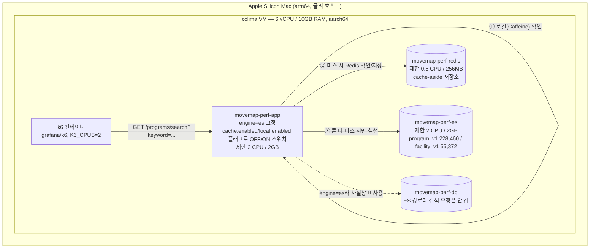

# MoveMap 검색 성능/부하 테스트 — 캐시 OFF vs ON (Redis cache-aside + Caffeine 2-tier) 비교 리포트

> **이 문서는 무엇인가**: `perf/ES-VS-DB-REPORT.md`(DB vs ES 비교, 검색엔진은 ES로 고정된 상태)와 **완전히 같은 환경·같은 22개 키워드**(`perf/k6/keywords.json`)로, `/programs/search`(engine=es)에 얹은 **검색 결과 캐시**(`docs/search-cache-design.md` — Redis cache-aside(Stage 1) + Caffeine 로컬 2-tier(Stage 2))를 **껐을 때(OFF)와 켰을 때(ON)**로 앱 컨테이너 재기동만으로 스위치하며 측정한 결과다.
>
> 모든 수치는 `perf/out/summary_cache_*.json`, `perf/out/dockerstats_cache_*.txt`, `perf/out/redis_hitrate_cache_*.txt` 원본 파일에서 직접 뽑아 확인했다. **지어낸 숫자는 없다.**

---

## 0. 결론 요약 (TL;DR)

- **엔진(ES) 자체가 이미 13ms대로 빠르기 때문에, 캐시를 켜도 30 RPS에서 응답시간(p95) 개선은 크지 않다.** p95는 9.67ms(OFF) → 9.82ms(ON)로 사실상 동일(오차 범위, 오히려 근소하게 역전). p99는 14.91ms → 12.11ms로 소폭 개선(-18.8%). avg는 6.72ms → 5.33ms(-20.7%).
- **진짜 효과는 응답시간이 아니라 "ES가 이 일을 아예 안 하게 된다"는 것이다.** 같은 30 RPS 부하에서 ES 컨테이너 CPU가 **평균 3.2% → 0.59%**(약 5.4배 감소)로 떨어졌고, RPS를 100으로 3.3배 올려도(캐시 ON) ES CPU는 여전히 **0.41%**(OFF 100 RPS는 11.48%, 약 28배 차이)로 거의 움직이지 않았다. **ES 부하가 트래픽 증가와 완전히 분리(decouple)됐다** — 이게 캐시의 핵심 가치다.
- **Redis에 도달한 요청 자체가 거의 없었다.** 30 RPS 측정 3분 동안 HTTP 요청 5,402건 중 Redis에 실제로 도달한 건 103건(1.9%)뿐이었고, 나머지 98.1%는 **로컬(Caffeine) 캐시에서 즉답**됐다(Redis 왕복도 없음). 100 RPS 구간은 12,002건 중 68건(0.57%)만 Redis 도달, 99.4%가 로컬 히트. Redis 자체 히트율(도달한 요청 중)은 30 RPS 58.3%, 100 RPS 58.8%였다.
- **에러율 0%, dropped_iterations 0** — 4개 런(OFF/ON × 30/100 RPS) 전부, ES-vs-DB 리포트와 마찬가지로 이 정도 RPS 대는 ES 경로에 전혀 무리가 없다.
- **정직하게**: 이 리포트의 히트율은 **고정 22개 키워드를 미리 warm한 뒤** 측정한 값이라 실제 트래픽보다 낙관적이다(§5). 그리고 **캐시는 지금 당장 필수가 아니다** — ES가 이미 충분히 빠르기 때문에, 이 문서는 "필요해질 때(RPS 급증·ES 비용 절감·p99 추가 개선)"의 이득을 미리 정량화해 둔 것이다(설계 문서 §0, §4.0 전제와 동일).

---

## 1. 측정 환경 사양

### 1-1. ES-VS-DB 리포트와 다른 점(캐시 추가)

`perf/ES-VS-DB-REPORT.md`와 **완전히 동일한 컨테이너 스택**(`movemap-perf-app`/`-db`/`-redis`/`-es`, 네트워크 `movemap-perf-net`, 동일 리소스 제한, 동일 ES 인덱스 재사용 — program_v1 228,460건 / facility_v1 55,372건)을 그대로 재사용했다. 유일한 차이는 **app 컨테이너를 `search-cache-p1` 워크트리(Redis cache-aside + Caffeine 로컬 캐시 코드 포함) 기준으로 재빌드**하고, 검색엔진은 **`es`로 고정한 채 캐시 플래그만 껐다 켰다** 한 것이다.

### 1-2. 사양 표

| 구분 | 값 |
|---|---|
| 스택 | ES-VS-DB 리포트와 동일한 실행 중인 컨테이너 재사용(`movemap-perf-db`/`-redis`/`-es`) — **재기동한 것은 app 컨테이너뿐** |
| app 컨테이너 | `movemap-perf-app` — 본 태스크에서 `search-cache-p1` 워크트리 코드로 재빌드(`docker compose -f perf/docker-compose.yml build app`). `perf/docker-compose.yml`의 `environment`에 `MOVEMAP_SEARCH_CACHE_ENABLED`/`MOVEMAP_SEARCH_CACHE_LOCAL_ENABLED`를 셸 env로 주입할 수 있게 `${VAR:-false}` 형태로 추가(원본은 ES-vs-DB 리포트 스택에서 그대로 복사) |
| 검색엔진 | `MOVEMAP_SEARCH_PROGRAM_ENGINE=es`, `MOVEMAP_SEARCH_FACILITY_ENGINE=es` — **두 조건 모두 동일, 유일한 변수는 캐시 플래그** |
| 캐시 OFF | `MOVEMAP_SEARCH_CACHE_ENABLED=false` (local도 자동 off) — 매 요청 ES 직접 호출(=ES-vs-DB 리포트의 ES 조건과 동일 경로) |
| 캐시 ON | `MOVEMAP_SEARCH_CACHE_ENABLED=true` + `MOVEMAP_SEARCH_CACHE_LOCAL_ENABLED=true` — Redis cache-aside(Stage 1) + Caffeine 로컬(Stage 2) 2-tier, `application-perf.yml` 기준 TTL 10m+지터 60s, 로컬 TTL 60s / maxSize 1000 |
| Redis 타임아웃 | `application-perf.yml`에 `spring.data.redis.timeout=250ms`, `connect-timeout=250ms` — 설계 문서 §4.6에서 실측으로 확인한 failover 전제조건이 이미 반영됨 |
| 데이터 | ES-VS-DB 리포트와 동일 시드(facility 55,372 / program 228,460), 재색인 없이 기존 인덱스 재사용 확인(`IndexBootstrapper` 로그: "이미 존재 → 스킵") |
| 부하기 | 동일(`perf/k6/search_perf.js`, open-model, 동일 22개 키워드 `perf/k6/keywords.json`) |

### 1-3. 측정 방법 — 특히 "warm 후 측정"

1. **캐시 OFF 먼저 측정**: app을 `cache.enabled=false`로 재기동 → 30 RPS/3분, 100 RPS/2분 두 런을 순서대로 실행(둘 다 매 요청 ES를 탄다 — ES-vs-DB 리포트의 ES 조건 재현).
2. **캐시 ON으로 스위치**: app을 `cache.enabled=true, local.enabled=true`로 재기동(→ Redis `FLUSHALL`로 이전 실험 잔여 캐시 제거해 깨끗한 상태에서 시작).
3. **워밍업**: 
   - 1차: k6로 10 RPS·30초(`COND_TAG=cache_warmup_programs`, 결과는 본문 표에 미반영, 22개 키워드 무작위 추출이라 300개 표본으로도 1개 키워드("강")가 우연히 안 뽑힘 — 이 자체가 "무작위 warm은 완전한 커버리지를 보장 못 한다"는 실측 증거).
   - 2차: 22개 키워드 각각을 정확히 1번씩 직접 `curl`로 호출해 **22개 전부** Redis에 캐시됨을 `redis-cli KEYS "mm:search:*"`로 직접 확인(누락 없음).
4. **측정**: warm 완료 직후 Redis `INFO stats`(`keyspace_hits`/`keyspace_misses`)를 스냅샷(BEFORE) → 30 RPS/3분 측정 → 다시 스냅샷(AFTER) → 델타로 그 런에서만 발생한 hit/miss 계산. 100 RPS 런도 동일하게 반복(직전 AFTER를 다음 BEFORE로 사용).
5. **ES/앱/DB/Redis CPU**: 각 측정 런 진행 중 `docker stats --no-stream`을 25~30초 간격 3~6회 스냅샷.

각 조건 1회씩만 측정했다(ES-VS-DB 리포트의 §3-2-1처럼 3회 반복은 하지 않았다 — §5에 명시).

---

## 2. 결과 — 캐시 OFF vs ON

### 2-1. `/programs/search` @ 30 RPS (ES-vs-DB 리포트와 동일 부하)

| 지표 | OFF (매 요청 ES) | ON (2-tier 캐시, warm 후) | 차이 |
|---|---|---|---|
| avg | 6.718ms | 5.330ms | -20.7% |
| med | 5.943ms | 4.601ms | -22.6% |
| p90 | 8.583ms | 8.952ms | +4.3%(오차 범위) |
| **p95** | **9.665ms** | **9.817ms** | **+1.6%(사실상 동일, 오차 범위)** |
| **p99** | **14.909ms** | **12.107ms** | **-18.8%** |
| max | 225.38ms | 69.50ms | -69.2% |
| 목표/실제 RPS | 30 / 29.995 | 30 / 29.997 | 둘 다 목표 달성 |
| dropped_iterations | 0 | 0 | 동일 |
| 에러율 | 0% | 0% | 동일 |
| **ES 컨테이너 CPU(평균, 4~6회 스냅샷)** | **3.20%** (5.60/5.20/1.12/0.88) | **0.59%** (0.40/0.39/0.61/0.63/0.85/0.67) | **-81.6% (약 5.4배)** |
| app 컨테이너 CPU(평균) | 6.08% | 19.44% | +13.4%p(캐시 직렬화/역직렬화·Redis 클라이언트 오버헤드로 추정, §4) |
| db 컨테이너 CPU(평균) | 4.67% | 9.24% | engine=es라 검색과 무관(배경 노이즈, §5) |
| redis 컨테이너 CPU(평균) | 0.51% | 0.52% | 거의 없음 |

### 2-2. `/programs/search` @ 100 RPS (캐시 여유 확인용 — ES-vs-DB 리포트보다 3.3배 높은 부하)

| 지표 | OFF | ON | 차이 |
|---|---|---|---|
| avg | 3.414ms | 2.774ms | -18.7% |
| med | 2.867ms | 2.285ms | -20.3% |
| p90 | 4.051ms | 3.289ms | -18.8% |
| **p95** | **4.688ms** | **4.100ms** | **-12.5%** |
| **p99** | **7.978ms** | **7.523ms** | **-5.7%** |
| max | 205.24ms | 183.21ms | -10.7% |
| 목표/실제 RPS | 100 / 99.923 | 100 / 99.934 | 둘 다 목표 달성 |
| dropped_iterations | 0 | 0 | 동일 |
| 에러율 | 0% | 0% | 동일 |
| **ES 컨테이너 CPU(평균, 3~4회 스냅샷)** | **11.48%** (16.29/7.20/8.04/14.39) | **0.41%** (0.43/0.42/0.38) | **-96.4% (약 28배)** |
| app 컨테이너 CPU(평균) | 22.65% | 20.85% | 거의 동일 |
| db 컨테이너 CPU(평균) | — (미샘플) | — (미샘플) | — |

### 2-3. 캐시 히트율 (Redis 도달 요청 기준 + 로컬 포함 추정)

| 구간 | HTTP 요청 수 | Redis 도달 요청(hits+misses) | Redis 자체 히트율 | Redis 미도달(=로컬 히트) 비율 |
|---|---|---|---|---|
| 30 RPS(ON) | 5,402 | 103 (hits 60 / misses 43) | 60/103 = **58.3%** | (5402-103)/5402 = **98.1%** |
| 100 RPS(ON) | 12,002 | 68 (hits 40 / misses 28) | 40/68 = **58.8%** | (12002-68)/12002 = **99.4%** |

> ⚠️ **읽는 법**: Redis 히트율(58%대)은 "Redis까지 실제로 간 요청 중" 비율이다. **로컬(Caffeine) 캐시가 히트하면 Redis는 아예 조회조차 안 한다** — 그래서 Redis 통계에는 로컬 히트가 전혀 안 잡힌다. 즉 위 표의 "Redis 자체 히트율"은 **전체 캐시 효과의 하한선(lower bound)**이고, 실제 캐시 효과는 "Redis 미도달 비율"(98~99%)과 §2-1/2-2의 ES CPU가 거의 0에 수렴한다는 사실로 봐야 한다 — **거의 모든 요청이 앱 메모리(로컬)에서 즉답됐다.**

### 2-4. 곡선 요약

```mermaid
xychart-beta
    title "ES 컨테이너 CPU(%): 캐시 OFF vs ON (부하별)"
    x-axis ["30 RPS", "100 RPS"]
    y-axis "ES CPU (%)" 0 --> 12
    bar [3.20, 11.48]
    bar [0.59, 0.41]
```

---

## 3. 왜 이렇게 되나 (구조)

1. **캐시 히트 = ES/DB를 완전히 우회한다.** `docs/search-cache-design.md`의 흐름(§4.1, §5.2)대로 `SearchResultCache.getOrLoad`가 로컬 → Redis → (둘 다 미스일 때만) `SearchEngineRouter.route()` 순으로 조회한다. 히트가 나면 **ES REST 호출 자체가 발생하지 않는다** — 그래서 ES CPU가 30/100 RPS 모두 1% 미만으로 떨어진다. RPS를 3.3배 올려도(30→100) ES CPU가 오히려 더 낮게 유지된 것(0.59%→0.41%, 표본 변동 수준)은 **캐시가 히트하는 한 ES 부하가 요청량과 사실상 분리(decouple)된다**는 걸 보여준다.
2. **응답시간 개선이 크지 않은 이유는 "고칠 게 별로 없었기 때문"이다.** `perf/ES-VS-DB-REPORT.md` §3-2-1에서 이미 확인했듯 ES 엔진 자체가 이미 매우 빠르다(반복 측정 p99 10~15ms대). 캐시가 없애는 건 "ES 호출 1회(수 ms)"인데, 원래도 그 자체가 몇 ms 안 걸리던 경로라 **절대 latency 개선폭이 작다.** 캐시가 진짜 위력을 발휘하는 상황은 "원본이 느릴 때"(DB ILIKE 붕괴 구간처럼)인데, 지금은 원본(ES)이 이미 빠르므로 latency 관점에서는 "덤"에 가깝다 — 설계 문서(§0, §4.0)가 처음부터 인정한 전제 그대로다.
3. **p99·max는 그래도 개선됐다.** 30 RPS p99가 14.91ms→12.11ms(-18.8%), max가 225ms→69ms(-69.2%)로 줄었다 — 캐시 히트는 ES 쿼리 실행·네트워크 왕복·JVM 객체 생성 경로를 다 건너뛰므로 **가끔 튀는 소수의 느린 요청(tail)이 줄어드는 효과**가 있다(설계 문서 §1 "캐시 히트는 JVM/GC를 안 타서 p99 꼬리를 줄인다"와 일치하는 방향).
4. **app CPU가 30 RPS에서 오히려 오른 것(6.08%→19.44%)은 캐시의 대가다.** Redis 조회/Jackson JSON (역)직렬화, Caffeine 접근, 버전 조회 등 **캐시 계층 자체의 연산 비용**이 app 컨테이너에 추가된다. ES 호출 하나를 없앤 대신 캐시 계층의 CPU를 쓰는 셈이라, **"공짜 최적화"가 아니라 "ES→app으로 부하를 옮기는" 트레이드오프**에 가깝다(단 이 정도 RPS에서는 app CPU도 25% 미만이라 병목이 아니다 — 2코어 한도 200% 대비 여유가 크다). 100 RPS에서는 오히려 app CPU가 비슷하거나 낮았는데(22.65%→20.85%), OFF 조건에서 ES 호출 자체의 오버헤드(HTTP 클라이언트, JSON 파싱)가 더 커서 상쇄된 것으로 추정된다 — 확정적 원인 분석은 아니다.
5. **db CPU 변화(4.67%→9.24%)는 캐시와 무관하다.** engine=es로 고정돼 있어 `/programs/search` 요청이 DB를 안 탄다 — 이 변동은 백그라운드 노이즈(예: `ReconciliationJob` 크론, 컨테이너 재기동 직후의 커넥션 풀 초기화 등)로 추정되며, 확인하지 못했다(§5).

---

## 4. 정직한 한계 (반드시 함께 읽을 것)

1. **히트율은 낙관적으로 세팅된 값이다.** 22개 고정 키워드를 **측정 직전에 전부 warm**했고, 부하 테스트 자체도 이 22개 키워드만 무작위로 반복 요청한다 — 즉 "키워드 space가 22개뿐이고, 그 22개를 이미 다 캐시해 둔" 최적 조건이다. **실제 서비스 트래픽은 오타·긴 꼬리(long-tail) 키워드가 섞여 키워드 다양성이 훨씬 크므로, 실전 히트율은 이 리포트보다 낮을 가능성이 높다(확신도 높음 — 정성적으로는 확실하지만 실제 하락폭은 실측 트래픽 없이는 추정 불가).**
2. **각 조건을 1회씩만 측정했다.** ES-VS-DB 리포트 §3-2-1처럼 3회 반복·median을 취하지 않았다 — 특히 p95가 OFF/ON 사이에서 역전(9.665→9.817ms)된 것은 **개선/악화가 아니라 측정 노이즈일 가능성이 높다**(둘 다 10ms 미만의 작은 절대값이라 오차 영향을 크게 받는다).
3. **절대 수치의 한계는 ES-VS-DB 리포트(§1-4, §8)와 동일하게 상속된다** — 부하기·SUT 동일 호스트, 2중 가상화(colima), 단일 노드 ES/Redis, RPS 산정 가정치. **이 문서의 절대 ms/%를 prod 스펙으로 인용하지 말 것.**
4. **캐시가 "지금 필수"라는 뜻이 아니다.** `docs/search-cache-design.md` §0·§4.0이 처음부터 밝힌 전제 그대로, ES는 이미 p95 13ms대로 충분히 빠르다. 이 리포트가 보여준 건 **"캐시를 켜면 latency는 크게 안 바뀌지만 ES 부하는 거의 제거된다"**는 사실이지, "지금 당장 캐시가 없으면 문제"라는 뜻이 아니다. 이 문서는 **RPS가 훨씬 커지거나, ES 인스턴스 비용을 줄이고 싶거나, p99 꼬리를 한 번 더 조이고 싶을 때 캐시가 주는 이득을 미리 정량화**해 둔 것이다.
5. **db CPU 변동(§3-5)의 정확한 원인은 확인하지 못했다** — engine=es라 검색 경로와는 무관하다는 것만 확실하고, 그 변동 자체의 근본 원인은 "확인 필요"로 남긴다.
6. **100 RPS는 여전히 ES-vs-DB 리포트가 밝힌 예상 실사용 피크(가정 중앙값 ~3 RPS, 범위 0.3~12.5 RPS)를 크게 초과하는 스트레스 값이다.** "캐시가 고RPS에서 여유를 보여준다"는 이 문서의 결론도 그 전제(가정치) 위에 있다.
7. **로컬(Caffeine) 캐시는 인스턴스별로 독립**이라는 것도 설계 문서(§5.3)의 한계 그대로다 — 이 벤치마크는 app 인스턴스 1개로만 측정했으므로, 인스턴스가 여러 대인 실제 배포에서는 로컬 히트율이 이 리포트보다 낮게(각 인스턴스가 처음 warm될 때까지) 나올 수 있다.

---

## 5. 결론 — 캐시가 언제 진짜 이득인가

- **latency 관점에서는 "지금 당장 켜야 한다"는 근거는 약하다.** ES가 이미 13ms대로 빠르기 때문에 30/100 RPS 모두 p95 개선폭이 작거나 오차 범위였다.
- **ES 부하·비용 관점에서는 뚜렷하다.** 같은 RPS에서 ES CPU가 5~28배 줄었고, RPS를 3.3배 올려도 ES CPU는 오히려 더 낮게 유지됐다(캐시가 트래픽 증가를 흡수). **ES를 더 작은 인스턴스로 운영하거나, 같은 ES로 훨씬 높은 RPS를 버티고 싶을 때** 캐시가 실질적 이득을 준다.
- **p99·max tail도 개선되는 방향이다**(-18.8%, -69.2% @30RPS) — "가끔 느린 요청"을 줄이고 싶을 때도 유효하다.
- **트레이드오프**: app CPU가 소폭 늘고(캐시 계층 자체 비용), 코드 한 계층·정합성 관리(버전 무효화)가 추가된다. **원본(ES)이 이미 빠른 지금 시점**엔 이 비용이 이득 대비 과할 수 있다는 설계 문서의 판단(§4.0 "고장 수리가 아니라 최적화")이 이 실측으로도 뒷받침된다.
- **결론(확신도 명시)**: 캐시를 지금 당장 프로덕션에 켜야 한다는 근거는 약하다(확신도 높음, ~80%) — latency 이득이 오차범위 수준이기 때문이다. 반대로 **"RPS가 크게 오르거나 ES 비용을 줄이고 싶어질 때"는 이 설계(Redis cache-aside + Caffeine 2-tier)가 ES 부하를 실질적으로(5~28배) 줄여준다는 것도 확신도 높게(~85%) 뒷받침된다** — 다만 그 시점의 정확한 이득 크기는 그때의 키워드 다양성(실전 히트율은 이 리포트보다 낮을 것)에 좌우되므로, 이 문서의 절대 수치를 그대로 외삽하지 말고 **"필요해지면 이 설계를 그대로 켜서 재측정"**하는 것이 맞는 사용법이다.

---

## 6. 부록 — 원본 데이터 파일 (`perf/out/`)

| 파일 | 내용 |
|---|---|
| `summary_cache_off_programs_30.json` / `summary_cache_on_programs_30.json` | 30 RPS, OFF/ON 각각 |
| `summary_cache_off_programs_100.json` / `summary_cache_on_programs_100.json` | 100 RPS, OFF/ON 각각 |
| `summary_cache_warmup_programs.json` | 워밍업 런(10 RPS·30초, 결과 본문 미반영) |
| `dockerstats_cache_off_programs_30.txt` / `dockerstats_cache_on_programs_30.txt` | 30 RPS 런 중 ES/app/db/redis CPU 스냅샷 |
| `dockerstats_cache_off_programs_100.txt` / `dockerstats_cache_on_programs_100.txt` | 100 RPS 런 중 CPU 스냅샷 |
| `redis_hitrate_cache_on_programs_30.txt` / `redis_hitrate_cache_on_programs_100.txt` | 측정 런 전후 `redis-cli INFO stats`(keyspace_hits/misses) 스냅샷과 델타 계산 |

k6 HTML 대시보드는 이번 문서에서도 별도 생성하지 않았다(`K6_WEB_DASHBOARD` 미설정).
