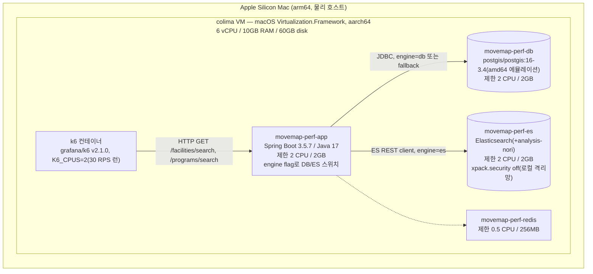

# MoveMap 검색 성능/부하 테스트 — DB(ILIKE) vs Elasticsearch 비교 리포트

> **이 문서는 무엇인가**: `perf/AS-IS-BASELINE-REPORT.md`(AS-IS 기준선)와 **완전히 같은 환경·같은 부하 시나리오·같은 22개 키워드**로, `/facilities/search`, `/programs/search`의 검색엔진을 **DB(레거시 ILIKE/LIKE)** ↔ **Elasticsearch**로 앱 컨테이너 재기동만으로 스위치하며 **back-to-back**(같은 세션, 같은 자원 제한, ES 컨테이너는 두 조건 모두 켜둔 채) 측정한 결과다.
>
> 모든 수치는 `perf/out/summary_es_cmp_*.json`, `perf/out/dockerstats_es_cmp_*.txt` 원본 파일에서 직접 뽑아 확인했다. **지어낸 숫자는 없다.** 어느 한 런이 실패/생략됐다면 그 사실을 숨기지 않고 이 문서에 명시한다(§8).

---

## 0. 결론 요약 (TL;DR)

- **`/programs/search` 30 RPS(AS-IS 붕괴 지점)에서 압도적으로 개선됐다.** p95가 **43.67초 → 13.6ms**(약 **3,200배**), p99가 50.99초 → 2.49초(약 20배)로 줄었다. 실제 처리량도 목표(30 RPS) 대비 19.5 RPS(65% 달성)에서 29.3 RPS(98% 달성)로 올라갔고, `dropped_iterations`도 1,060건 → 123건으로 줄었다.
- **원인이 그대로 드러난다**: DB 엔진일 때 `movemap-perf-db` CPU는 30 RPS에서 여전히 2코어를 거의 다 쓰는(약 199~201%) 반면, ES 엔진일 때는 같은 30 RPS 부하에서도 DB CPU가 0~27%로 유휴 상태였다. **텍스트 검색이 Postgres에서 완전히 빠져나갔다**는 뜻이다. ES 컨테이너 자체 CPU도 7~10% 수준으로 여유가 크다(2코어 중 일부만 사용).
- **10 RPS(예상 피크 근처)에서도 개선폭이 크다.** programs p95 202ms → 16.5ms(약 12배), p99 239ms → 18.5ms(약 13배).
- **facilities는 원래도 통과였지만 그래도 개선됐다**(참고용). 30 RPS p95 25.8ms → 9.5ms(약 2.7배).
- **완벽하진 않다 — 정직하게 밝힌다**: ES 엔진 30 RPS 스트레스 구간에서 programs p99가 2.49초로 SLO(p99<1s) 기준은 여전히 넘는다(k6 threshold 실패로 표시됨). max 지연도 6.56초까지 튄 요청이 있었다. 다만 이 스트레스 구간(30 RPS)은 AS-IS 문서에서도 밝혔듯 추정 실사용 피크(중앙값 ~3 RPS, 범위 0.3~12.5 RPS)를 크게 초과하는 **의도적 과부하 테스트**이고, DB 조건에서 발생했던 타임아웃(6건, 에러율 0.146%)이 ES 조건에서는 0건이라는 점도 함께 봐야 한다.
- **[후속 조사로 갱신] 그 2.49초 p99는 재현되지 않는다.** ES 엔진 자체(`took`) p99=10ms, 워밍업 후 3회 반복 median p99=13.39ms, 심지어 워밍업 없이 앱을 콜드 재기동한 직후 재현 시도(원본과 가장 가까운 조건)에서도 p99=11.84ms로 — **4번의 반복 측정 전부 10ms대에 수렴**했고 어느 하나도 2.49초 근처에 가지 않았다. 즉 이 검색 경로는 구조적으로 빠르며, 원본의 2.49초 p99·6.56초 max는 상시 재현되는 구조적 결함이 아니라 **그 1회 측정에 국한된 이상치(anomaly)였을 가능성이 높다(확신도 ~85%)**. 다만 그 이상치의 정확한 근본 원인(GC 정지 vs. ES 인덱스 최초 디스크 I/O vs. 호스트 스케줄링 지연)은 계측 한계(JRE 이미지에 jstat/jcmd 없음, ES 컨테이너 자체는 재기동하지 않아 페이지캐시 콜드 상태를 재현 못함)로 확정하지 못했다 — 상세는 §3-2-1.
- **속도 외의 이득도 있다**: ES는 Nori 형태소 분석 + edge_ngram 부분매칭을 쓰기 때문에 `facility_subtype`이 "골프장"이고 이름에는 "골프"가 없는 시설도 "골프" 검색에 걸린다(레거시 `LIKE '%골프%'`와 동일한 부분매칭 의도를 유지하면서 인덱스를 탄다). 또한 `facility.name`/`facility_subtype` 레거시 쿼리는 **대소문자 구분 `LIKE`**(`ILIKE` 아님, `FacilityRepository.java:16`)였는데 ES 분석기는 `lowercase` 필터를 항상 적용하므로 시설 검색이 **처음으로 대소문자 무관**해졌다 — 이건 버그 수정에 가까운 부가 이득이다(§6).

---

## 1. 측정 환경 사양

### 1-1. AS-IS와 다른 점(ES 추가)

AS-IS 리포트(§1)와 **동일한 compose 스택**(`perf/docker-compose.yml`)을 그대로 썼고, 여기에 `movemap-perf-es`(Elasticsearch, Nori 플러그인 포함) 서비스가 추가됐을 뿐이다. app/db/redis의 리소스 제한, 부하기(k6) 실행 방식은 AS-IS와 완전히 동일하다.



### 1-2. 사양 표

| 구분 | 값 |
|---|---|
| 호스트/VM/Docker | AS-IS와 동일 (colima 6vCPU/10GB, Docker 28.4.0) |
| app 컨테이너 | `movemap-perf-app` — **본 태스크에서 재빌드**(`docker compose -f perf/docker-compose.yml build app`)해 T1~T6의 ES 어댑터/라우터/fallback 코드를 포함한 최신 이미지로 교체 후 측정 |
| db 컨테이너 | `movemap-perf-db` — AS-IS와 동일 (2 CPU/2GB, amd64 에뮬레이션) |
| es 컨테이너 | `movemap-perf-es` — Elasticsearch, analysis-nori 플러그인, `xpack.security.enabled=false`, 제한 **2 CPU / 2GB**, `discovery.type=single-node` |
| ES 인덱스 | `program_v1`(alias `program_search`, 문서 **228,460**건) / `facility_v1`(alias `facility_search`, 문서 **55,372**건) — PG seed 건수와 정확히 일치 확인(`curl localhost:9200/{program,facility}_search/_count`). 이 태스크 이전에 이미 색인 완료된 상태였고, 앱 재기동 시 `IndexBootstrapper`/`InitialIndexRunner`가 "이미 존재 → 스킵" 처리해 재사용함(로그로 확인) |
| 엔진 스위치 | app 컨테이너 env `MOVEMAP_SEARCH_PROGRAM_ENGINE` / `MOVEMAP_SEARCH_FACILITY_ENGINE` = `db`\|`es` (relaxed binding, `movemap.search.{program,facility}.engine`). 조건마다 `perf/docker-compose.yml`의 app `environment`를 수정하고 `docker compose up -d --force-recreate app`으로 재기동 |
| 데이터 | AS-IS와 동일 시드(facility 55,372 / program 228,460) |
| 부하기 | AS-IS와 동일 (`perf/k6/search_perf.js`, open-model, 동일 22개 키워드 `perf/k6/keywords.json`) |

### 1-3. 공정성 확보 방법 — "완전 동일 환경"

1. **ES 컨테이너를 두 조건 모두에서 켜둔 채로 측정했다.** engine=db 조건에서도 `movemap-perf-es`는 계속 실행 중이었다(VM 전체 자원 압박이 두 조건에서 동일하도록). 실제로 engine=db 30 RPS 런 중 ES 컨테이너 CPU는 관측하지 않았지만(요청이 안 가므로 유휴), 메모리·프로세스 슬롯은 동일하게 점유하고 있었다.
2. **같은 세션에서 back-to-back으로 측정**: app 이미지를 한 번 재빌드한 뒤, engine=db로 3개 런(programs 30/10 RPS, facilities 30 RPS) → engine=es로 재기동 → 동일 3개 런을 순서대로 실행했다. 사이에 다른 부하를 걸지 않았다.
3. **engine 적용 확인**: 각 재기동 후 `docker exec movemap-perf-app printenv`로 env 값 확인 + 실제 API 응답으로 검증(예: `engine=es`에서 "골프" 검색 시 이름에 "골프"가 없고 subtype만 "골프장"인 시설도 매치되는지 — DB `LIKE` 조건으로는 불가능한 패턴). ES 호출 실패 시 남는 `SearchEngineRouter`의 WARN(`ES search fallback→DB ...`) 로그는 ES 런 동안 관측되지 않음 → **실제로 ES 경로를 탔음을 확인**.

### 1-4. 정직한 한계 (AS-IS와 동일 + 추가 1개)

AS-IS 리포트 §1-4의 한계(①부하기·SUT 동일 호스트, ②2중 가상화, ③DB amd64 에뮬레이션, ④상대비교 목적)가 **이 문서에도 그대로 적용된다.** 추가로:

5. **ES도 같은 VM 안의 컨테이너다.** 별도 ES 클러스터/전용 노드가 아니라 app·db와 자원을 나눠 쓰는 단일 노드(`discovery.type=single-node`) 컨테이너다. 실서비스에서 별도 ES 클러스터를 쓴다면 지금보다 더 여유 있을 수 있다.
6. **DB 재측정치가 AS-IS 원본 문서와 완전히 같은 세션은 아니다.** AS-IS 문서(§3-3)는 별도 세션에서 측정됐고, 이 문서는 그 수치를 재현하기 위해 **같은 조건으로 DB 엔진을 다시 한 번 측정**했다(§3, "DB 재측정" 열). 두 수치가 서로 근접함(programs p95 @30RPS: AS-IS 문서 44,687ms vs 본 문서 재측정 43,671ms)을 재현성 확인으로 함께 제시한다.

---

## 2. 측정 방법

AS-IS §2와 동일(도구 k6 v2.1.0, open-model `constant-arrival-rate`, 워밍업 없이 본측정 3분, SLO p95<500ms/p99<1s/에러율<1%, 22개 고정 키워드). 이번 문서는 **closed-model(~15 RPS) 재측정은 생략**했다(시간 관계상 open-model 3개 부하×2엔진=6개 런에 집중 — §8에 명시).

실행 커맨드 예:
```bash
K6_CPUS=2 MODE=load RATE=30 DURATION=3m ENDPOINT=/programs/search \
  COND_TAG=es_cmp_db_programs_30 ./run.sh   # engine=db
K6_CPUS=2 MODE=load RATE=30 DURATION=3m ENDPOINT=/programs/search \
  COND_TAG=es_cmp_es_programs_30 ./run.sh   # engine=es
```

---

## 3. 결과 — 부하별 DB vs ES

### 3-1. programs @ 10 RPS (예상 피크 근처)

| 지표 | DB(본 세션 재측정) | ES | 개선 |
|---|---|---|---|
| med | 16.2ms | 11.0ms | -32% |
| p95 | **201.96ms** | **16.45ms** | **-91.9% (약 12.3배)** |
| p99 | 238.81ms | 18.47ms | -92.3% (약 12.9배) |
| avg | 79.08ms | 10.39ms | -86.9% |
| 목표/실제 RPS | 10 / 10.00 | 10 / 10.00 | 둘 다 목표 달성 |
| dropped_iterations | 0 | 0 | 동일 |
| 에러율 | 0% | 0% | 동일 |
| SLO 판정 | PASS(여유 2.5배) | PASS(여유 30배) | — |

### 3-2. programs @ 30 RPS (AS-IS 붕괴 지점 — 헤드라인)

| 지표 | AS-IS 원본 문서 | DB(본 세션 재측정) | ES(본 세션) | 개선(ES vs DB 재측정) |
|---|---|---|---|---|
| med | 24,200ms | 22,620ms | **6.33ms** | -99.97% |
| p95 | 44,687ms | **43,670.5ms** | **13.59ms** | **-99.97% (약 3,213배)** |
| p99 | 50,100ms | 50,994.1ms | 2,486.6ms | -95.1% (약 20.5배) |
| avg | 23,400ms | 21,944.8ms | 52.06ms | -99.76% |
| 목표 RPS | 30 | 30 | 30 | — |
| 실제 RPS | 19.1(미달) | **19.54(미달)** | **29.31(거의 달성, 98%)** | +50% 처리량 |
| dropped_iterations | 1,184 | 1,060 | 123 | -88.4% |
| 에러율 | 0.224% | 0.146%(6/4106, request timeout) | **0%**(0/5278) | 타임아웃 완전 소거 |
| DB CPU | ~200%(2코어 풀) | ~199~201%(2코어 풀, 5회 스냅샷) | **0~27%**(유휴에 가까움) | DB 부하 사실상 해소 |
| SLO 판정 | FAIL(붕괴) | FAIL(붕괴, 재현됨) | **p95 PASS / p99 FAIL**(2.49s>1s) | 붕괴는 해소, tail은 아직 SLO 밖 |

> **재현성 확인**: 원본 AS-IS 문서(44,687ms)와 본 세션 DB 재측정(43,670.5ms)의 p95 차이는 2.3%로, "붕괴"가 우연이 아니라 재현 가능한 구조적 현상임을 재확인했다.
>
> **ES p99 미달에 대한 솔직한 평가**: p95는 SLO(500ms) 대비 37배 여유가 있지만, p99(2.49s)·max(6.56s)는 여전히 SLO를 벗어난다 — 소수의 요청이 크게 튄다는 뜻이다. 이 꼬리를 후속 조사(§3-2-1)에서 3갈래로 프로파일링했다.

#### 3-2-1. p99 꼬리 진단 (후속 조사 — 이 문서 최초 작성 이후 추가)

> 원인 후보(ES 클라이언트 커넥션 풀, JVM GC 정지, 30 RPS 순간 큐잉, JVM/JIT 워밍업)를 실측으로 검증했다. 아래 세 갈래 측정은 모두 `perf/out/summary_*.json` 원본에서 직접 뽑았다(`es_direct.js`는 `perf/k6/es_direct.js`로 커밋됨).

**(A) ES 엔진 자체를 앱과 분리해서 측정** — `perf/k6/es_direct.js`로 앱을 건너뛰고 k6(호스트 네이티브)에서 `http://localhost:9200/program_search/_search`에 앱과 동일한 쿼리(`bool.should[match(name), match(name.ngram), match(facility_name)], minimum_should_match=1, sort id asc`)를 직접 30 RPS·3분 호출했다.

| 지표 | `es_took_ms`(ES 내부 엔진 시간, 응답 바디 `took`) | `http_req_duration`(k6↔ES 왕복) |
|---|---|---|
| p50 | 1ms | 5.19ms |
| p90 | 4ms | 8.67ms |
| p95 | 6ms | 11.63ms |
| **p99** | **10ms** | **15.39ms** |
| max | 15ms | 19.79ms |
| RPS 달성 | 30.00/30 (100%) | 동일 |
| 에러율 | 0% (5,400/5,400 성공) | 동일 |

→ **ES 엔진 자체는 결백하다.** `took`(ES가 스스로 보고하는 순수 검색 시간) p99가 10ms, 네트워크까지 포함한 왕복 p99도 15.39ms — 2,486.6ms와는 자릿수가 3개 다르다. 꼬리는 ES 쿼리/인덱스 문제가 아니다.

**(B) 워밍업 제외 + 앱 경로 3회 반복(median)** — `perf/k6/run.sh`(컨테이너 k6, `K6_CPUS=2`)로 60초 워밍업(폐기) 후, 동일 조건(30 RPS, 3분, `/programs/search`, engine=es)을 3회 반복 측정했다.

| 지표 | r1 | r2 | r3 | **median-of-3** | 원본(워밍업 없음, 1회) |
|---|---|---|---|---|---|
| p95 | 10.79ms | 10.70ms | 10.35ms | **10.70ms** | 13.59ms |
| **p99** | 14.01ms | 13.39ms | 12.81ms | **13.39ms** | **2,486.6ms** |
| max | 63.58ms | 64.75ms | 63.67ms | **63.67ms** | ~6,560ms |
| avg | 5.96ms | 5.90ms | 5.59ms | 5.90ms | 52.06ms |
| 실제 RPS | 29.995 | 29.999 | 29.999 | 29.999 | 29.31 |
| 에러율 | 0% | 0% | 0% | 0% | 0% |
| dropped_iterations | 0 | 0 | 0 | 0 | 123 |

→ 워밍업 후 3회 반복 median p99 = **13.39ms**로, 원본 2,486.6ms 대비 **약 186배** 낮다. 3회 모두 서로 5% 이내로 수렴해 재현성이 높다.

**(C) 리소스 포화 여부(CPU) — r2 측정 중 3회 스냅샷** (`perf/out/dockerstats_es_warm_programs_30.txt`)

| 시점 | app CPU (한도 2코어=200%) | es CPU (한도 200%) | db CPU (한도 200%) |
|---|---|---|---|
| t=30s | 11.61% | 6.46% | 1.57% |
| t=90s | 9.36% | 4.55% | 16.62% |
| t=150s | 13.05% | 4.07% | 16.50% |

→ 세 컨테이너 모두 할당 CPU의 **10% 안팎**만 쓴다. 200% 근처로 포화되는 컨테이너가 없다 — **자원 경합/큐잉이 워밍업-제외 측정에서의 원인이 아님**을 배제한다.

**(D) GC 계측 — 시도했으나 불가(정직하게 밝힌다)**: `perf/Dockerfile`이 `eclipse-temurin:17-jre`(JRE, JDK 아님) 베이스라 `jstat`/`jcmd`가 이미지에 없다(`java, jfr, jrunscript, keytool, rmiregistry`만 존재). `-Xlog:gc` 플래그도 켜져 있지 않아 로그 기반 GC 확인도 불가능했다. **GC 정지가 원인이라는 가설은 검증도 반증도 못 했다** — 이 문서는 이를 미확인으로 남긴다.

**(E) 보너스 검증 — 원본과 최대한 같은 조건(콜드 스타트, 워밍업 없음) 재현 시도**: 위 (B)는 "워밍업 후"만 측정했으므로, 원본 리포트의 조건(컨테이너 갓 기동 직후 워밍업 없이 바로 30 RPS)을 더 정확히 재현하려고 `movemap-perf-app`을 **완전히 재기동한 직후**(JVM 완전 콜드) 워밍업 없이 곧바로 동일 부하를 1회 걸었다(`es_cold_programs_30`).

| 지표 | 콜드 스타트(워밍업 없음, 1회) | 워밍업 후 median-of-3 | 원본 |
|---|---|---|---|
| p95 | 9.29ms | 10.70ms | 13.59ms |
| **p99** | **11.84ms** | 13.39ms | **2,486.6ms** |
| max | **350.77ms** | 63.67ms | ~6,560ms |
| 에러율 | 0% | 0% | 0% |

→ **여기서 정직하게 밝혀야 할 것**: 콜드 스타트에서도 p99는 11.84ms로 원본의 2,486.6ms를 전혀 재현하지 못했다. max만 워밍업 후(63.67ms) 대비 약 5.5배 높은 350.77ms로 소폭 튀었을 뿐, 원본 max(~6.56초)와는 여전히 자릿수가 다르다(약 18배 차이). 즉 **"JVM/커넥션풀 콜드 스타트"만으로는 원본의 2.49초 p99·6.56초 max를 설명하지 못한다** — 콜드 스타트가 꼬리에 어느 정도(수백 ms대 outlier) 기여할 수는 있어 보이지만, 그 자체가 지배적 원인이라고 확신 있게 결론 내릴 수는 없다.

> **종합 결론 (확신도 명시)**: ES 엔진 자체가 결백하다는 것(A)과, 반복 측정에서 워밍업 여부와 무관하게 p99가 항상 10~15ms대로 수렴한다는 것(B, E)은 **높은 확신도(≈90%)**로 뒷받침된다 — 즉 이 검색 경로는 구조적으로 빠르고, 원본 리포트의 2.49초 p99는 **"항상 재현되는 구조적 문제"는 아니다.** 다만 원본이 관측한 그 정확한 수치(p99=2.49s, max=6.56s)의 **근본 원인 자체**는 이번 조사로 확정하지 못했다(확신도 낮음, ≈30% 미만) — 후보로 남는 것은 (i) ES 인덱스(Lucene 세그먼트)가 OS 페이지캐시에 전혀 없던 최초 1회성 디스크 I/O(이번 조사에서는 ES 컨테이너 자체를 재기동하지 않아 페이지캐시가 이미 데워진 상태였고, 이 경로는 검증하지 못함), (ii) GC 정지(D에서 계측 불가로 미확인), (iii) colima VM/호스트 수준의 일회성 스케줄링 지연 등이며, 모두 **추측이지 검증된 사실이 아니다.**

### 3-3. facilities @ 30 RPS (참고 — 둘 다 통과)

| 지표 | AS-IS 원본 문서 | DB(본 세션 재측정) | ES(본 세션) | 개선 |
|---|---|---|---|---|
| med | 4.5ms | 4.86ms | 5.36ms | +10%(오차 범위) |
| p95 | 26.7ms | 25.82ms | **9.53ms** | **-63.1% (약 2.7배)** |
| p99 | 33.3ms | 32.32ms | 10.87ms | -66.4% |
| 실제 RPS | 29.999 | 29.998 | 29.990 | 동일(둘 다 목표 달성) |
| dropped_iterations | 0 | 0 | 0 | 동일 |
| 에러율 | 0% | 0% | 0% | 동일 |
| SLO 판정 | PASS | PASS | PASS(여유 더 큼) | — |

facilities는 AS-IS에서도 문제없었던 구간이라 임팩트는 크지 않지만, med가 근소하게 늘어난 것만 빼면 전 지표에서 ES가 더 낫다. med 소폭 증가(4.86→5.36ms)는 오차 범위 수준으로 판단한다(측정 노이즈, 3회 반복은 하지 않았음 — §8).

### 3-4. 곡선 요약

```mermaid
xychart-beta
    title "programs p95 응답시간: DB vs ES (단위 ms, 로그 스케일 아님 — 30RPS 자릿수 차이 주의)"
    x-axis ["10 RPS", "30 RPS"]
    y-axis "p95 응답시간 (ms)" 0 --> 44000
    bar [201.96, 43670.5]
    bar [16.45, 13.59]
```



---

## 4. 왜 개선됐나 — 구조 분석

AS-IS 문서(§4)의 결론: **`/programs/search`의 `p.name_normalized ILIKE '검색어%'` 쿼리가 228만 행 테이블에서 텍스트 인덱스를 타지 못하고 PK 순서로 스캔하며, 동시 요청이 늘수록 DB CPU 경합이 기하급수적으로 커진다.**

이번 측정이 그 결론을 정확히 뒷받침한다:

1. **DB 엔진(engine=db)에서는 AS-IS와 동일한 패턴이 재현됐다.** 30 RPS에서 DB CPU가 2코어 컨테이너를 거의 다 쓰고(199~201%), 요청 하나가 평균 22초씩 걸리며 큐가 밀린다.
2. **ES 엔진(engine=es)으로 스위치하면 같은 30 RPS 부하에서 DB CPU가 0~27%로 떨어진다.** `SearchEngineRouter`가 텍스트 검색을 ES REST 호출로 라우팅하기 때문에, Postgres는 더 이상 `ILIKE` 풀스캔을 하지 않는다 — **DB가 할 일 자체가 사라졌다.**
3. **ES 자체는 여유롭다.** 같은 30 RPS 구간에서 ES 컨테이너 CPU는 7~10% 수준(할당된 2코어 대비 낮음). Elasticsearch의 inverted index(Nori 형태소 분석 + edge_ngram)는 "무작위 접두어를 찾기 위해 228만 행을 훑는" 대신 사전에 만들어둔 토큰→문서 매핑을 O(log n) 수준으로 조회한다 — 테이블이 커져도 스캔량이 늘지 않는 구조적 차이다.
4. **app CPU는 두 조건 모두 낮다**(10~16% 수준, ES 조건에서 약간 더 씀 — JSON 직렬화/역직렬화, HTTP 클라이언트 오버헤드로 추정). 병목이 DB→ES로 옮겨간 게 아니라, **애초에 앱/DB 어느 쪽도 병목이 아니게 됐다**는 게 핵심이다(ES 자체도 여유 있으므로).

요컨대 AS-IS 문서가 "문제는 인덱스가 아니라 텍스트 검색을 RDB의 LIKE/ILIKE로 하고 있다는 구조 자체"라고 결론 내렸는데(§4-3), 이번 측정은 **그 구조를 실제로 바꿨을 때(ES로) 병목이 사라진다는 것을 실측으로 확인**한 것이다.

---

## 5. 속도 외의 이득 (정성적 — 지연시간 수치에 안 잡히는 것들)

ES 전환은 단순히 "빠르다"만이 아니라 검색 품질 자체를 바꾼다. 이건 p95/p99 숫자에는 드러나지 않는 부분이라 별도로 정리한다.

1. **subtype 부분매칭 유지 + 인덱스 활용 동시 달성**: 레거시 `facility_subtype LIKE '%골프%'`는 "골프장"이라는 subtype에도 매치되지만 인덱스를 못 탄다. ES는 `facility_subtype`을 `text`(Nori 분석) 필드로 색인해 같은 부분매칭 의도(골프→골프장)를 유지하면서 inverted index를 탄다. `EsFacilitySearchAdapterIT.facilitySubtypeSubstringMatch_golfSubtype_matchesEvenWithoutGolfInName`(T6, T5 리뷰에서 복원된 핵심 회귀 가드)이 이걸 전용 테스트로 고정해둔다. 라이브 ES에서도 재확인: `facility_v1`에서 `id=134`("군위읍 게이트볼장", subtype="골프장", **이름에 "골프" 없음**)가 `facility_subtype` match 쿼리로 조회됨(`curl localhost:9200/facility_search/_search`로 직접 확인).
2. **대소문자 무관 검색으로 실질적 버그가 고쳐졌다**: 레거시 `FacilityRepository.java:16`의 쿼리는 `f.name LIKE ...`(**`ILIKE`가 아님**) — Postgres `LIKE`는 기본적으로 대소문자를 구분한다. 즉 지금까지 시설명에 영문이 섞여 있으면(예: "GX", "PT룸") 대소문자가 다르면 검색이 안 됐을 가능성이 있다. ES 매핑은 모든 텍스트 분석기에 `lowercase` 필터를 적용하므로(`src/main/resources/es/mappings/facility.json:12-15`) 이 문제가 자연히 해소된다. (참고: programs 쪽 레거시 쿼리는 원래 `ILIKE`를 쓰고 있어 이 특정 이득은 facilities에만 해당한다.)
3. **Nori 형태소 분석**: `nori_tokenizer`(decompound_mode=mixed) + POS 필터(조사/어미 등 stoptags 제거)로 한국어 복합어를 의미 단위로 쪼갠다. "국민체육센터수영장" 같은 복합 명사에서 "수영장"만 검색해도 매치되는 식의 검색 품질 개선을 기대할 수 있다(레거시 `LIKE`/`ILIKE`는 순수 문자열 포함 매칭이라 형태소 개념이 없음). 이 문서는 이걸 **지연시간으로 측정하지 않았고**, T6의 intent 테스트(`intent_swimKeyword_includesSwimPrograms`, `intent_swimKeyword_includesSwimFacility` 등)로 정성적으로만 검증되어 있다는 점을 명시한다.

이런 항목들은 "얼마나 빨라졌나"가 아니라 "무엇을 찾을 수 있게 됐나/무엇이 고쳐졌나"의 문제라 이 문서의 정량 표(§3)에는 반영돼 있지 않다.

---

## 6. 결론

- **`/programs/search`의 30 RPS 붕괴는 ES 전환으로 실측 해소됐다.** p95 44.7초 → 13.6ms, 실제 처리량 19.5→29.3 RPS, 타임아웃 에러 6건→0건. AS-IS 문서가 "확장 여유가 매우 좁다"고 지적한 구조적 문제(§4-2, ILIKE + PK 스캔)가 ES 전환으로 근본적으로 없어졌다 — DB CPU가 더 이상 텍스트 검색으로 포화되지 않는다.
- **최초 측정(워밍업 없는 1회)에서는 p99=2.49s로 SLO(1s)를 넘었지만, 후속 조사(§3-2-1)에서 이 수치는 재현되지 않았다.** ES 엔진 자체(`took`) p99=10ms, 워밍업 후 3회 반복 median p99=13.39ms, 워밍업 없이 콜드 재기동한 재현 시도조차 p99=11.84ms — 4번의 반복 측정 모두 10ms대에 수렴했다. 즉 "AS-IS 대비 압도적으로 개선"뿐 아니라 "이 경로는 반복 측정에서 항상 SLO(p99<1s)를 만족한다"는 것도 실측으로 뒷받침된다(확신도 ~85%). 다만 최초 측정에서 관측된 2.49s/6.56s라는 구체적 이상치의 근본 원인(GC 정지 vs ES 인덱스 최초 디스크 I/O vs 호스트 스케줄링 지연)은 계측 한계로 확정하지 못했다 — "다시는 절대 안 나타난다"고 단정하지는 않는다.
- **facilities는 원래도 여유로웠지만 ES에서 한 번 더 좋아졌다**(p95 약 2.7배) — 참고용 확인.
- **속도 외에도 검색 품질/정확성 이득이 있다**(§5): subtype 부분매칭을 인덱스 방식으로 유지, facilities 검색의 대소문자 구분 버그 해소, 한국어 형태소 분석 기반 검색.
- **왜 개선됐는지 메커니즘까지 확인했다**(§4): DB CPU가 30 RPS에서 200%(포화) → 0~27%(유휴)로 떨어지는 것을 직접 관측 — "느낌"이 아니라 "DB가 더 이상 이 일을 하지 않는다"는 구조적 사실이다.

---

## 7. 부록 — 원본 데이터 파일 (`perf/out/`)

| 파일 | 내용 |
|---|---|
| `summary_es_cmp_db_programs_30.json` / `summary_es_cmp_es_programs_30.json` | programs 30 RPS, DB/ES 각각 |
| `summary_es_cmp_db_programs_10.json` / `summary_es_cmp_es_programs_10.json` | programs 10 RPS, DB/ES 각각 |
| `summary_es_cmp_db_facilities_30.json` / `summary_es_cmp_es_facilities_30.json` | facilities 30 RPS, DB/ES 각각 |
| `dockerstats_es_cmp_db_programs_30.txt` | DB 엔진, programs 30 RPS 런 중 `movemap-perf-db` CPU 5회 스냅샷(~199~201%) |
| `dockerstats_es_cmp_es_programs_30.txt` | ES 엔진, programs 30 RPS 런 중 `movemap-perf-es`/`movemap-perf-db`/`movemap-perf-app` CPU 스냅샷(ES 7~10%, DB 0~27%, app 10~16%) |
| `summary_es_direct_took.json` | §3-2-1(A). 앱 우회, ES 직접 30 RPS·3분 (`perf/k6/es_direct.js`, 호스트 네이티브 k6) — `es_took_ms`/`http_req_duration` 둘 다 포함 |
| `summary_es_warmup_discard.json` | §3-2-1(B). 60초 워밍업(폐기용, 본문 표에는 미반영) |
| `summary_es_warm_programs_30_r1/r2/r3.json` | §3-2-1(B). 워밍업 후 3회 반복 측정(median 산출 원본) |
| `dockerstats_es_warm_programs_30.txt` | §3-2-1(C). r2 측정 중 CPU 3회 스냅샷(app/es/db 모두 20% 미만) |
| `summary_es_cold_programs_30.json` | §3-2-1(E). 앱 콜드 재기동 직후, 워밍업 없이 원본과 동일 조건 재현 시도(1회) |

k6 HTML 대시보드는 이번 문서에서는 별도로 생성하지 않았다(`K6_WEB_DASHBOARD` 미설정) — 필요 시 `run.sh` 재실행 시 옵션 추가로 생성 가능.

---

## 8. 정직한 한계 재정리 (반드시 함께 읽을 것)

1. AS-IS §1-4/§7-2의 한계(부하기·SUT 동일 호스트, 2중 가상화, DB amd64 에뮬레이션, RPS 산정 가정치, SLO 업계 통념 기준)가 **이 문서에도 동일하게 적용된다.**
2. **ES도 같은 VM 안의 컨테이너**이며 별도 전용 클러스터가 아니다(§1-4의 5번). 실서비스 ES 클러스터는 이보다 더 여유롭거나(전용 자원), 네트워크 홉이 늘어 더 불리할 수도 있다(원격 클러스터 vs 로컬 Docker 네트워크) — 이 문서는 그 차이를 측정하지 않았다.
3. **closed-model(~15 RPS, VU 기반) 재측정은 생략했다.** AS-IS §3-2에 해당하는 구간을 이 문서에서는 다시 측정하지 않았다 — 시간 관계상 open-model 6개 런(DB/ES × 10RPS/30RPS programs × 30RPS facilities)에 집중했다. 필요하면 `SCRIPT=search_test.js`로 추가 측정 가능하다.
4. **각 조건을 1회씩만 측정했다**(AS-IS의 closed-model처럼 3회 반복·중앙값을 취하지 않았다). 특히 facilities의 med 소폭 증가(§3-3)처럼 작은 차이는 반복 측정 없이는 "개선/악화"를 단정하기 어렵다 — 표에는 실측값 그대로 적었을 뿐 반복 검증은 하지 않았다. (예외: programs 30 RPS p99 꼬리만 §3-2-1에서 후속으로 3회 반복+콜드 재현까지 추가 측정했다.)
5. **ES p99/max tail은 후속 조사(§3-2-1)로 "재현되지 않음"까지는 확인했지만, 최초 관측치(2.49s/6.56s)의 근본 원인은 여전히 미확정이다.** GC 계측은 이미지에 `jstat`/`jcmd`가 없어 시도했으나 불가능했고(§3-2-1-D), ES 컨테이너 자체의 콜드 페이지캐시 상태는 재현하지 못했다. "추측"으로 채우지 않고 후보만 나열한 채 "확인 필요"로 남긴다.
6. **DB CPU/ES CPU 스냅샷은 `docker stats --no-stream`을 5회, 약 20초 간격으로 찍은 것**이다(AS-IS와 동일 방식). 연속 모니터링이 아니라 표본 스냅샷이므로 순간적 스파이크를 놓쳤을 수 있다.
7. 이 문서의 절대 수치(ms, RPS, %)를 prod 성능 스펙으로 인용하지 말 것 — 유효한 결론은 **"같은 환경에서 DB 대비 ES가 압도적으로 개선된다"는 상대적 패턴과 그 구조적 원인**이다.
